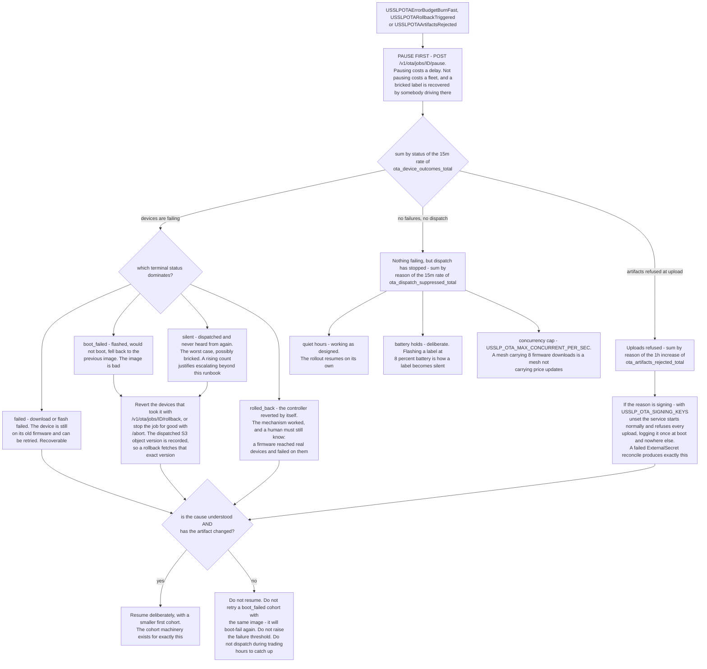

# Runbook — OTA rollout

**Alerts:** `USSLPOTAErrorBudgetBurnFast`, `...BurnSlow`, `...BurnTicket`,
`USSLPOTARollbackTriggered`, `USSLPOTAArtifactsRejected`

**SLO:** 99.7% OTA success. Budget 0.3%.

**The thing that makes this different from every other rollout in the platform:**
a firmware image that bricks a label is not recoverable over the air. A label is
a battery-powered device cemented to a shelf rail in a store that may be on
another continent. Recovery means somebody drives there and replaces 40,000 of
them by hand.

**So: pause the rollout first, diagnose second.** Always.

Everything below in the order it must happen. The first box is not a triage
step; it is the one action that is cheap to take and expensive to skip.



---

## Pause it

```bash
curl -X POST -H "Authorization: Bearer $TOKEN" \
  https://api.<region>.usslp.example/v1/ota/jobs/<id>/pause
```

Pausing costs a delay. Not pausing costs a fleet. There is no situation in which
gathering more data first is the better trade.

---

## What actually failed

```promql
sum by (status) (rate(ota_device_outcomes_total[15m]))
```

The terminal statuses are `succeeded`, `failed`, `boot_failed`, `silent`,
`rolled_back` (`platform/internal/ota/domain/job.go`). `pending` and `dispatched`
are in flight; `skipped` is a deliberate decision — quiet hours, a low battery, a
device already on the target version — and is not a failure. The SLO denominator
is the terminal set only, which is why a rollout starting does not look like an
outage.

| Status | What it means | Severity |
|---|---|---|
| `failed` | Download or flash failed; device still on the old firmware | Recoverable |
| `boot_failed` | Flashed and would not boot; fell back to the previous image | Serious — the image is bad |
| `silent` | Dispatched and never heard from again | **Worst case.** Possibly bricked. |
| `rolled_back` | The controller reverted automatically | The mechanism worked |

A rising `silent` count is the one that justifies escalation beyond this
runbook. `boot_failed` means the fallback worked; `silent` means it may not have.

---

## An automatic rollback fired

`USSLPOTARollbackTriggered` (`increase(ota_rollbacks_total[15m]) > 0`) means the
rollout's failure threshold was crossed and the controller reverted by itself.
That is the system protecting the fleet, and it is still something a human must
know about immediately: a firmware reached real devices and failed on them.

**Do not restart the rollout before understanding why.** The next attempt will
reach the same devices.

---

## Dispatch has stopped but nothing has failed

```promql
sum by (reason) (rate(ota_dispatch_suppressed_total[15m]))
sum(ota_downloads_in_flight)
```

`reason` separates quiet hours from battery holds from concurrency caps — which
is the difference between "the rollout is waiting" and "the rollout is stuck".

- **Quiet hours** — working as designed. A store does not take firmware
  downloads during trading; the rollout resumes on its own.
- **Battery holds** — devices below the threshold are skipped deliberately.
  Flashing a label at 8% battery is how a label becomes `silent`.
- **Concurrency cap** — `USSLP_OTA_MAX_CONCURRENT_PER_SEC` bounds simultaneous
  downloads per controller, because a mesh carrying 8 firmware downloads is a
  mesh not carrying price updates.

---

## Uploads are being refused

```promql
sum by (reason) (increase(ota_artifacts_rejected_total[1h]))
```

If the reason is a signature or key problem, check the obvious thing first:

```bash
kubectl -n usslp logs -l app.kubernetes.io/component=ota-service | head -30 | grep -i 'signing keys'
```

With `USSLP_OTA_SIGNING_KEYS` unset the service **starts normally** and refuses
every upload, logging it once at boot and nowhere else. The chart mounts the key
ring from an ExternalSecret; a failed reconcile produces exactly this.

The artifact itself is in an S3 bucket with Object Lock in COMPLIANCE mode — it
cannot be replaced, and a re-upload creates a new version. The OTA service
records the version id it dispatched, so a rollback fetches that exact version
rather than whatever is at the key now.

---

## Resuming

Only when the cause is understood and the artifact has changed.

```bash
curl -X POST .../v1/ota/jobs/<id>/rollback    # revert the devices that took it
curl -X POST .../v1/ota/jobs/<id>/abort       # stop this job for good
curl -X POST .../v1/ota/jobs/<id>/resume      # continue, deliberately
```

Start the next attempt with a smaller cohort. The cohort machinery exists for
exactly this: proving a firmware on a hundred labels in one store before it
reaches fifty million.

---

## What NOT to do

**Do not retry a `boot_failed` cohort with the same image.** It will boot-fail
again.

**Do not raise the failure threshold to make the rollback stop firing.** The
threshold is what stands between a bad image and the fleet.

**Do not dispatch during trading hours to "catch up".** The quiet-hours window
is a mesh-bandwidth decision, and the mesh's other job is delivering prices.
