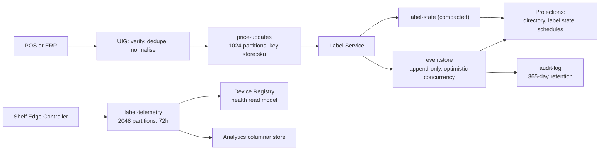

# 0001 — Event-driven CQRS with event sourcing for the price path, and not for telemetry

**Status:** Accepted

---

## Context

A price on a shelf edge is a regulated artefact. Weights-and-measures regimes
(NTEP in the United States, OIML elsewhere) require the price a shopper reads on
the shelf to be the price charged at the till, and a retailer challenged on that
months later has to be able to answer four questions about a specific label at a
specific instant: who changed the price, from what, on whose authority, and in
what order relative to every other change that touched the same product.

A mutable row in a table answers none of them. It holds the current value and
whatever the audit trigger happened to capture; the ordering information is gone
by construction, and a projection rebuild is indistinguishable from a rewrite of
the record.

The same platform also carries `label-telemetry`: battery voltage, RSSI, LQI and
shelf temperature from every label in the fleet. At the estate the platform is
sized for that stream reaches 167,000 readings per second
(`platform/pkg/canon/topics.go`, `platform/internal/registry/app/telemetry.go`).
Those readings are observations, not decisions. Nobody will ever be asked to
explain a battery reading in a tribunal.

The two workloads want opposite things from a storage layer.

## Decision

**The price path is event sourced.** `platform/pkg/eventstore` is the CQRS write
side: an append-only store over `pkg/kvstore` in which the events *are* the
record and the current state of a label is a projection that can be discarded
and rebuilt. Three properties carry the design, and all three are in the package
comment on `eventstore.go`:

- **Optimistic concurrency.** `Append` takes the version the caller believed the
  stream was at. If an NCR till and a Shopify webhook both try to reprice the
  same SKU from version 41, exactly one lands and the other gets
  `ErrConcurrency` and re-reads. No distributed lock, nothing silently lost.
- **A global monotonic position.** Every event has a position in one total order,
  so a projection that has consumed to position N resumes at N+1 and rebuilds
  deterministically on any replica.
- **Idempotent append.** A redelivered POS webhook carries the same idempotency
  key, and the second append returns the original event rather than creating a
  second price change.

Reads are served from projections, not from the stream: `adapters.KVDirectory`
resolves SKU to labels for the fan-out, `adapters.KVStateStore` holds per-label
current state, and `label-state` is a **compacted** stream so a restarting
service rebuilds its read model without replaying seven days of history.

**Telemetry is not event sourced and never enters the event store.**
`registry.Service.IngestTelemetry` folds a controller's batched readings into the
health read model and republishes them on `label-telemetry`, keyed per label. The
comment on that function states the reason directly: putting 167,000 appends per
second through an optimistically-concurrent aggregate store would make the
registry the platform's bottleneck, and a three-day-retention stream of
observations is not a decision anyone has to be able to explain in a year.

`label-telemetry` therefore has a 72-hour retention against `audit-log`'s
8,760 hours, and telemetry's consumers (analytics, anomaly detection) read it as
a stream, not as a history.

The upper path is event sourced: an append-only store, projections that can be
thrown away and rebuilt, and a 365-day audit stream. The lower path is not: a
three-day stream of observations, consumed and aged out.

## Consequences

**What it buys.**

- The audit answer is structural rather than bolted on. `audit-log` is retained
  for 365 days (`canon.StreamAudit`) and the attestation signature is retained
  with it, so "prove this shelf was authorised to show £2.49 at 14:02" is a
  stream read, not a forensic exercise.
- Two concurrent writers to the same SKU cannot silently lose one another's
  work. `TestRedeliveredWebhookIsAppliedOnce` shows the ingress half of that:
  ten deliveries of one Shopify webhook produce one sequence advance and one
  panel refresh.
- Read models are disposable. A schema change to a projection is a rebuild, not
  a migration.

**What it costs.**

- Every consumer must be idempotent, because delivery is at-least-once
  (see [0008](0008-at-least-once-with-monotonic-sequence.md)). That is a real
  and permanent tax on every handler in the tree.
- Eventual consistency is visible to operators. A price accepted by the UIG is
  durable before it is projected, so a read immediately after a write can be
  stale. The API surface reports the sequence rather than pretending otherwise.
- **The idempotency boundaries do not cover every case that matters.** All four
  documented boundaries hold (`INTERFACE-CONTRACTS` §6), and none covers a
  *distinct* POS delivery carrying a price the label is already displaying: the
  aggregate applies the change and the panel runs a full waveform to redraw the
  same number. `TestDistinctWebhookWithAnUnchangedPriceStillRefreshes` records
  the behaviour so that fixing it is visible. A full waveform is roughly a
  hundred times the energy of anything else a label does, so a POS that
  republishes its price book nightly spends the fleet's battery budget on it.
- **The event store is on an embedded LSM store, not a database.**
  `pkg/eventstore` sits on `pkg/kvstore`. Nothing in the Go tree opens a
  PostgreSQL connection. See
  [0011](0011-in-tree-log-and-broker-behind-ports.md) for what that means for a
  multi-process deployment.

## Alternatives considered

**A relational table with an audit trigger.** Rejected on the ordering question.
A trigger records that a row changed and roughly when; it does not record the
position of that change relative to every other change on a partition, and it
cannot answer "was this promotion applied before or after head office's
markdown" without a total order that the trigger does not create.

**Event sourcing everything, telemetry included.** Rejected on arithmetic.
167,000 optimistically-concurrent appends per second, each of which is a
read-modify-write against an aggregate version, is not a workload the write side
is shaped for, and the data has no audit value to justify it.

**CQRS without event sourcing** — separate read and write models over a mutable
store. This gets the read-scaling benefit and none of the audit benefit, which is
the half that is legally required. Rejected.

**A change-data-capture pipeline off a relational primary.** Would produce a
stream, but the stream would be derived from mutations rather than being the
system of record, so a projection rebuilt from it reconstructs the database's
history rather than the business's. It also puts the audit guarantee behind the
correctness of a CDC connector.
