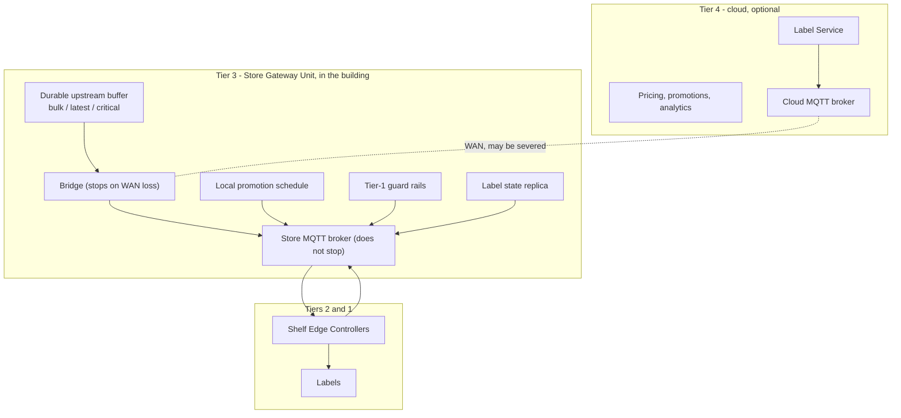

# 0003 — Edge-first: the cloud is an optimisation, not a dependency

**Status:** Accepted

---

## Context

Retail wide-area links fail. A DSL line resets, a construction crew cuts a duct,
a carrier has a bad afternoon. In a store running electronic shelf labels the
consequences of treating that as an outage are severe and immediate: if the
shelves depend on the cloud, a WAN failure means either blank labels or stale
prices, and a stale price is a weights-and-measures exposure that grows with
every minute and every till transaction.

Worse, the failure is correlated with the moment it matters most. A national
promotion starts at 08:00. If four hundred stores need a cloud round trip to
activate it, the ones whose link is down at 07:59 are still showing yesterday's
prices at nine, and nobody knows which ones.

## Decision

**The store is the unit of correctness. The cloud is where optimisation,
analytics and cross-store coordination happen, and a store keeps trading
correctly with none of it running.**

Four mechanisms in `edge/sgu` implement it.

**1. The store runs its own broker.** The Store Gateway Unit *is* the store's
MQTT broker, and every Shelf Edge Controller connects to it, never to the cloud.
The SGU is separately a client of the cloud broker and bridges between the two.
When the cloud link drops the bridge stops and the broker does not. That single
structural fact is the whole mechanism behind zero label downtime during an
outage (`edge/sgu/bridge.go`, `INTERFACE-CONTRACTS` §3).

**2. WAN loss is detected by acknowledged probe, with asymmetric hysteresis.**
`edge/sgu/wan.go` combines the MQTT client's own link state — immediate, and not
sufficient, because a TCP connection to a broker behind a load balancer stays
"up" long after the path behind it has gone — with a QoS 1 publish that must be
acknowledged. Entering autonomy is cheap and reversible and happens on three
consecutive failed probes; leaving it means replaying a buffer and running a
merge, so it waits for the link to prove itself for longer than it took to fail.

**3. Everything the store would have told the cloud is buffered durably, in
classes.** `edge/sgu/queue.go` is a bounded, `kvstore`-backed queue with an
explicit sacrifice order:

| Class | Contents | On overflow |
|---|---|---|
| `bulk` | Telemetry | Dropped first, oldest first. An hour of battery readings costs a dashboard some resolution. |
| `latest` | Controller heartbeats, mesh topology | Coalesced by topic on the way in, so they cost bounded space however long the outage runs. |
| `critical` | Delivery acknowledgements, price rejections, store mode transitions | Dropped only when nothing else is left, and dropping one marks the reconciliation **lossy** so a human is told rather than left to infer it. |

**4. The store can decide things on its own clock.** A local promotion schedule
(`edge/sgu/schedule.go`) activates on store time; the Tier-1 pricing guard rails
(`edge/sgu/rules.go`) run locally in under ten milliseconds so an autonomous
store still refuses a price that breaches a regulatory floor; and
`pricing/domain` is dependency-free precisely so the identical rules engine runs
in the cloud service and in the gateway's offline brain and reaches the identical
decision.

The one thing the store does **not** get for free is the authority to author a
price. A label refuses anything it cannot verify, so a locally originated price
needs a signature. `Gateway.LocalPriceChange` handles that explicitly: with a
delegated, store-scoped `pki.PriceAuthority` whose public half is in every local
controller's key ring, the change reaches the glass; without one, the change is
recorded and reported upstream and **is not displayed**, and the caller is told
so. Nil is the default, which is right for a store with no local point of sale.

## Consequences

**Measured.** `TestStoreSurvivesWANOutage`, on a 2-core container with the edge
tier simulated:

- The store detected the severed uplink and went autonomous on its own.
- A price change originated inside the store reached a label with the WAN down.
- A promotion scheduled for 06:04:23 activated on the store's own clock with the
  WAN down.
- The upstream buffer held 5 messages (5,299 bytes) durably.
- On reconnect: 7-second outage, 6 messages flushed, 0 deduplicated, 0 dropped,
  16 keys compared, 1 changed, 0 conflicts, `Lossy: false`, worst measured clock
  skew 6 ms.

**A price change into an unreachable store is not a three-second change, and the
platform says so.** The SLO clock starts when the cloud takes durable
responsibility, and the store could not be reached for most of what followed.
`make demo` measures one deliberately and reports 8–9.5 s, most of which is the
outage. The guarantee during an outage is a different one and it is the one the
store keeps: the shelves go on trading, nothing goes blank, and no price changes
without a signature the label itself checked.

**Every store is now a stateful appliance with an operations story.** It has a
durable store that can be corrupted, a queue that can fill, a clock that drifts
and a broker that can stop listening. `deploy/edge/RUNBOOK.md` exists because of
this decision, and its first instruction is the one that matters: find out
whether the shelves are wrong or only the cloud's picture of them, because those
need completely different responses and the second has no urgency at all.

**Divergence has to be reconciled rather than assumed away.** See
[0009](0009-hybrid-logical-clocks-for-reconciliation.md).

**The autonomous store's clock is the residual risk, and it is acknowledged
rather than solved.** The store activates promotions on local time, and local
time is exactly what has been undisciplined for the length of the outage. Every
activation records the clock skew measured at the time and the reconciliation
report carries it, so "the promotion started four minutes early" is a fact
somebody can find rather than one they have to deduce from till receipts.

**One simulation artefact this design created.** `edge/sim` is a discrete-event
engine whose clock only advances when an event fires, so on a quiet store
`Engine.Now()` can sit seconds behind the wall clock and a price arriving during
a quiet spell is timestamped in the past. Measured drift reached 2.5 s.
`stack.startClockTick` schedules a 20 ms heartbeat per store engine, bringing
observed drift under 120 ms, and publishes what is left as `clock_drift_ms` in
every SLO report so the error bar travels with the number.

## Alternatives considered

**Cloud-authoritative with a local cache.** The conventional design: controllers
talk to the cloud, a local cache serves reads during an outage. Rejected because
a cache cannot *activate* anything. A promotion scheduled for 08:00 does not
start; a locally originated price does not exist; the store is frozen rather than
trading. It also gives the wrong failure mode for the cache itself, which goes
stale silently.

**A store-local replica of the whole platform.** Every store runs the full cloud
tier. Rejected on operational cost: 100,000 copies of nine services, each needing
its own upgrade, monitoring and on-call story, to serve a store that generates a
few hundred price changes a day.

**Giving every gateway a full price-authority key** so autonomy needs no
delegation. Rejected outright. That would put the platform's most consequential
secret in a fanless box in a stock room in every store, and compromising any one
of them would compromise the whole fleet's ability to authorise prices. The
delegated key is deliberately narrow: one store, a short validity, revocable from
the cloud without touching a single label.

**Treating a WAN outage as an incident.** Rejected because it produces the wrong
behaviour under the alert. `USSLPStoreAutonomous` fires, and the runbook's first
paragraph says a store whose cloud link is down is not an outage. Pretending
otherwise trains an on-call rota to page for weather.
