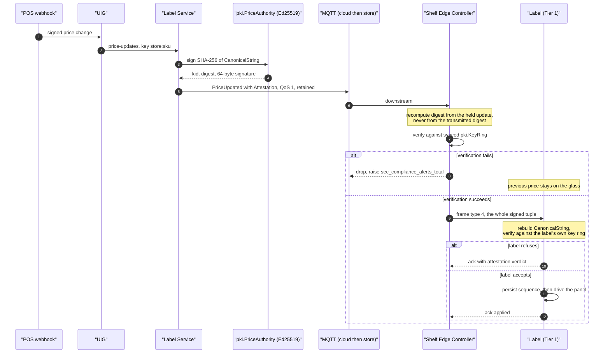

# 0004 — Cryptographic price attestation, verified end to end at the label

**Status:** Accepted. Supersedes the original controller-terminated design
recorded in `INTERFACE-CONTRACTS` §5, which is now the weaker of two checks
rather than the only one.

---

## Context

Weights-and-measures regulation requires the price a shopper sees on the shelf to
be the price charged at the till. Most ESL platforms discharge that obligation
*procedurally*: a change-control process, an audit report, a reconciliation job.
That works until someone asks what stops a price appearing on a shelf without
having gone through the process.

USSLP discharges it cryptographically instead. The Label Service signs a
canonical digest of everything that could change what a shopper is charged, and
that signature is checked before a pixel moves.

The original design, which is what `INTERFACE-CONTRACTS` §5 specifies, put that
check at the **Shelf Edge Controller**: the SEC recomputes the digest from the
update it is holding — never from the digest on the wire — verifies it against
its synced key ring, and only then renders and transmits. Against the threat
model the contract states, which is an attacker with write access to the store's
MQTT broker, that design holds completely.

It leaves one hole, and `firmware/README.md` is where it was written down first.
The contract's guarantee is that a compromised controller cannot change a
displayed price — but a controller that has been rooted or physically replaced is
*inside* the trust boundary that claim rests on. It is the thing doing the
verifying. A shelf label is a device a member of the public can put a hand on, in
a building with a service door; the controller is a Linux box in the ceiling void
above it. Verifying only at the controller means the last hop is protected by
precisely the component an attacker would replace.

## Decision

**Two independent verifications. The controller verifies, and then the label
verifies again, against its own key ring, before driving a single pixel.**

### What is signed

`canon.AttestationInput` — `(tenant, store, label, SKU, price minor units,
currency, effective time, sequence, promotion)`. Every field that could change
what a shopper is charged is in it; nothing else is, so re-rendering with a
different template does not invalidate the attestation.

`CanonicalString()` is deliberately dull: fixed field order, explicit separators,
integer minor units, RFC 3339 UTC to the second, no optional whitespace, no map
iteration. The label firmware implements the same nine lines in C
(`firmware/src/crypto/usslp_canon.c`), and any cleverness in Go would be a bug in
C. The separator choice matters and is tested: store `"ab"` / label `"c"` must
not hash the same as store `"a"` / label `"bc"`.

### The chain of custody

### Frame type 4

`edge/labelsim/wire_attested.go` and `firmware/src/radio/usslp_wire.h` define the
attested update frame. It carries the five identifiers, the price, the effective
instant, the sequence, the key identifier, the digest and the 64-byte Ed25519
signature. Its first 33 bytes are byte-identical to a type 1 update so that a
controller can build one frame and truncate it for a label that has not been
upgraded, and so both decoders share a head.

`CONFIG_USSLP_REQUIRE_ATTESTATION` defaults to `y`. A deployment whose
controllers predate frame type 4 sets it to `n`, which is a deliberate decision
to trust Tier 2; the label logs it loudly at every boot and exposes it as a
cluster attribute so a fleet audit can find every label running that way.
`TestEveryLabelVerifiesForItself` is that audit, and it fails if any label is in
a mode where it would take a controller's word for a price.

### The order of operations on the label

`firmware/src/app/price.c`: decode → **sequence check** → **attestation** →
decode and load → **persist sequence** → drive the panel → ack.

Persisting the sequence before driving the panel is the whole design. A brownout
during a 1.5 s refresh is a real event on a coin cell driving a charge pump.
Persisting first loses one price change and the retry is accepted. Persisting
after would leave new pixels on the glass with the old sequence in NVS, and the
retry would be discarded as stale — a label showing a price it has told the
platform it is not showing, which is precisely the state the whole apparatus
exists to make impossible.

The sequence check comes before the attestation for a cheaper reason: a duplicate
is the common case under at-least-once delivery, and an Ed25519 verification is
13 ms of a coin cell's life.

## Consequences

**Verified, at both points.** `TestTamperedPriceIsRefused` publishes a forged
price on the store's broker; the controller refuses it with
`digest mismatch (transmitted price differs from signed price)` and the label
keeps showing $21.75. `TestUnattestedPriceIsRefused` publishes an unsigned one;
it is refused with `unknown price authority key id ""`.
`TestFleetBootsWithNoAttestationRefusal` shows a fleet finishing boot with 12
verifications, 0 attestation failures, 0 unattested frames refused, 0 bad frames.

**The threat model genuinely changed.** An attacker now has to hold the
platform's Ed25519 signing key rather than a controller. A rooted or swapped SEC
can suppress an update — visible within three missed heartbeats — but cannot
author one.

**The edge agent measured what it costs, and it is not free.** The signed tuple
makes the air frame **199 bytes larger**, and the label spends about **13 ms**
verifying. Both consequences are visible in the numbers:

| | Before end-to-end attestation | After |
|---|---|---|
| Channel utilisation per zone, 40/s sustained | ~1.55% | 2.08–2.20% (measured, 8 controllers) |
| Controller-to-label hop, p99 | inside 300 ms | **331 ms** over 1,000 changes; **314 ms** under sustained load. §4's line item moved to 400 ms as a result |
| Deliveries needing a retransmission after a mesh reroute | — | about one in six |

The 127-byte 802.15.4 PHY limit means a 199-byte-larger frame fragments, which is
more airtime per transmission, which is why the `INTERFACE-CONTRACTS` §4 line
item for that hop was wrong at p99. The three-second total still holds with room
— measured p99 2,365 ms over 1,000 changes, 2,728 ms under sustained load — so
the line item was the wrong side of the comparison, and **§4 now reads 400 ms**,
re-balanced by taking 50 ms each from `Label Svc → broker` and
`broker → SGU → SEC`, which together measure 8–18 ms against a 300 ms allowance.
The total is unchanged at 3,000 ms.

§4 also records *why* the frame grew, because the obvious way to get back under
300 ms is to stop carrying the tuple — and that is the one change this ADR
exists to argue against. The airtime is the price of a label that can verify
without trusting the controller in front of it.

**A mesh reroute is the worst case.** `INTERFACE-CONTRACTS` §4 budgets hops, not
retransmissions. The coordinator backs off 500 ms and then a second, so a third
attempt on top of a 1,500 ms full waveform lands at 3.2–4.3 s.
`TestMeshReroutesAroundADeadRelay` asserts the budget on first-attempt
deliveries — 375–540 ms in the run recorded here — and prints the retried ones
with their attempt counts rather than hiding them in an average. In that run one
of five deliveries took 1,932 ms across three attempts.

**A stale key ring now fails at two places instead of one**, and telling the two
failure causes apart matters operationally. The firmware's ack carries an
attestation verdict in bits 2–4 of the flags byte with eight values, so an
operator can distinguish `unknown-key-id` (the label missed a rotation; push it a
ring) from `digest-mismatch` (the price on the wire is not the price that was
signed; this is a security incident).

**The edge tier reads those bits.** `edge/labelsim` defines ack status 3
(`refused: attestation did not verify`), status 4 (`refused: unattested frame`)
and the three-bit verdict field (`wire.go`), maps a verification failure onto a
verdict (`verdict.go`), and carries both back to the controller on the ack
(`sec/coordinator.go`). `sec.Controller` routes the two refusals apart because
their runbooks are opposite: status 3 raises a compliance alert carrying the
verdict and a `tampering` flag; status 4 raises an *operational* alert naming the
remedy, because a `REQUIRE_ATTESTATION=y` label being sent type-1 frames is a
fleet configuration problem and not a compliance one.

The old inference — a bad-frame ack to a frame this controller had already
verified must be a label refusal — survives as an explicitly secondary fallback,
reached only when a label reports status 2. It is for firmware that predates the
new codes, it is lossy in both directions, and the alert it raises is marked
`label (inferred)` with an empty verdict so nobody mistakes it for a read
signal. It should go away when no old firmware remains in the fleet. See
`firmware/README.md`, *Protocol changes the controller must match*.

**Key rotation now has a 30-day floor.** `pki.DefaultRotationOverlap` is 30 days,
sized from the worst realistic case rather than from cryptographic hygiene: a
price signed today may still be on a shelf a month from now, and a controller
re-verifies its cached state from scratch on every reboot, which for a store that
loses power during a refit can be weeks after the price was set. An overlap
shorter than the longest plausible gap between signing and verification turns a
routine rotation into a store full of labels refusing to redisplay what they are
already showing.

**Interop was proved by compiling the firmware's own decoder against the Go
encoder** — `usslp_wire.c`, `usslp_canon.c`, `usslp_sha256.c`, `usslp_crc32c.c`
against a harness — and that exercise found a real defect in the firmware's own
test, which had hand-assembled its frame from byte offsets and skipped the
promotion field. It passed because its single vector had an empty promotion. The
test now uses a real encoder and runs over every vector.

## Alternatives considered

**Terminate verification at the controller** (the original `INTERFACE-CONTRACTS`
§5 design). Cheaper on air by 199 bytes per frame and 13 ms per verification on
the label, and sound against the stated threat model. Rejected once the threat
model was extended to a physically compromised controller, which is the realistic
case in a building with a service door.

**Sign at the label and verify in the cloud.** Backwards: it proves what the
label reported, not what it was authorised to show. The regulatory question is
about authority, not about reporting.

**A MAC (HMAC) instead of a signature.** Much cheaper on the label. Rejected
because a symmetric key that every label holds is a key an attacker who opens one
label can use to author prices for the whole fleet. Asymmetry is the point:
50 million devices hold only verification keys.

**Signing the rendered image rather than the price tuple.** Rejected because it
binds the attestation to a rendering decision the controller is entitled to make
(`edge/sec/render.go`: only the controller knows which panel is clipped to that
shelf edge today), and because it would make a template change invalidate a
price.

**Timestamping or a transparency log.** Would strengthen the audit story
further. Not rejected on merit — simply not built. The audit stream retains the
attestation for 365 days, which is what the compliance requirement asks for
today.
