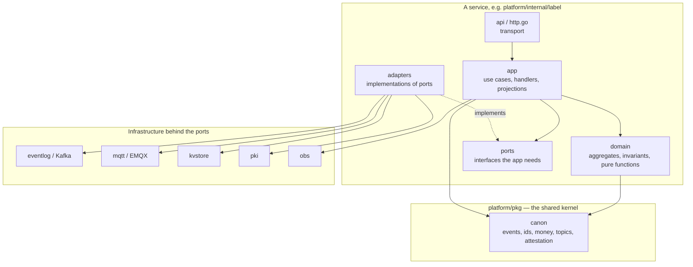

# 0010 — Go and a ports-and-adapters structure for the backend

**Status:** Accepted

---

## Context

The same business logic has to run in three very different places:

- **The cloud tier**, on Kubernetes across three regions, against Kafka, a real
  MQTT broker and a warehouse.
- **A Store Gateway Unit**, which is a fanless x86 appliance with 2 GB of RAM in a
  stock room, no container runtime, no Python, no BLAS, and no reliable WAN.
- **One process on a laptop**, because that is what a reviewer, a test suite and a
  single-store pilot actually need.

The Tier-1 pricing rules in particular have to produce the *identical* decision in
all three, because a store operating autonomously that reaches a different
decision from the cloud rewrites prices customers have already seen when the link
returns.

## Decision

**Go, standard library only, in a hexagonal (ports-and-adapters) layout.**

`go.mod` declares `module github.com/usslp/usslp` and `go 1.24` and nothing else.
There are no third-party dependencies in the tree. The size of it — file, test
and line counts, dated, with the commands that produced them — is in the root
`README.md`; it is not repeated here, because a figure repeated in two places is
a figure that will disagree with itself.

### Why Go

- **One static binary, no runtime.** The SGU installer
  (`deploy/edge/install.sh`) drops a binary into a versioned directory and
  symlinks `current`. There is no interpreter, no shared library, no package
  manager on the appliance.
- **`CGO_ENABLED=0` everywhere**, so the same source cross-compiles to the arm64
  a Store Gateway Unit frequently is (`.github/workflows/release.yml`) without a
  toolchain per target.
- **Concurrency that matches the shape of the work.** The platform is a set of
  consumers, publishers and timers; goroutines and channels are the right
  primitive and the race detector is in the standard toolchain (`make
  test-race`).
- **Deterministic, allocation-visible code where it matters.**
  `pricing/domain` allocates nothing on the evaluation path beyond one small
  violation slice, which is what makes a sub-millisecond Tier-1 decision
  credible at 52,000 evaluations a second.

### Why no dependencies

This is the more consequential half. It is why the tree contains an MQTT broker,
an event log, an LSM store, a metrics registry, a JWT implementation, a WebSocket
implementation and four machine-learning models written by hand. Each of those is
recorded separately ([0011](0011-in-tree-log-and-broker-behind-ports.md),
[0013](0013-hand-written-ml-in-go.md),
[0014](0014-columnar-analytics-store.md)); the shared reason is that every one of
them has to run on an appliance with no network, and that `make demo`, `make
test-e2e` and `make run` all have to work with Go 1.24 and nothing else.

### The layout

Every service is the same four layers, and the dependency direction is inward
only:

`platform/internal/label/app`'s package comment states the rule and what it buys:
everything in `app` depends only on `domain` and `ports`, which is what makes the
price path testable end to end in milliseconds with in-memory fakes, and what
lets the same handlers run against the embedded event log on a store gateway and
against Kafka in the cloud without a line changing.

`platform/pkg/canon` is the shared kernel — the one package every service and
every tier agrees on. It holds the event envelope, the identifier types, money,
the stream catalogue, the MQTT namespace and the attestation format. It is the
enforcement point for `INTERFACE-CONTRACTS`, and
`TestLatencyBudgetMatchesTheContract` checks the runtime against the document.

`platform/cmd/usslpd/stack` is the composition root: it constructs every service
in one process against one shared event log, one cloud broker, one store gateway,
its controllers and a simulated fleet.

## Consequences

**A reviewer can run the whole platform with `make run` and no infrastructure.**
That is not a convenience; it is what makes `make test-e2e` a suite of claims
rather than a suite of mocks. The end-to-end tests boot a real runtime per test
group with an ephemeral data directory and assert on behaviour.

**The same binary is a legitimate production shape.** `usslpd` is what a
single-store or disconnected pilot wants, not only a test fixture.

**Writing the infrastructure is a real cost that shows up as risk, not as lines.**
`pkg/mqtt` is a complete MQTT 3.1.1 broker and client; `pkg/kvstore` is a WAL
plus a skip-list MVCC index plus checkpoints; `pkg/eventlog` is a partitioned log
with consumer groups, rebalancing, retention, compaction and dead-lettering.
Every one of those is code the platform now owns and has to maintain, and none of
them has the field history of the thing it stands in for.

**The ports are only proved by one implementation each.** The seam is real —
`eventbus.Bus` and `msgbus.Client` are narrow, and services are written against
them — but a port that has never had a second implementation behind it is a port
whose abstraction has not been tested. See
[0011](0011-in-tree-log-and-broker-behind-ports.md) for what that means today.

**Go's type system does not enforce the layering.** Nothing prevents a handler in
`app` importing an adapter. The discipline is convention plus review, and it
holds in the current tree, but it is not a compile error.

## Alternatives considered

**Rust.** Better fit for the firmware-adjacent parts and no garbage collector.
Rejected for the backend on ecosystem and hiring, and because the GC is not on
the critical path: the pause metric is exported
(`usslp_go_gc_pause_p99_seconds`) and alerted on (`USSLPGCPauseHigh`), and the
budget it competes for is 120 ms of Label Service time out of 3,000.

**Java or Kotlin on the JVM.** The strongest Kafka ecosystem by a wide margin,
which is exactly where the tree's biggest gap is. Rejected on the appliance: a
JVM in a 2 GB stock-room box, cross-compiled to arm64, with a cold-start
requirement after a power cut, is the wrong shape.

**Python for the pricing and ML tier, Go for the rest.** Rejected because the
Tier-1 and Tier-2 pricing decisions have to run *on the gateway*, and the gateway
has no Python runtime. Splitting the language would have split the rules engine,
which is the one thing that must be bit-identical across tiers. See
[0013](0013-hand-written-ml-in-go.md).

**Using third-party libraries for the infrastructure** — `paho.mqtt`,
`segmentio/kafka-go`, `pebble`, `prometheus/client_golang`. This is the
defensible alternative and the one a production team would probably take. The
cost of the choice actually made is written above; the benefit is that
`git clone && make demo` works, on any machine, with no network.
