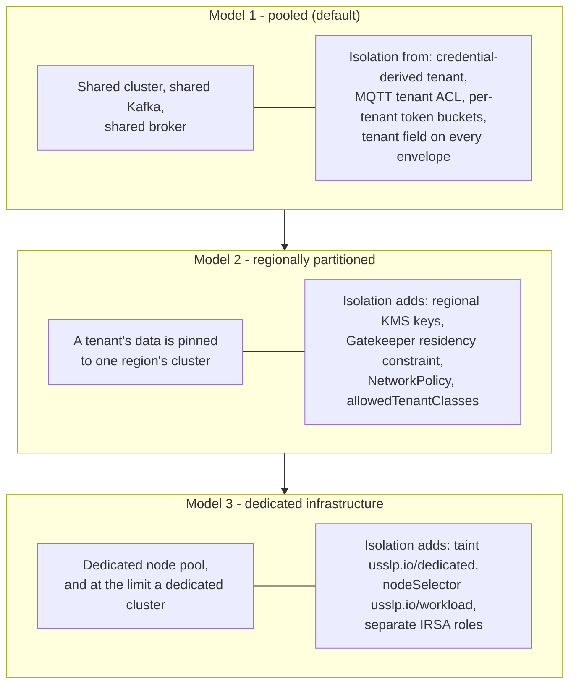

# 0012 — Multi-tenancy: three isolation models, and a tenant boundary that is constructed rather than checked

**Status:** Accepted

---

## Context

USSLP serves several retailers from one platform. Two of them may be direct
competitors, and the data they entrust to it — every price, every promotion,
every store's planogram, the full shape of the estate — is close to the most
commercially sensitive material a grocer holds. A cross-tenant leak is not a
privacy incident, it is a competitive one, and it is unrecoverable.

The internal services, meanwhile, are written to trust their callers. The Label
Service reads a tenant from `X-USSLP-Tenant`; the Device Registry reads one from
a path segment; the Pricing Service reads one from a header. That is the correct
design for a service mesh where every hop is mutually authenticated and the only
clients are other USSLP components — and it is catastrophic if any of those
services is ever exposed directly.

## Decision

### Part one: the tenant boundary is constructed, not checked

`platform/internal/apigw`'s package comment states it as a principle: **tenancy is
not a check, it is a construction.**

A request's tenant is derived exclusively from the credential that authenticated
it — an API key record, a verified JWT, or the SPIFFE identity in a client
certificate — and is then *stamped onto* the proxied request, overwriting
anything the client sent. Three credential types, one output: a `Principal` whose
tenant came from the credential and from nowhere else. Handlers never see a
token, a certificate or a key.

The mechanical half is `scrubbedRequestHeaders`. Every inbound request has
`X-USSLP-Tenant`, `X-USSLP-Subject`, `X-USSLP-Roles`, `X-USSLP-Stores` and the
upstream selector **deleted at the door**, before authentication and before
routing. The reasoning is in the file: if a client could set the header and the
gateway merely overwrote it in the happy path, then any code path that forwarded a
request without going through the rewrite — a future health probe, a mistaken
direct handler, a proxy bug — would be a cross-tenant hole. Deleting the headers
means no such path can exist.

Upstreams that scope by path (the UIG) are addressed through a rewrite template
whose tenant segment is filled from the principal, never from the URL.

The observable consequence, pinned by
`TestCrossTenantLabelAccessIsNotFound`: a fully authenticated tenant A asking for
a label belonging to tenant B gets **404, not 403**. Confirming that an
identifier exists somewhere in the platform is itself a cross-tenant leak.

### Part two: the MQTT namespace makes isolation a one-line ACL

`canon.TopicScope` builds every device topic as
`usslp/{tenant}/{region}/{store}/…`, and the tenant segment sits immediately
below the root **for exactly this purpose**. One ACL rule — *subscribe only to
`usslp/{your-tenant}/#`* — is complete isolation, and every device credential is
issued with precisely that constraint. Cloud service credentials get a
cross-tenant wildcard.

`mqtt.TenantAuthorizer` enforces it on every packet, not per connection. Two
details make it airtight rather than nominal:

- A subscribe filter must name its tenant **literally**. `usslp/+/#` is refused,
  because a `+` in that position would match every tenant on the broker. An
  authorizer has to reason about what a filter could match, not about one
  concrete topic.
- The tenant comes from the client certificate's Organization when there is one,
  and only falls back to the username otherwise — a certificate is issued by the
  platform's CA, a username is whatever the device was told to send.

Publish and subscribe are authorised separately, because a store's POS bridge may
publish price updates and must never subscribe to another lane's traffic, and a
controller is the mirror image.

### Part three: three isolation models, chosen per tenant

| | Model 1 — pooled | Model 2 — regionally partitioned | Model 3 — dedicated |
|---|---|---|---|
| What is shared | Everything | Compute and streams within a region | Nothing below the control plane |
| Where it is in the tree | `apigw` principal derivation, `canon.TopicScope`, `mqtt.TenantAuthorizer`, `TenantLimiter` | `values-prod-euw1.yaml` / `values-prod-aps1.yaml` `dataResidency.enforced`, `deploy/policy/gatekeeper` `USSLPDataResidency`, per-region `deploy/terraform/regions/*`, regional (never multi-region) KMS keys | `nodeSelector: usslp.io/workload`, `tolerations: usslp.io/dedicated`, per-service IRSA roles per region |
| Bought by | Every tenant | Tenants with a residency obligation | Tenants with a contractual isolation requirement |
| Cost | None | A cluster per region; no cross-region restore without re-encryption | A node pool or cluster per tenant |

The KMS decision is worth calling out because it is where residency stops being a
label and becomes a mechanism: every key is **regional and not multi-region**. A
multi-region key has replicas whose material is identical everywhere, which would
let a caller in us-east-1 decrypt an eu-west-1 ciphertext — exactly what
residency forbids. The stated cost is that a cross-region restore is impossible
without re-encrypting, and that is the intended cost.

## Consequences

**Measured, in the hardest configuration.** `TestNoCrossTenantLeakage` runs two
retailers in *one process*, where there is no network, no cluster and no
namespace between them — only the code. It asserts on all four surfaces they
share and all four pass: the HTTP API (including the fan-out directory, which
resolves zero of tenant A's labels for tenant B), the event stream, the MQTT
namespace, and credentials. If tenancy holds there it holds when the two are in
different clusters.

**The gateway is the only process that may face the public internet.** That is a
deployment invariant this decision creates, and violating it is silent: an
internal service exposed directly would take `X-USSLP-Tenant` from whoever sent
it. `deploy/istio/peerauthentication.yaml` is STRICT namespace-wide with one
port-level exemption for the MQTT broker, which terminates connections from
appliances that will never have an Envoy and authenticates them with device mTLS
instead.

**The event streams are attributable, not physically separate.** One Kafka
cluster serves every tenant in a pooled deployment, and the isolation is the
tenant field on the envelope plus the consumer's own filtering — the tenancy test
says so explicitly rather than implying stronger separation than exists. A
consumer with a bug that ignores the field is a leak, and nothing structural
stops it.

**Noisy-neighbour isolation is a rate limit, not a partition.**
`app.TenantLimiter` gives each tenant a token bucket sized from the capacity
model: 10,000 sustained label updates per second (a fifth of the platform's
52,000 peak) with a burst of 40,000, which is one store's worth of labels, so the
common case never waits. Without it, one tenant's overnight repricing occupies
every worker in the pool for minutes while another tenant's single urgent change
— a mispriced item a manager is standing next to — waits behind it. A *global*
limiter does not fix that; it just means the loudest tenant consumes the whole
global budget.

**Permissions are coarse and store scope is separate.** `apigw/rbac.go` has nine
resource nouns and three actions, and no `delete` — in an event-sourced platform
nothing is deleted, it is retired, revoked or expired, each of which is a write.
"This key may only touch store 42" is expressed as the principal's store scope
rather than as a combinatorial explosion of permission names. `keys` is
deliberately its own resource: the ability to mint credentials is the ability to
escalate to anything, so it is never folded into a general admin grant.

**A residual: the WebSocket credential channel.** A browser cannot set
`Authorization` on `new WebSocket(...)`. The remaining options are a query
parameter — which lands in every access log, proxy log and browser history in
between — and the subprotocol header, which does not. The console offers
`["usslp.v1", "usslp.credential.<key>"]` and the gateway selects `usslp.v1` in
its response, never echoing the credential back. It is the least-bad channel, not
a good one.

**Model 3's boundary is Kubernetes scheduling, which is a weaker boundary than a
cluster.** A taint and a nodeSelector separate workloads; they do not separate
control planes, and a compromise of the shared API server crosses them. A tenant
whose requirement is genuinely "no shared control plane" needs a separate cluster,
which the ApplicationSet supports by adding an entry rather than by a new
mechanism.

## Alternatives considered

**A tenant column checked in every query.** The conventional approach. Rejected
because it is a check, and a check is something a code path can miss. Every
missed check is a silent cross-tenant read, and the number of code paths only
grows.

**A database, schema or namespace per tenant.** Strong isolation, and it does not
survive the numbers: at 100,000 stores across tens of tenants it multiplies
migrations, connection pools and operational surface by tenant count, and the
edge tier gets none of the benefit because a store gateway serves exactly one
tenant anyway.

**Deriving the tenant from a subdomain.** Attractive because it is visible in
logs. Rejected: it is client-controlled, so it would have to be verified against
the credential anyway, at which point the credential is the source and the
subdomain is decoration that will eventually be trusted by mistake.

**403 instead of 404 for cross-tenant access.** More honest as an HTTP status,
and it leaks. Rejected explicitly and tested against.

**One MQTT broker per tenant.** Would make the ACL question moot. Rejected on
operational cost, and because it does not remove the problem — a store gateway
still bridges between a local broker and a shared cloud one, so the namespace
discipline is needed regardless.
