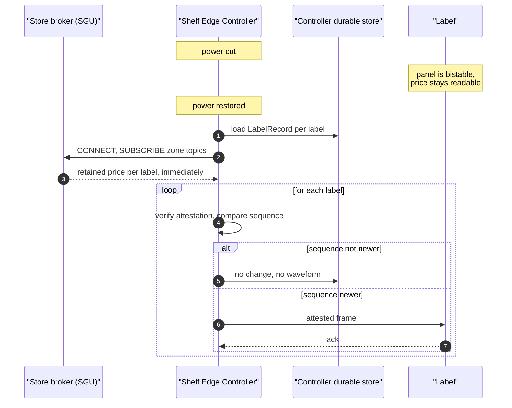

# 0015 — MQTT retained messages as the store's cold-start recovery mechanism

**Status:** Accepted

---

## Context

A Shelf Edge Controller loses power. The store's mains trips, a cleaner unplugs
a cabinet, a UPS runs out during a longer outage. When it comes back it has to
answer one question before it can do anything useful: **what price is every label
in my zone supposed to be showing?**

There are four ways to answer it and three of them are wrong for this platform.

- **Ask the cloud.** Requires a WAN link that may not exist —
  [0003](0003-edge-first-architecture.md) exists precisely because it often does
  not — and turns a local power blip into a cloud dependency.
- **Re-drive every label.** A store-wide fan-out at boot: 40,000 full waveforms
  in a hypermarket, each roughly a hundred times the energy of anything else a
  label does, for prices that in almost every case have not changed.
- **Poll the labels.** `edge/labelsim/wire.go` notes the cost directly: polling
  40,000 labels would consume the zone's whole airtime budget, and a sleepy end
  device is unreachable except in its own receive window anyway.
- **Keep durable local state and trust it.** The controller does keep a durable
  `LabelRecord` per label. But a controller that has been power-cycled has to
  know whether a retained price update it receives on reconnect is *news* — and
  its own record cannot tell it what happened while it was off.

## Decision

**Every downstream price and configuration topic is published with the MQTT
retain flag set, and the store's own broker holds it.**

`INTERFACE-CONTRACTS` §3 fixes which topics are retained:

| Topic | QoS | Retain |
|---|---|---|
| `…/sec/{sec}/labels/{label}/price` | 1 | **yes** |
| `…/sec/{sec}/labels/{label}/config` | 1 | **yes** |
| `…/store/planogram/update` | 1 | **yes** |
| `…/sec/{sec}/labels/{label}/ota` | 2 | no |
| `…/sec/{sec}/zone/price` | 1 | no |
| `…/store/promotion/activate` | 1 | no |

`MQTTDevicePublisher.PublishPrice` sets it, and the comment on that function
calls the flag out as contract rather than preference: *a controller rebooting
after a power cut recovers the current price of every label in its zone from the
local broker, with no round trip to a cloud that may be unreachable. This single
flag is most of what makes a store survive a WAN outage with correct prices on
the glass.*

Upstream, three topics are retained for the mirror-image reason —
`…/sec/{sec}/heartbeat`, `…/sec/{sec}/mesh/status` and `…/store/mode` are
last-known-state, so a subscriber that connects after the fact still learns the
current answer rather than waiting for the next publication.

The retained set combines with the sequence rule
([0008](0008-at-least-once-with-monotonic-sequence.md)) to make recovery a no-op
in the common case: the controller receives the retained price, compares it
against its durable `LabelRecord`, and if the sequence is not newer it drives no
waveform at all. The panel is bistable, so the price is still readable on the
glass the whole time the controller was off.

## Consequences

**Recovery is bounded by broker delivery, not by a cloud round trip or by
40,000 waveforms.** A controller is back in service in the time it takes to
receive its zone's retained set.

**It works with the WAN down.** The retained messages live on the *store's*
broker, inside the building. The bridge stopping does not empty it.

**The broker's retained set becomes state that must be correct.** Retained
messages are a store of record now, with the memory and disk cost that implies
(`usslp_mqtt_broker_retained_messages` is exported for exactly this reason). A
store of 40,000 labels is 40,000 retained payloads on the store broker.

**A stale retained message on the wrong topic is a real failure mode, and the
code names it.** `sec.ErrUnknownLabel` — "the update addressed a label this
controller does not own" — is documented as usually meaning a planogram change
left a stale retained message on a zone topic. Retained state does not expire on
its own; when a label moves between controllers, the old topic has to be cleared
with a zero-length retained publish or the next controller reboot resurrects a
placement that no longer exists.

**Retained delivery does not bypass verification.** A retained price arrives at
the controller through the same path as a live one and is verified the same way
([0004](0004-end-to-end-price-attestation.md)), which matters because an attacker
with write access to the store's broker could otherwise plant a retained message
that survives every reboot. `TestTamperedPriceIsRefused` attacks exactly that
surface.

**Retained prices interact with key rotation, and that is why the overlap is
30 days.** A controller re-verifies its cached state from scratch on every
reboot. A store that loses power during a refit may verify, weeks later, a price
signed before a rotation. `pki.DefaultRotationOverlap` is sized from that case
rather than from cryptographic hygiene: an overlap shorter than the longest
plausible gap between signing and verification turns a routine rotation into a
store full of labels refusing to redisplay what they are already showing.

**The gateway's reconnect logic has to expect retained state early.** The cloud's
retained view can arrive milliseconds after the link returns and seconds before
the WAN detector's hysteresis admits the store is back, which is why
`sgu.onModeChange` arms collection on *entry* to autonomy rather than on exit
([0009](0009-hybrid-logical-clocks-for-reconciliation.md)).

## Alternatives considered

**Replaying the compacted `label-state` stream on controller boot.** This is the
cloud-side equivalent and it does exist — `label-state` is compacted precisely so
a restarting *service* rebuilds its read model without replaying seven days of
history. Rejected for the controller because it requires reaching the event
stream, which is across the WAN.

**A snapshot file the controller writes and reads.** The controller does keep
one. It is not sufficient on its own: it records what the controller believed
when it went down, not what changed while it was down, and the retained set is
what closes that gap.

**Re-driving every label at boot.** Rejected on energy: full waveforms across a
zone for prices that have not changed is the single most expensive thing a
platform can ask a coin-cell fleet to do, and it would happen on every power blip.

**Querying the SGU's replica over HTTP at boot.** Workable — the gateway holds a
full replica of the store's label state — but it adds a second recovery path with
its own failure modes to sit alongside the one MQTT already provides for free,
and the retained set arrives as part of the subscription the controller has to
make anyway.

**Not retaining, and accepting that a rebooted controller has a stale view until
the next price change.** Rejected because "the next price change" for a stable
grocery line can be weeks, and the controller's view is what the delivery-failure
reporting and the fleet health model are derived from.
