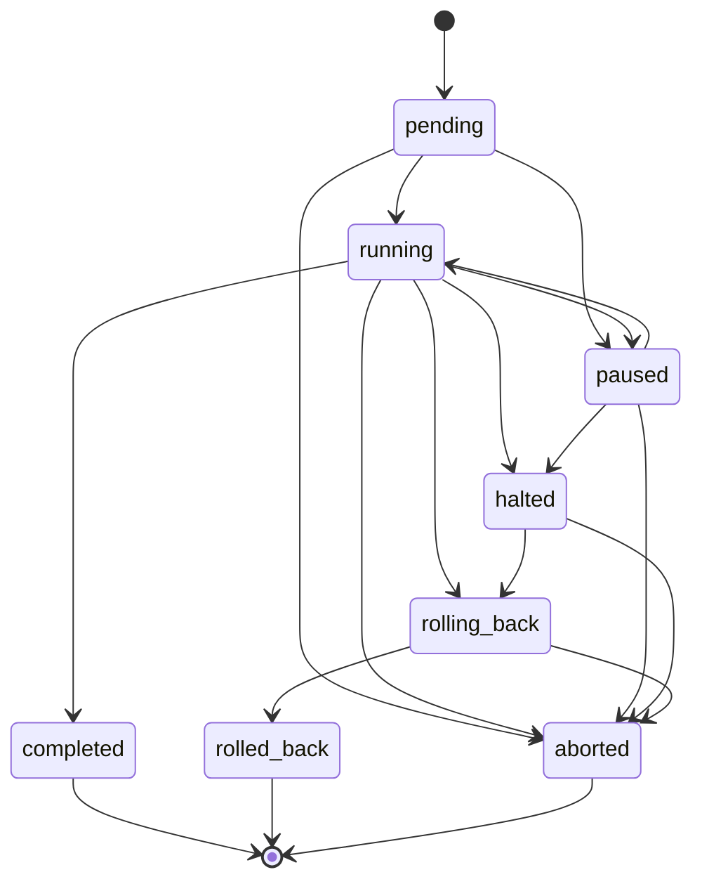

# 0016 — Staged OTA rollout with automatic rollback, signing the manifest rather than the image

**Status:** Accepted

---

## Context

A shelf label cannot be recovered over the air once it stops booting. Recovery is
a person walking an aisle with a screwdriver, per device, and production labels
have no SWD header. At 50 million devices, a firmware image that bricks 1% of the
fleet is 500,000 service visits.

Two failure modes matter more than the obvious one:

- **A bad image succeeds, and only later fails.** An image with a bug in its
  sleep path drains a coin cell in weeks instead of years. An image that bricks
  the radio produces *silence*, which looks identical to a healthy device that
  has not reported yet.
- **A perfectly legitimate, properly signed image is installed on the wrong
  hardware.** A 4.2-inch three-colour panel driven by a 2.9-inch monochrome
  waveform is a brick, and over-driving a waveform bakes a permanent shadow that
  is invisible for weeks and not recoverable at all.

The second is the more dangerous one, because a signature over the raw image does
nothing to prevent it.

## Decision

### Sign the manifest, not the image

`ota/domain.SigningManifest` fixes the signed byte string:

```
usslp-firmware-v1 \n <version> \n <hardware tier> \n <lowercase sha256 hex>
```

The reasoning is in the file. Signing the raw image would prove only that some
authorised party once built those bytes. It would say nothing about what they are
*for*. Binding the version and the hardware tier into the signed string makes it
impossible to re-declare an image as a different tier without invalidating its
signature. The digest is included rather than the image itself so verification is
constant-cost regardless of image size, and the fields are separated by a byte
that cannot occur in any of them so no two different field splits produce the
same string.

`KeyRing.Verify` tries **every** key in the ring rather than only the one the
upload names, because the key identifier travels with the signature and is
therefore attacker-controlled; trusting it to select the key would let an
attacker point verification at whichever key they had a signature for. The ring is
a set rather than a single key because a fleet of 50 million devices is never all
on one side of a rotation at one instant.

An unsigned artifact is refused at **upload**, not at rollout (`ErrUnsigned`) —
it is not a degraded case to warn about, it is one the pipeline has no way to
evaluate.

### Stage the rollout, and make membership a pure function

`DefaultCohorts` is `{1, 5, 25, 100}`, cumulative. Cumulative is the form an
operator reasons in ("we're at 25%") and the form that keeps a wave's membership
stable when a later wave's size is changed mid-rollout. The shape is a compromise:
1% of a large fleet is still a large enough sample that a 2% failure rate is
unmistakable rather than noise, and small enough that an image that bricks
everything it touches is a manageable number of service visits rather than a
national incident.

Membership is `SHA-256(jobID, 0x00, deviceID) mod 10000`, not a stored list.
Nothing to store, nothing to reconcile, nothing that can drift across a service
restart, a controller failover, a job paused for a week, or a fleet that gained
and lost devices meanwhile. Ten thousand buckets gives hundredth-of-a-percent
resolution, which matters because 1% of 50 million is 500,000 devices and a
rollout manager sometimes wants a first wave an order of magnitude smaller. The
job identifier is mixed in so two consecutive rollouts do not pick the same
unlucky 1% twice — otherwise one store's shelf is the canary for every release
the platform ever ships.

### Four health gates, because a bad image fails in four ways

| Gate | Default | Why it is separate |
|---|---|---|
| `MaxErrorRate` | 2% | The obvious signal: the update failed outright |
| `MaxBootFailureRate` | **1%** | The device took the image and did not come back. Lower than the error rate because a boot failure is a device somebody has to physically retrieve, where a failed update is a device still running its old firmware that can be retried. It is reported by the *controller*, since the device reports nothing. |
| `MaxSilenceRate` | 5% | The one a naive controller always misses: it counts successes and failures, sees no failures, and advances a rollout that has killed every device it touched |
| `MaxBatteryAnomalyRate` | 5% | Post-update drain materially worse than the pre-update baseline — a sleep-path bug shows up here long before it shows up as a failure |

Plus `MinSuccessRate` 95%, `MinCohortSamples` 20 — without which a first wave of
three devices with one failure reads as a 33% error rate and halts a rollout on
no evidence — and `SoakDuration` 30 minutes, because the failures that matter most
take time to appear and a rollout that advances the instant the last
acknowledgement lands has tested nothing except the download.

### The state machine forbids two edges deliberately

There is **no `halted → running`**: a job the controller stopped for a failed
health gate must not be restarted by the same "resume" button an operator uses on
a job they paused themselves, because the two situations call for entirely
different judgement. And there is **no `rolled_back → anything`**: a finished
rollback is history, and the way to try again is a new job with a new artifact.



### Airtime and quiet hours are part of the rollout, not around it

`DefaultMaxConcurrentPerSEC` is **4**, and the reasoning is airtime arithmetic: a
250 kbit/s nominal channel yields perhaps 40 kbit/s of usable application
throughput once mesh routing, retries and duty cycles are accounted for, so a
300 KiB image is about a minute of exclusive airtime per label — against a price
path whose whole Zigbee slice is 300 milliseconds. Four leaves headroom for the
traffic the shelf edge is actually for. Eight would halve the rollout and put
price updates behind a firmware queue, which is the wrong trade in a building
where a wrong price is a regulatory matter and a slow rollout is not.

The budget is a semaphore *per controller* rather than a global rate limit,
because the contended resource is per controller: two labels on opposite sides of
a store share nothing.

`QuietHours` is a store's local window, and `time/tzdata` is embedded in the
binary rather than relying on the container image. A scratch image has no time
zone database, `time.LoadLocation` returns an error, and the natural handler for
that error is a fallback to UTC — which in July shifts a London store's quiet
window an hour into trading. 450 KiB of binary removes an entire class of
environment-dependent wrongness from a safety-critical calculation.

### On the device: tier check first, and "confirmed" means more than "booted"

The firmware's order is manifest → **tier check** → version check → chunks →
delta apply → SHA-256 against the manifest → structural check → mark → reset →
confirm-or-revert. The tier check is first, **before any flash is erased**.

`usslp_slot_verify_signature` is explicitly *not* an authenticity check, and the
firmware says so rather than implying otherwise: Zephyr does not expose MCUboot's
verifier to the application, and moving it there would mean moving the key there,
which would defeat it. What it checks is that the assembled image is structurally
an image, plus the SHA-256 against the manifest — which catches a corrupt
transfer while the label is still awake instead of after two reboots. A *forged*
image passes it and fails at boot, where MCUboot checks the signature. That is
the correct division of labour.

"Confirmed" means **joined the mesh and applied one price update**, not "booted".
An image that boots and cannot join is exactly as unreachable as one that does
not boot. Until both have happened the watchdog is armed and a reset reverts.

Two full-size 424 KiB slots rather than swap-move: swap-move rewrites the running
slot during the swap, so a power loss mid-swap leaves the device depending on
MCUboot's recovery path. On a device that must be physically retrieved if it does
not boot, 424 KiB of flash to keep the running image immutable until the new one
is verified is the right trade.

## Consequences

**Measured.** `TestOTARollbackOnCohortFailure`: cohort 0 updated 12 devices
successfully; cohort 1 produced 16 boot failures; the controller halted with
`boot-failure rate 100.00% exceeds the 1.00% threshold (8 devices did not come
back)`; **0 devices were in flight when it halted and none were added
afterwards**; 40 labels remained on working firmware 1.4.2. `USSLPOTARollbackTriggered`
and the `usslp.slo.ota` burn-rate group cover it in production.

**The OTA SLO has no five-minute window**, because a rollout dispatches in waves
with quiet-hour gaps between them and a five-minute rate is frequently zero and
frequently unrepresentative. The short window of each burn-rate pair is 30 m / 2 h
instead.

**A rollout is slow by design.** Four cohorts, a 30-minute soak between each,
four concurrent downloads per controller, inside a store's quiet hours. A fleet
update is measured in days. That is the correct trade for a device that cannot be
recovered over the air, and it means a security fix cannot be pushed in an hour —
which is a real limitation, not an oversight.

**The OTA slot, not the part, is the binding flash constraint.** The 2.9-inch
build is estimated at ~343 KB against a 424 KiB slot: 81%. Only the 21,392-byte
portable core row of that estimate is measured; every other row is an engineering
estimate from published nRF Connect SDK footprints, **because nothing in the
firmware has been linked**. `scripts/memory_report.sh` produces the real numbers
once it can.

**None of the device-side half has ever been compiled.** The OTA controller, the
slot handling and the MCUboot integration all include `zephyr/` headers and have
never been fed to a compiler. The portable half — the delta applier and the
inflater — has been tested hard: a patch `domain.Diff` produced reconstructs its
target byte for byte, a wrong base is refused before any write, and **every
single-bit corruption of all 185 patch bytes** is refused, as is truncation at
every length.

## Alternatives considered

**Sign the image bytes.** Rejected on the wrong-tier failure above, which is the
one that bricks devices permanently.

**A stored cohort membership list.** Rejected: 50 million rows written
transactionally with the job, reconciled on every provision and retirement, and
replayed identically after a crash. A hash makes membership a pure function with
nothing to drift.

**A single health gate on error rate.** Rejected because it cannot see silence,
and silence is what a bricked fleet looks like.

**Swap-move OTA slots** to halve the flash cost. Rejected: it rewrites the
running slot during the swap, so a power loss mid-swap depends on MCUboot's
recovery path on a device that has to be physically retrieved if it does not
boot.

**Faster cohorts, or no soak.** Rejected because battery-drain and
watchdog-reboot failures do not appear inside the download window, and a rollout
that advances the instant the last acknowledgement lands has tested only the
download.
