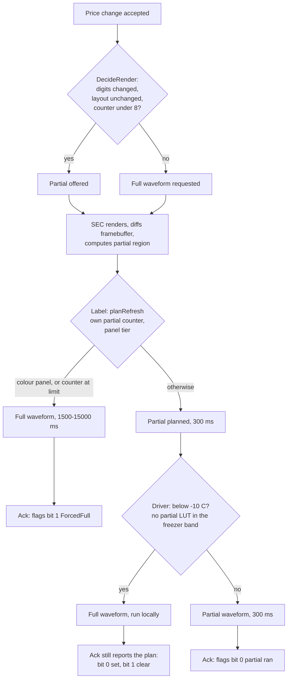

# 0017 — The E-Ink partial-versus-full refresh policy and the ghosting constraint

**Status:** Accepted

---

## Context

The single largest line item in the three-second price path is the E-Ink
waveform. `INTERFACE-CONTRACTS` §4 gives it 2,000 ms of a 3,000 ms budget, and
the panel specifications behind that are not negotiable:

| Tier | Panel | Full waveform | Partial | Max consecutive partials | Refresh current |
|---|---|---|---|---|---|
| 0 | 2.9″ 296×128 BWR | 1,500 ms | 300 ms | 8 | 26 mA |
| 1 | 4.2″ 400×300 BW | 2,000 ms | 300 ms | 8 | 30 mA |
| 2 | 5.85″ 600×448 ACeP | 15,000 ms | **none** | 0 | 35 mA |

A full waveform drives every particle to both rails and visibly flashes the panel
black and white. A partial rewrites only the pixels that changed. Inside a
three-second budget, 1,500 ms versus 300 ms is the difference between meeting the
SLO and missing it, and on a shelf of forty labels updating together the flash is
the difference between "the prices changed" and "something is wrong with the
shelf".

But a partial waveform is short precisely because it does not drive the particles
fully to their rails. Residual charge accumulates, and after enough consecutive
partials a faint image of the previous content remains. **On a shelf label that
ghost is a previous price.** A shopper can read two prices on one label, which is
a weights-and-measures problem rather than a cosmetic one. The only way to clear
it is a full waveform.

The panel is bistable, so the residue survives a reboot even though RAM does not.

## Decision

**Partial refresh is offered by the cloud and decided by the label, and the label
has the last word.**

### The cloud offers: `label/domain.DecideRender`

`partialSafe` returns true only when all of the following hold:

- The label has a previous price at all. **The first price a label shows is
  always drawn with a full waveform.**
- The partials-since-full counter is below `Policy.FullRefreshEvery` (default 8).
- Template, badge, LED colour and show-was are all unchanged — a change to any of
  them alters regions outside the price field, and the controller's cached
  framebuffer for those regions is no longer valid.
- The currency is unchanged, because a currency change moves the symbol and
  therefore the whole field.
- The price actually changed. Re-publishing an identical price — a controller
  replacement, a retained-message rebuild — must redraw from a known state rather
  than partially rewriting nothing.
- The rendered width is unchanged. 9.99 to 10.99 forces a full refresh, because
  the digit field is re-laid out and the partial region the controller would
  compute no longer covers the change.

At the default of 8, a label repriced twice a day is fully cleared every four
days, and a promotion-heavy label repriced hourly every eight hours.

### The controller renders: `edge/sec/render.go`

The cloud declares *intent* in a `canon.RenderSpec` ("promo template, badge SALE,
show the was-price"); the controller decides *pixels*, because only the
controller knows which panel is clipped to that shelf edge today. Reassigning a
2.9-inch label to a 4.2-inch bracket must not require the cloud to know. The
controller then diffs its cached framebuffer to compute the partial region.

### The label decides: `labelsim.planRefresh` / `display/usslp_render_policy.c`

The label has the last word because **only the label knows how many partials
actually reached the glass.** The controller's count is an estimate that a lost
frame, a reboot or a manual refresh invalidates, and a disagreement in the
controller's favour means a shopper can read the previous price ghosted behind
the current one.

The ghosting counter is persisted alongside the sequence, for the same reason the
sequence is persisted: the panel is bistable, so the residue outlives a reboot.

The driver adds one thing no policy above it can know: **below about −10 °C there
is no partial waveform at all.** A single-phase drive does not complete and
produces a smeared digit. `usslp_waveform_lut` returns no partial LUT in that
band, and `usslp_eink_refresh` falls back to a full refresh locally. It does
**not** report `ForcedFull`: the plan it is handed is `const`, so the ack still
carries the plan the policy made — bit 0 set, bit 1 clear. `ForcedFull`, bit 1
of the ack's flags byte, is set only by the two cases `planRefresh` itself
decides — a colour panel, and the partial counter at its limit — which is where
the controller's energy model does learn it did not get what it asked for.

### The colour panel cannot do this at all

The 5.85-inch ACeP tier has no partial waveform, for three independent reasons:
its waveform sequences the pigments through the whole stack and there is nothing
to shorten; its controller exposes no LUT override; and at 4 bits per pixel its
134 KB framebuffer does not fit in the label's RAM, so the firmware streams it
and has no local copy to diff against. `partialSafe` and `planRefresh` both know
this and never offer a partial for it.

## Consequences

**Measured, and it dominates the latency distribution.** In
`TestPriceLatencyPercentiles` over 1,000 changes, the refresh hop is **300 ms at
p50 and 1,500 ms at p99** against a 2,000 ms budget — the p50 is a partial and
the p99 is the periodic full. End to end, p50 544 ms and p99 2,365 ms. Under
sustained 40/s load the refresh is 300 ms at both p50 and p99 and the load
report says the mix of the two "sets the floor no amount of cloud capacity can
move".

A price change that moves only the last digits is 461–544 ms end to end. One that
changes the layout, or lands on the eighth refresh, is over 1,700 ms with the
same platform underneath it. **The panel, not the platform, is what the number is
mostly made of.**

**The eighth refresh is a visible latency cliff**, and it is not smoothable.
Every eighth price change on a label takes 1.2 seconds longer than the seven
before it.

**The unchanged-price gap is expensive here specifically.** A distinct POS
delivery carrying the price already on the glass currently refreshes the panel
([0008](0008-at-least-once-with-monotonic-sequence.md)) — and because the price
is unchanged, `partialSafe` returns false, so it is a **full** waveform. A full
waveform is roughly a hundred times the energy of anything else a label does, so
a POS that republishes its price book nightly would spend the fleet's battery
budget redrawing numbers that did not move.

**The colour tier cannot run the planning workload on a coin cell at all.** A
15-second waveform at 35 mA, ten times a day, is 60.8 µA on its own — nine times
the whole rest of the budget, giving 0.86 years against a 7–10 year target. At
one update a day it reaches 4.4 years, still short. It is a mains-powered or
low-cadence fitting, and `app/provision.c` computes the projection at
commissioning and raises `device.battery.projection.short` while a technician is
still standing in the aisle.

**The freezer aisle is the other place the policy meets physics.** Chemistry
derating takes a 2.9-inch label from 8.67 years at 20 °C to 6.23 at −20 °C, below
target — and below −10 °C there are no partials, so every refresh is a full one
and the projection is worse than the derating alone suggests.

**None of the waveform tables has been run on glass.** They are transcribed from
the panel datasheets' recommended tables with one deliberate change (a fourth
clear pass). A wrong waveform does not merely look bad: over-driving bakes a
permanent shadow that is invisible for weeks. Any change there needs a
temperature-chamber run and a thousand-cycle soak. `firmware/README.md` says so
under *Not verified*.

**The ghosting threshold of 8 is a policy value, not a measurement made here.**
`Policy.FullRefreshEvery` is described as "inside the ghosting threshold measured
on the platform's panels with a comfortable margin", and a tenant may tighten it
for a panel generation with worse ghosting. No measurement of actual ghosting on
actual glass exists in this tree.

## Alternatives considered

**Always full refresh.** Correct by construction, no ghosting, no counter, no
disagreement between tiers. Rejected on both budget lines at once: 1,500 ms of a
3,000 ms latency budget, and a hundredfold energy cost against a 6.584 µA total
that has to last a decade.

**Always partial, with a scheduled nightly clear.** Rejected because ghosting
accumulates with partial *count*, not with elapsed time, and a promotion-heavy
label can take dozens of partials in a day. It also makes the clear a store-wide
fan-out at a fixed hour, which is the worst shape of traffic for a shared radio
channel.

**Let the controller alone decide.** Simplest, and wrong: the controller's count
is an estimate a lost frame, a reboot or a manual refresh invalidates, and being
wrong in that direction puts two readable prices on one label.

**Let the cloud alone decide.** Worse still: it knows neither which panel is on
that bracket today nor the shelf temperature.

**Region-diffing on the label rather than at the controller.** Would let a label
compute its own partial region. Rejected on RAM: the label's framebuffer is
packed to two 1-bit planes (9,472 bytes for the 2.9-inch tier) precisely because
one byte per pixel is 37,888 bytes and does not fit alongside two radio stacks.
The controller can afford clarity; the label cannot.
