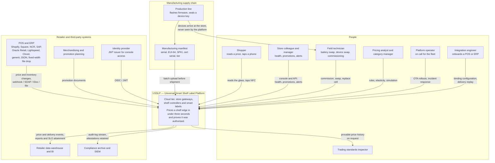

# 01 — System context (C4 level 1)

**Derived from:** `README.md`, `docs/architecture/INTERFACE-CONTRACTS.md`,
`docs/DEMO.md`, `platform/internal/uig/adapter/adapter.go`,
`platform/internal/uig/adapters/*`, `platform/internal/apigw/routes.go`,
`platform/internal/apigw/doc.go`, `platform/pkg/pki/doc.go`,
`platform/pkg/canon/attestation.go`, `platform/internal/registry/domain/manifest.go`,
`platform/internal/registry/app/provision.go`,
`platform/internal/analytics/domain/tables.go`, `firmware/README.md`,
`deploy/README.md`.

See also: [02 — Containers](02-containers.md) ·
[05 — Sequence diagrams](05-sequence-diagrams.md)

---

## The problem

Electronic shelf labels are not a new product. What has never worked is buying
them. Every incumbent platform ships bespoke middleware per point-of-sale
vendor, so the retailer's ability to put a price on a shelf edge is coupled to
whether somebody has written an integration for the exact ERP they run. A
grocer on a stock Shopify or Square estate can buy labels; a grocer whose price
book lives in a twenty-year-old AS/400 that writes a fixed-width file at two in
the morning cannot, at any price. USSLP replaces the per-vendor middleware with
one ingest pipeline behind a four-method protocol-adapter seam
(`uig/adapter.Adapter`: `Name`, `Verify`, `IdempotencyParts`, `Ingest`). A
Shopify webhook, a Square catalogue event, an NCR item-price message in XML or
JSON, an SAP PRICAT IDoc, an Oracle Retail SOAP envelope, a Lightspeed item
update, a Clover object reference that has to be fetched back, and that
fixed-width file all arrive downstream as the same
`canon.PriceChangeRequested`. Adding a retailer is a configuration change;
adding a POS vendor is one adapter.

The second problem is that a shelf edge is a legal instrument. Weights-and-
measures regulation — NTEP in the United States, OIML elsewhere — requires the
price a shopper reads on the shelf to be the price charged at the till. Most
platforms discharge that obligation procedurally: a process document, a
periodic audit, a member of staff walking the aisle with a scanner. USSLP
discharges it cryptographically. Every authorised price carries an Ed25519
signature over a canonical digest of *(tenant, store, label, SKU, price,
effective time, sequence, promotion)*, and that signature is verified twice —
at the Shelf Edge Controller, and again on the label itself, which rebuilds the
canonical string and checks it against its own key ring before it drives a
single pixel. A compromised controller, a corrupted mesh frame or an attacker
with write access to the store's broker cannot change a displayed price. They
can only stop one changing, which is visible within three missed heartbeats.

The third problem is that stores keep trading when the wide-area network does
not. A platform whose shelf prices are a function of cloud reachability will
eventually blank forty thousand shelf edges in a store whose DSL line reset, and
that is a trading incident, not an IT incident. USSLP puts a Store Gateway Unit
in the back office that runs the store's own MQTT broker, holds a replica of
every label's state, keeps a local promotion calendar on the store's own clock,
carries the Tier-1 pricing guard rails, and — where a delegation has been
issued — holds a store-scoped signing key so a locally originated price can
still be verified by the controllers. When the cloud link drops, the bridge
stops and the broker does not. On recovery the two sides reconcile through a
hybrid logical clock with an explicit, domain-aware conflict policy rather than
a bare last-writer-wins.

Both headline claims are measured rather than asserted. `make test-e2e` fails
the build if a price change stops reaching the glass inside three seconds, or if
a store stops trading through a severed uplink.

---

## Context diagram

---

## Who touches the system, and where

| Actor | Enters through | What they can do | Where it is implemented |
|---|---|---|---|
| Shopper | The glass, and the NFC tag | Reads the price. A tap serves an NDEF record that **follows** the glass and never leads it, so a tapped price and a displayed price can never disagree. | `firmware/src/nfc/nfc.c`, `edge/labelsim.Label.NFCTap` |
| Store colleague / manager | API Gateway console, `/v1/stores/{storeId}/…` | Store overview, label roster, device health, mesh map, battery runway, planogram upload, promotion activation | `platform/internal/apigw/routes.go`, `console.go` |
| Field technician | Commissioning path; `/v1/devices:provision`, `/v1/devices/{id}/retire` | Enrol a spare, retire a unit, quarantine and release | `platform/internal/registry/app/provision.go` |
| Pricing analyst | `/v1/pricing/rules`, `/v1/pricing/simulate` | Author guard rails, run elasticity and optimisation, simulate before committing | `platform/internal/pricing` |
| Platform operator | `/v1/ota/jobs…`, admin ports, `usslpctl` | Staged rollouts, pause/resume/abort/rollback, SLO and burn rate, chaos injection in dev | `platform/internal/ota`, `tools/usslpctl` |
| Integration engineer | UIG operator endpoints; binding configuration | Install a binding, inspect deliveries, replay a quarantined one past the guard | `platform/internal/uig/gateway`, `uig/deliveries` |
| Regulator / inspector | Exported price history and audit stream | Ask what a shelf showed, when, and on whose authority — answered from the label's own event stream plus the retained attestation | `label/domain` event stream, `canon.StreamAudit` |
| POS / ERP | `POST /v1/ingest/{tenant}/pos` and the adapter-specific endpoints | Push price and inventory changes | `platform/internal/uig` |
| Manufacturing | Manifest upload | Declare what was built: serial, EUI-64, public key, certificate serial, hardware tier | `platform/internal/registry/domain/manifest.go` |

### The supply chain is a trust anchor, not a logistics detail

Zero-touch provisioning works because the factory tells the platform, before
the hardware ships, exactly what it built. `domain.ManufacturingRecord` carries
the serial, the EUI-64 radio address, the SubjectPublicKeyInfo, the certificate
serial and the hardware tier. At first power-on the device presents a
certificate chain; the registry verifies it against the platform's own
hierarchy including revocation, extracts the identity **from the verified
certificate and never from the request body**, and then compares it against the
manifest record. A certificate that verifies but was never issued for a unit
that was actually built is refused and the identity is quarantined. So is a
second device presenting an identity the registry has already placed elsewhere.

That comparison is why the manifest records a public key at all: a certificate
that verifies proves only that some authority signed it, whereas comparing the
key proves it is the certificate issued to the unit that came off the line. An
attacker who obtained the ability to mint certificates still fails, because the
private key is sealed in that device's secure element.

### What the platform deliberately does not do

- **It does not price at the till.** USSLP publishes what the shelf shows; the
  POS remains the system of record for what is charged. The platform's job is
  to make the two provably equal.
- **It does not own the catalogue.** Product data arrives from the retailer.
  The Promotion Service evaluates against a supplied catalogue port
  (`promotion/ports`), it does not maintain one.
- **It does not decide authorisation.** `pkg/pki` binds an identity a caller
  has already authorised to a public key whose possession has been proven; the
  decision that a device is entitled to that identity is the registry's.
- **It does not address a label's radio from the cloud.** A tier only ever
  talks to the tier directly above and below it (INTERFACE-CONTRACTS §1).

---

## Regulatory and jurisdictional surface

| Obligation | How the platform meets it | Code |
|---|---|---|
| Displayed price equals charged price | Ed25519 attestation verified at the controller and again at the label; a failure holds the previous price and raises a compliance alert | `canon.Attest` / `canon.Verify`, `sec.Controller.Apply`, `labelsim` verdicts |
| Retention of the pricing record | `audit-log` stream at 365 days retention; the attestation is also stored on the label's own aggregate stream, which outlives every stream retention policy | `canon.StreamAudit`, `label/domain.PriceApplied.Attestation` |
| "Was/now" claims | `TemplatePromo` renders the struck-through previous price only when a was-price was supplied and is in the same currency | `label/domain/render.go` |
| Unit pricing (EU/UK) | `TemplateUnitPrice` with `unit_price` and `unit_measure` render fields | `label/domain/render.go` |
| Legibility | A partial E-Ink waveform is refused when it would leave a readable ghost of the previous price; the label has the last word because only it knows how many partials actually reached the glass | `label/domain.DecideRender`, `sec.DecidePartial`, `labelsim.planRefresh` |
| Data residency and tenant isolation | Tenant is the root of every isolation boundary: event keys, MQTT namespace, certificate subject, API principal. A device credential is issued with exactly one ACL — subscribe to `usslp/{your-tenant}/#` | `canon.TopicScope`, `pki.Identity`, `apigw/principal.go` |
| Promotion mechanics that cannot be shelf-priced | A `THRESHOLD` promotion drives a badge and an LED and leaves the undiscounted price on the glass, because that is what will match the till | `promotion/domain.Type.ShelfPriceable` |
