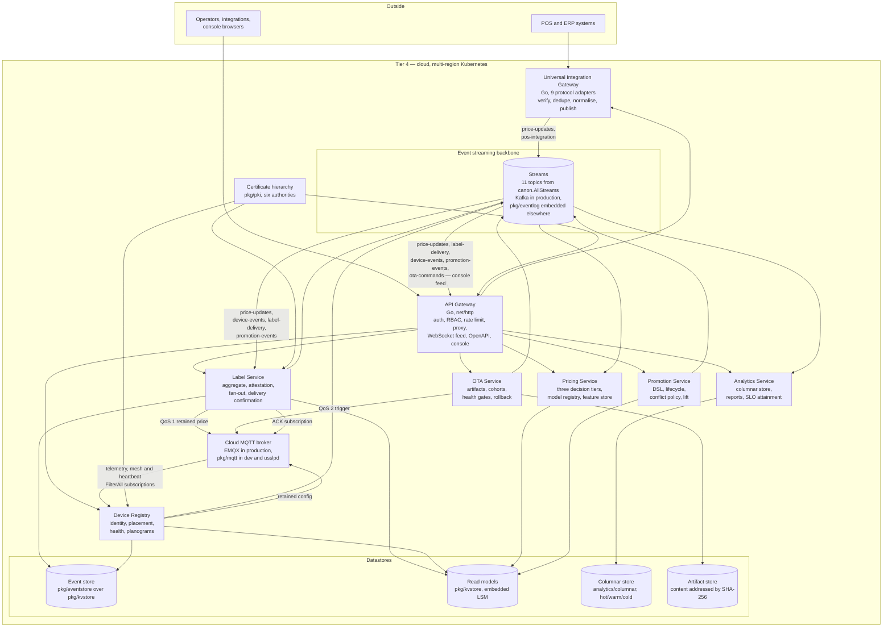
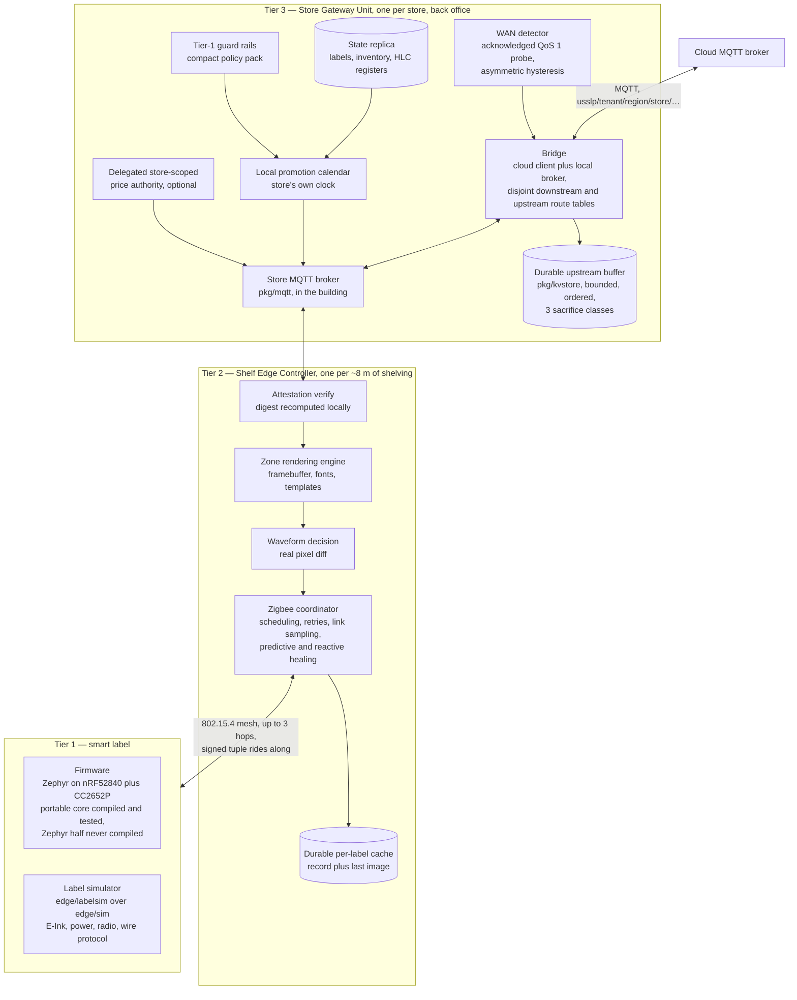
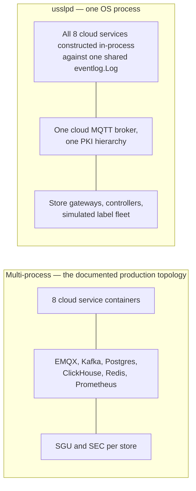

# 02 — Containers (C4 level 2)

**Derived from:** `platform/cmd/*/main.go`, `platform/cmd/usslpd/stack/*.go`,
`edge/cmd/*/main.go`, `platform/pkg/{eventbus,eventlog,eventstore,kvstore,mqtt,msgbus,obs,pki}`,
`platform/internal/*/service.go`, `edge/sgu/gateway.go`, `edge/sec/controller.go`,
`edge/labelsim/label.go`, `firmware/README.md`, `deploy/README.md`,
`deploy/helm/usslp/values.yaml`, `docs/architecture/INTERFACE-CONTRACTS.md`.

See also: [01 — Context](01-context.md) · [03 — Components](03-components.md) ·
[06 — Data architecture](06-data-architecture.md)

---

## Diagram 1 — the cloud tier

## Diagram 2 — the store and device tiers

Two things this picture is asserting, both load-bearing:

- **The store broker is inside the building.** Controllers are clients of the
  Store Gateway Unit's broker, never of the cloud's. When the cloud link drops
  the bridge stops and the broker does not; that is the whole mechanism behind
  zero label downtime (INTERFACE-CONTRACTS §3).
- **The signature crosses the last hop.** The controller forwards the digest and
  the signature it received rather than recomputing them, because a controller
  that could recompute them would be a controller able to author a price
  (`sec.Controller.encodeFrame`).

---

## Container catalogue

### Cloud

| Container | Responsibility | Technology | Scaling unit | Failure mode |
|---|---|---|---|---|
| **API Gateway** (`platform/cmd/api-gateway`) | The only process facing the public internet. Authenticates (API key, JWT, mTLS SPIFFE), applies RBAC and store scoping, constructs the tenant and stamps it on every proxied request, rate limits per tenant and per credential, circuit-breaks per upstream, serves OpenAPI, the console and a tenant-filtered WebSocket event feed. | Go, `net/http`, hand-written RFC 6455 WebSocket | Stateless replicas, HPA on CPU 70% plus `usslp_requests_per_second`; chart `min 6 / max 40` | Loss of the whole external surface. Devices and stores are unaffected — they speak MQTT, not HTTP. A failing upstream trips its own breaker and returns a typed error rather than a 500 storm. |
| **Universal Integration Gateway** (`platform/cmd/uig`, chart workload `pos-integration-gw`) | One ingest pipeline behind nine protocol adapters. Verifies on raw bytes, dedupes before parsing, parses, schema-maps, normalises currency and locale, validates, resolves the source store code to a canonical store, publishes to `price-updates` and a raw copy to `pos-integration`, then answers. Owns 50 ms of the price budget. | Go, `net/http`, `pkg/idem`, `pkg/eventbus` | Stateless replicas, HPA at 400 rps/pod plus CPU 75%; chart `min 4 / max 20` | POS traffic is refused with a classified status the source will retry on (429/503) or will not (4xx, quarantined with the body retained for replay). Prices already in the platform continue to flow. |
| **Label Service** (`platform/cmd/label-service`) | The hot path. Consumes `price-updates`, resolves affected labels from its own placement directory, loads the event-sourced aggregate, decides, signs, appends durably, publishes QoS 1 retained to the owning controller, then emits `label-state` and `audit-log`. Also consumes `promotion-events` and turns an activation or expiry into shelf prices through the same batch path; runs the ACK bridge, the delivery-confirmation consumer, the future-dated price runner and the batch fan-out pipeline. Owns 120 ms of the budget. | Go, `pkg/eventstore`, `pkg/kvstore`, `pkg/msgbus`, `pkg/pki` | Stateless replicas partitioned by consumer group; HPA on CPU 70% (fan-out is Ed25519-signing bound); chart `min 6 / max 30`. `ConsumerConcurrency` stays at 1 on the price path so per-partition ordering holds. | No new prices reach shelves. Shelves keep showing their last verified price. Retained MQTT messages mean a controller rebooting still recovers its zone. |
| **Device Registry** (`platform/cmd/device-registry`) | Identity and lifecycle for all three device tiers. Manifest ingest, zero-touch provisioning with chain verification, manifest comparison and anti-cloning, placement and planogram binding, telemetry-derived health, quarantine and retirement, retained device configuration. | Go, `pkg/pki`, `pkg/eventstore`, `pkg/kvstore` | Stateless replicas; HPA on CPU; chart `min 3 / max 10` | New devices cannot enrol and health stops being derived. Existing devices keep operating; the Label Service's directory is its own read model and does not call the registry on the hot path. |
| **OTA Service** (`platform/cmd/ota-service`) | Signed firmware artifacts (the signature covers version, hardware tier and digest), delta preparation, staged cohorts by stable hash, quiet hours in store-local time, four health gates, automatic halt and rollback. | Go, content-addressed artifact store, `pkg/msgbus` | Deliberately small; HPA on `ota_downloads_in_flight`; chart `min 2 / max 6` | Rollouts stall in place. Nothing is half-flashed: the label's own order is persist-sequence, then flash, then confirm-or-revert, and a job's control loop is idempotent. |
| **Pricing Service** (`platform/cmd/pricing-service`, chart workload `pricing-ai-service`) | Tier 1 rules (pure, sub-millisecond, and the same code runs inside the SGU from a policy pack), Tier 2 per-store demand model and margin optimiser in an 8–15 ms budget, Tier 3 asynchronous cross-store pass correcting for cannibalisation. Model registry, point-in-time feature store, anomaly detection. | Go; hand-written elasticity regression, gradient-boosted trees, isolation forest and LSTM (`pricing/ml`) | Stateless pool that lazily loads only the models for the stores it serves; HPA on `usslp_pricing_tier1_p99_seconds` plus CPU; chart `min 3 / max 12` | Recommendations stop. Prices already authorised are unaffected: pricing is advisory, the Label Service is authoritative. |
| **Promotion Service** (`platform/cmd/promotion-service`) | The promotion DSL and its compiler, the lifecycle sweep, the documented precedence and stacking policy, publication of `promotion.activated` / `promotion.expired`, lift measurement. | Go, `pkg/kvstore`, `pkg/eventbus` | Stateless replicas; HPA on CPU; chart `min 2 / max 10` | Promotions do not activate or expire on schedule. Displayed prices are unaffected. |
| **Analytics Service** (`platform/cmd/analytics-service`) | Ingests four streams into a column-oriented time-series store, answers retail-intelligence queries, computes SLO attainment and error budgets, ages segments hot → warm → cold. | Go, `analytics/columnar` (block-structured, per-column compression, per-block min/max index, t-digest) | Chart `min 2 / max 8` | Reports and SLO attainment go stale. Nothing on the price path depends on it. |
| **Event streaming backbone** | 11 topics defined once in `canon.AllStreams()` with their partition counts and retentions. Ordering is per partition key only; delivery is at least once; every consumer is idempotent. | Kafka in production behind `pkg/eventbus.Bus`; `pkg/eventlog` (embedded, file-backed, CRC32C-framed segments, fsync-before-ack by default) elsewhere | Partitions: 1,024 on `price-updates`, 2,048 on `label-telemetry`, 512 on `device-events`/`label-delivery`/`label-state` | Ingest is refused rather than accepted-and-lost: the UIG releases its idempotency key and answers 503 if the durable publish fails. |
| **Cloud MQTT broker** | The device plane. Retained prices and configuration, QoS 1 for prices, QoS 2 for OTA triggers, sessions that survive a reconnect, last wills. | EMQX in production; `pkg/mqtt` — a complete MQTT 3.1.1 implementation, protocol level 4 — in dev and in `usslpd` | Chart runs it as a `StatefulSet` fixed at 5, deliberately not autoscaled: a broker rebalances sessions on a membership change | Stores go autonomous. That is a designed state, not an outage: shelves keep trading and upstream traffic buffers to disk. |
| **Event store** | CQRS write side: append-only, optimistically concurrent, globally ordered, idempotent append, aggregate snapshots, durable projection checkpoints. | `pkg/eventstore` over `pkg/kvstore` (WAL + skip-list MVCC index + checkpoints) | Per-service data volume | A write refused is a price not applied — visible, not silent. Read models can always be rebuilt from position zero. |
| **Read models** | Placement directory, label state rows, schedule due-index, registry projections, idempotency guards. | `pkg/kvstore` | Per-service data volume | Queries go stale or fail readiness; the aggregate remains the truth. |
| **Certificate hierarchy** | Root, device-issuance intermediate, manufacturing and shelf-controller sub-CAs, services intermediate, tenant-management intermediate. Path-length constrained so a stolen sub-CA key cannot mint another CA. Also the Ed25519 price authority and the published key ring. | `pkg/pki` | Per tenant / per region | No new device certificates and no new signatures. A price that cannot be signed is never persisted and never published. |

### Store and device

| Container | Responsibility | Technology | Scaling unit | Failure mode |
|---|---|---|---|---|
| **Store Gateway Unit** (`edge/cmd/sgu`) | Runs the store's MQTT broker; bridges the contract's downstream and upstream route tables; detects WAN loss by acknowledged probe with asymmetric hysteresis; buffers upstream to a durable bounded queue; holds a label and inventory replica with hybrid-logical-clock registers; activates scheduled promotions on the store's own clock; enforces Tier-1 guard rails locally; reconciles on reconnect; optionally holds a delegated store-scoped signing key. | Go, `pkg/mqtt`, `pkg/kvstore`; systemd or K3s on back-office hardware | **One per store.** Not horizontally scaled — it is a bulkhead, and two would mean two brokers and two clocks | The store loses cloud connectivity *and* its local broker. This is the only single point of failure inside a store, and it is why the queue, the replica and the schedule are all durable: a gateway that loses power mid-outage comes back with everything it had not yet delivered, in order. |
| **Shelf Edge Controller** (`edge/cmd/sec`) | Verifies every attestation before a pixel moves; renders the framebuffer for the label's panel tier; diffs it against the image believed to be on the glass and chooses partial or full waveform; encodes the air frame carrying the signed tuple; reserves the sequence durably before transmitting; is the Zigbee coordinator for its zone, with retries, link sampling, predictive and reactive rerouting; batches telemetry; publishes heartbeat, mesh topology and status with a registered last will. | Go, `pkg/kvstore`, `pkg/mqtt`, `edge/mesh` | **One per ~8 m shelf section**, roughly 25 per store, up to ~500 labels each | A dead controller is announced by its retained last will in under thirty seconds. Its zone's labels keep displaying their last verified price; nothing goes blank. The controller-to-label delivery slot limit (8 in flight) is the store's throughput ceiling. |
| **Smart label — firmware** (`firmware/`) | Decode, sequence check, attestation verify against its own key ring, decode and load the framebuffer, **persist the sequence**, drive the panel, acknowledge. Duty-cycled radio, NFC record that follows the glass, tamper interrupt, OTA with a tier check before any flash erase. | Zephyr 3.x on nRF52840 + CC2652P; portable core in C11 with no Zephyr dependency | One per shelf facing; up to 40,000 per store, 50 M modelled fleet | Refuses any price it cannot verify and keeps the last verified one. A brownout mid-refresh loses one price change and the retry is accepted, because the sequence is persisted before the panel is driven. |
| **Smart label — simulator** (`edge/labelsim` over `edge/sim`) | A faithful model of the above: three panel tiers with their real waveform durations and ghosting budgets, a power model integrating duty cycling arithmetically, the wire protocol including the attested frame, and the same verdict enumeration. Labels are structs on a shared discrete-event engine, not goroutines, so 40,000 fit in one process. | Go | One process models a store | See known gap 4 in the root README: on a quiet store the discrete-event clock can lag the wall clock, so `usslpd` schedules a 20 ms heartbeat per store engine and publishes `clock_drift_ms` with every SLO report. |

---

## Two legitimate deployment shapes

`usslpd` is not only a test fixture. It is what a single-store or disconnected
pilot wants, and it is the only shape in which the cross-service event stream
currently works.

**Why the single-process shape exists at all.** `pkg/eventlog` keeps its
consumer-group coordination in memory, so two OS processes must not share one
log directory. In the multi-process compose profile each service therefore has
its own log, and the UIG's `price-updates` records do **not** reach the Label
Service. `usslpd` fixes that by handing one `*eventlog.Log` to every
constructor. The Kafka adapter behind `pkg/eventbus.Bus` is the documented
production port for the multi-process shape.

---

## Divergences

1. **"Nine cloud services" is eight service binaries plus a composition root.**
   The USSLP-authored cloud binaries are: API Gateway, UIG, Label Service,
   Device Registry, OTA Service, Pricing Service, Promotion Service and
   Analytics Service — eight. `platform/cmd` holds nine main packages because
   `usslpd` is one of them. The Helm chart declares ten workloads, two of which
   (`mqtt-broker`, `kafka-connect`) are infrastructure rather than USSLP code.

2. **File and line counts drift, and the root README now says when it counted.**
   It carried 367 Go files / 116 tests / ~133,000 lines long after the tree had
   moved past them. The figures there are recounted and dated; treat any repeat
   of them elsewhere as a snapshot rather than a fact — which is why no count is
   transcribed into this set.

### Closed since this document was written

- **`promotion-events` had no consumer in the Label Service** (closed
  2026-08-31). The service now subscribes natively as consumer group
  `label-service.promotions`; `platform/cmd/usslpd/stack/promobridge.go`, which
  stood in for it, is gone. See the Label Service row above and
  [05 §3](05-sequence-diagrams.md#3-store-wide-promotion-fan-out).
- **`analytics-service` was documented as absent** (closed 2026-08-31). It is
  `enabled: true` in the chart, in both CI and release image matrices and in the
  dev compose profile; the "Absent" heading in `deploy/README.md` now reads
  "Nothing". The gateway's `analytics` breaker sitting open is a real fault
  again rather than the expected steady state.
