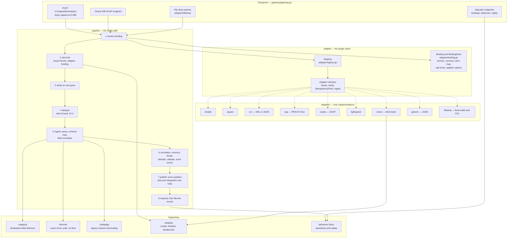
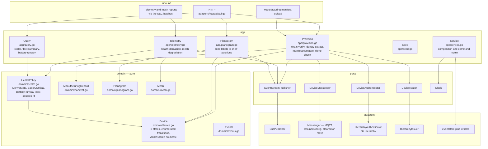
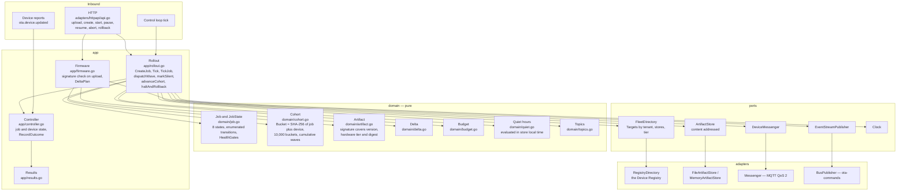
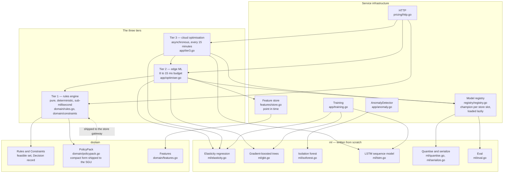
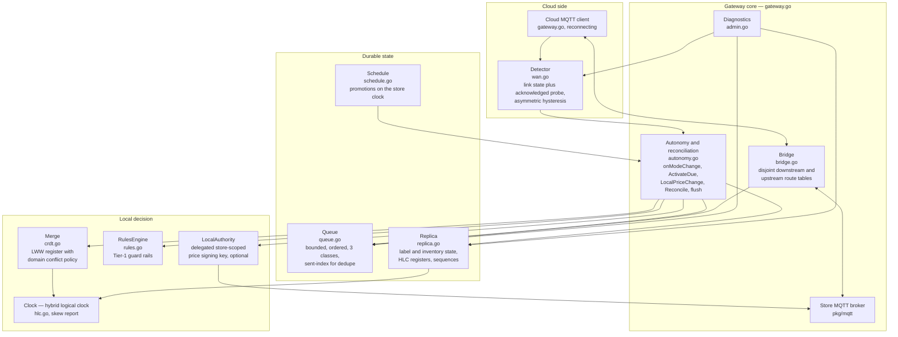
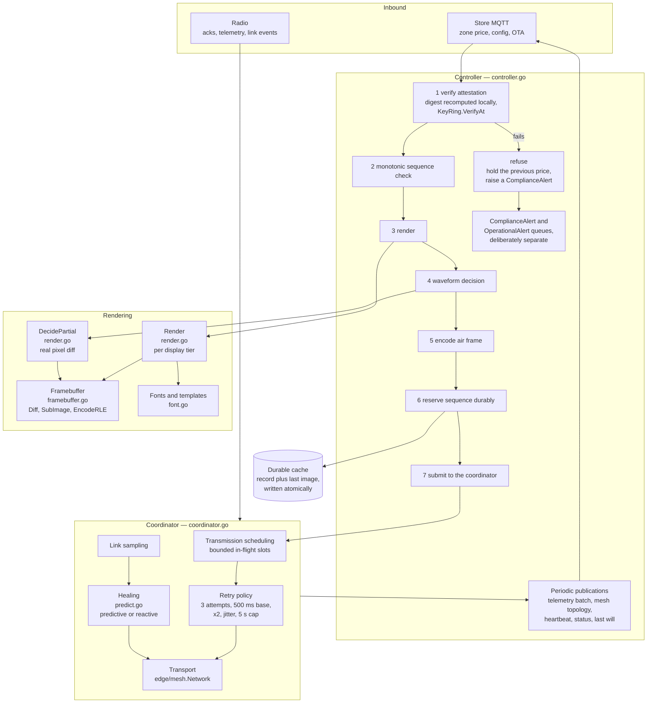

# 03 — Components (C4 level 3)

**Derived from:** `platform/internal/label/{service.go,http.go,domain,app,ports,adapters}`,
`platform/internal/uig/{pipeline,adapter,adapters,gateway,mapping,deliveries,reliability,decimal,codepage}`,
`platform/internal/registry/{app,domain,ports,adapters}`,
`platform/internal/ota/{app,domain,ports,adapters}`,
`platform/internal/pricing/{service.go,app,domain,ml,ports,registry,features}`,
`edge/sgu/*.go`, `edge/sec/*.go`, `platform/cmd/*/main.go`.

See also: [02 — Containers](02-containers.md) ·
[05 — Sequence diagrams](05-sequence-diagrams.md) ·
[06 — Data architecture](06-data-architecture.md)

---

## The shape every cloud service has

Five of the seven services below are laid out as a hexagon and mean it. The
convention, and it is followed literally:

| Layer | Package | Rule |
|---|---|---|
| Domain | `internal/<svc>/domain` | Pure. No sockets, no clock it was not given, no knowledge that an event store exists. Commands are pure functions from `(state, command, policy)` to `(events, error)`. |
| Ports | `internal/<svc>/ports` | The seams: interfaces plus the sentinel errors the application layer branches on. Adapters translate their own sentinels (`eventstore.ErrConcurrency`, `kvstore.ErrNotFound`) into these. |
| Application | `internal/<svc>/app` | Use cases. Written against `ports` alone. |
| Adapters | `internal/<svc>/adapters` | Implementations: event store, event bus, MQTT, key/value read models, PKI. |
| Composition root | `internal/<svc>/service.go` (or `app/service.go`) | The only file that knows all four layers exist at once, which is what keeps every other dependency arrow pointing inwards. |

Two services depart from it and the departure is deliberate, noted where it
appears: the **UIG** is a pipeline with a plugin seam rather than an aggregate,
and the **Pricing Service** has a model registry and a feature store where
another service would have a repository.

---

## 1. Label Service

`platform/internal/label` — the hot path. Owns 120 ms of the price budget
(INTERFACE-CONTRACTS §4).

```mermaid
flowchart TB
    subgraph inbound["Inbound"]
        stream_in["price-updates<br/>device-events<br/>label-delivery<br/>promotion-events"]
        http_in["HTTP / gRPC<br/>label/http.go"]
    end

    subgraph app_l["app — use cases"]
        upd["UpdatePriceHandler<br/>app/update_price.go<br/>load, decide, attest, append,<br/>publish, project"]
        batch["BatchUpdater<br/>app/batch.go<br/>1 resolver, bounded queue,<br/>fixed worker pool"]
        limiter["TenantLimiter<br/>app/ratelimit.go<br/>per-tenant token bucket"]
        promoh["PromotionHandler<br/>app/promotion.go<br/>match, price, revert —<br/>then hand to BatchUpdater"]
        deliv["DeliveryConfirmationHandler<br/>app/delivery.go"]
        dirproj["DirectoryProjection<br/>app/directory.go"]
        sched["ScheduledPriceRunner<br/>app/scheduler.go"]
        stateproj["LabelStateProjection<br/>app/state.go"]
    end

    subgraph dom_l["domain — pure"]
        agg["Label aggregate<br/>domain/label.go<br/>state, replay, apply"]
        cmds["Commands<br/>domain/commands.go<br/>ApplyPriceChange, Provision, Assign,<br/>ActivateSchedule, ConfirmDelivery"]
        pol["Policy and PolicySet<br/>domain/policy.go<br/>grace, horizon, guard rail,<br/>FullRefreshEvery"]
        rend["DecideRender<br/>domain/render.go<br/>template, badge, LED,<br/>partial-refresh verdict"]
        evs["Domain events<br/>domain/events.go"]
    end

    subgraph promo_dom["promotion/domain — shared rule vocabulary"]
        pmatch["Compile and Matcher<br/>which shelves a rule touches"]
        papply["Apply<br/>what each should now cost"]
    end

    subgraph ports_l["ports — the seams"]
        p_repo["Repository"]
        p_dir["Directory"]
        p_att["Attestor"]
        p_dev["DevicePublisher"]
        p_str["StreamPublisher"]
        p_state["StateStore"]
        p_sched["ScheduleStore"]
        p_rate["RateLimiter"]
        p_clock["Clock"]
    end

    subgraph adapt_l["adapters"]
        a_repo["EventStoreRepository<br/>adapters/repository.go<br/>snapshot plus events since"]
        a_kv["KVDirectory, KVStateStore,<br/>KVScheduleStore<br/>adapters/readmodels.go"]
        a_mqtt["MQTTDevicePublisher<br/>adapters/messaging.go<br/>QoS 1, retained"]
        a_bus["BusStreamPublisher<br/>adapters/messaging.go"]
        a_ack["ACKBridge<br/>adapters/messaging.go<br/>MQTT ACKs to label-delivery"]
        a_run["StreamConsumer,<br/>StateProjectionRunner<br/>adapters/runners.go"]
        a_pki["pki.PriceAuthority"]
    end

    stream_in --> a_run --> upd
    stream_in --> dirproj
    stream_in --> deliv
    stream_in --> promoh
    http_in --> batch
    http_in --> upd

    batch --> limiter
    batch --> upd
    sched --> upd
    promoh --> pmatch
    promoh --> papply
    promoh --> p_state
    promoh --> batch

    upd --> cmds --> agg
    cmds --> pol
    cmds --> rend
    agg --> evs

    upd --> p_repo --> a_repo
    upd --> p_dir --> a_kv
    upd --> p_att --> a_pki
    upd --> p_dev --> a_mqtt
    upd --> p_str --> a_bus
    upd --> p_state --> a_kv
    upd --> p_sched --> a_kv
    batch --> p_rate
    upd --> p_clock
    deliv --> p_repo
    dirproj --> p_dir
    stateproj --> p_state
    a_ack --> p_str
    a_run --> stateproj
```

**Why the directory is a local read model and not a call to the Device
Registry.** A store-wide promotion resolves up to 40,000 placements. Doing that
over the network inside a 120 ms slice is not possible, and making the price
path depend on another service's availability would mean a Device Registry
outage stops prices changing. `DirectoryProjection` therefore consumes
`device-events` **from offset zero** — a replica joining at the tail would know
about no label provisioned before it started and would silently decline to
price them — while the price and delivery consumers join at the tail, because a
new group at offset zero would replay seven days of price history to every
shelf in the estate.

**Ordering.** `ConsumerConcurrency` defaults to 1 and stays there for every
group, and most pointedly for promotions. On `price-updates` it is the guarantee
that two price changes for the same product apply in the right order. On
`promotion-events`, which is keyed `tenant:promo`, every transition of one
promotion lands on one partition in the order it happened; above a concurrency
of one an `expired` could overtake its own `activated`, reverting a promotion to
base prices and then immediately re-applying it, leaving a whole chain
discounted with nothing left to switch it off. One record there is already a
40,000-label fan-out with its own bounded worker pool, so the parallelism that
matters is inside the handler rather than across it.

**The promotion consumer decides which labels and what price — and nothing
else.** `PromotionHandler` uses the promotion domain's own compiled matcher and
`Apply`, never a second implementation, and hands the resolved set to
`BatchUpdater` as a `BatchRequest`. Nothing in `app/promotion.go` publishes to a
device or appends an event, so a promotion fan-out gets exactly the same
per-tenant rate limiting, attestation, sequencing, guard rails and per-label
failure reporting as a store-wide repricing — because it *is* one, arrived at
differently. Items are addressed by `LabelID` rather than by `(store, SKU)`,
because the handler already emits one item per facing and letting the batch
resolver expand each item across every facing would square the fan-out.

**Three constraints the promotion path carries, all of them deliberate.**

- *`BasePrice` exists so an expiry has something to revert to.* It is the last
  non-promotional price, tracked separately from `PreviousPrice` because the two
  answer different questions: `PreviousPrice` is "what was on the glass a moment
  ago", which after two consecutive promotions is another promotional price.
  Without `BasePrice` an ending promotion would restore whatever the previous
  promotion charged and the shelf would stay discounted forever — and a second
  promotion would discount from the first's discounted price.
- *A rule the shelf cannot evaluate is refused by name, not guessed at.* The
  compiled matcher is a conjunction, so an unobservable attribute has two
  readings and both are wrong: an empty value makes the test fail and the
  promotion silently applies to nothing, which merchandising discovers from a
  sales report a week later; skipping the test makes it apply to everything,
  which puts a discount on the alcohol, tobacco and infant-formula lines the
  exclusion list exists to protect. So `shelfBlocker` refuses `store_groups`,
  `min_inventory` and `max_days_to_expiry`, naming the attribute, and
  `THRESHOLD` and customer-segmented rules are skipped as not shelf-priceable.
- *Category and brand are held on the label, not fetched.* They arrive on the
  price feed and are what lets a category-scoped rule resolve its label set
  without a synchronous catalogue lookup — a national activation would otherwise
  become two thousand stores' worth of simultaneous fan-in. They are only ever
  as good as the last price change that carried them, which is why a rule
  constrained on an attribute no label has recorded resolves to nothing rather
  than to everything.

**Known limitation: overlapping promotions resolve last-activation-wins at the
shelf.** `promodomain.Resolve` arbitrates priority, stacking and exclusive
groups against the *whole* active set, and only the Promotion Service holds that
set. `PromotionHandler` deliberately does not re-implement a partial arbiter,
because a second pricing engine eventually disagrees with the first. The
consequence is explicit and predictable: where two promotions overlap, the most
recently activated one is what the shelf shows, because it takes the higher
per-label sequence. The fix is to put `Resolve`'s output on the event rather
than more logic here.

**Concurrency.** `UpdatePriceHandler.Apply` retries an optimistic-concurrency
loss exactly twice. One reload is enough for a genuine concurrent update to be
resolved correctly; a longer loop turns a hot SKU into unbounded work on the
hot path and a third attempt is more likely a duplicated consumer than real
contention.

**Read-your-writes.** `writeState` is a write-through onto the query-side row,
so an operator who has just pushed a price sees it. The projection remains the
authority and rebuilds the same row from the same function.

---

## 2. Universal Integration Gateway

`platform/internal/uig` — one pipeline, nine adapters, 50 ms of the budget.

**Why the ordering of the pipeline is load-bearing.** Verification precedes
everything, on the raw bytes, because every stage after it spends resources on
the caller's behalf, and because an adapter that parsed before it could
authenticate would be parsing unauthenticated input on the price path.
Deduplication precedes parsing because the expensive stage is parsing and the
common case in retail integration is redelivery: an SAP ALE queue resending a
6,000-segment IDoc costs a hash lookup here, not a parse.

**The acknowledgement rule.** The caller is answered as soon as the change is
durable on the stream. Everything after that line is bookkeeping and none of it
may delay the answer — POS systems retry aggressively on slow responses, and a
202 in 50 ms is worth more than a 200 in two seconds spent creating duplicate
work.

**The failure rule.** `Ingest` never returns an error; every failure mode is a
classified `Result`, because the caller's job is to render an answer to a POS
and an unclassified error escaping to the HTTP layer would be answered 500 —
the one answer that must never be given to a message that will never parse. Any
path that does not durably publish **releases the idempotency key**, because
holding it after a failure would suppress every retry for 24 hours and lose the
price change silently.

**Raw body retention.** `pos-integration` carries the exact bytes, because "the
retailer says they sent 1.99" is a question only the bytes settle. That is why
it is retained for 3 days where `price-updates` is retained for 7.

---

## 3. Device Registry

`platform/internal/registry` — identity and lifecycle for all three tiers.

**The check order in `Provision` is the security design.** Verify the chain
against the platform's hierarchy including revocation *before reading a single
field of the request*; extract identity from the verified certificate, never
from the body, so a controller cannot enrol a label into a store it does not
serve; compare against the manufacturing record — public key, certificate
serial, radio address, hardware tier; only then consult existing registry state
for the anti-cloning check. A failure at either of the last two quarantines the
identity, because when two things present the same identity the platform cannot
tell which is genuine and continuing to trust either is worse than taking both
out of service.

**Health is derived, decisions are not.** `HealthPolicy.DeriveState` only ever
proposes `active`, `degraded` or `offline` — the three states that are facts
about contact. Quarantine, retirement and assignment are decisions and must
never be undone by a heartbeat arriving.

**Battery runway is a least-squares fit, not two-point extrapolation**, because
the number dispatches a technician to an aisle with a box of cells and the value
of the estimate is that the visit happens before the shelf edge goes blank.

---

## 4. OTA Service

`platform/internal/ota` — staged rollouts that can be stopped.

**Cohort membership is a pure function, not a stored list.** `Bucket(jobID,
deviceID)` is `SHA-256(job, 0x00, device) mod 10000`. There is nothing to
store, nothing to reconcile across a restart or a failover, and nothing that can
drift; a device provisioned halfway through a rollout lands in whichever wave it
would always have been in. The job identifier is mixed in so two consecutive
rollouts do not pick the same unlucky 1% twice — otherwise one store's shelf
would be the canary for every release the platform ever ships.

**Four health gates, because a bad image fails in four ways.** Update failure
rate; boot-failure rate (reported by the *controller*, because a device that
installs and will not boot reports nothing itself); battery-drain anomaly (a bug
in the sleep path drains a coin cell in weeks and shows up long before a
failure does); and silence rate — the one a naive rollout controller always
misses, because it counts successes and failures, sees no failures, and advances
a rollout that has killed every device it touched. `MinCohortSamples` stops a
first wave of three devices with one failure reading as a 33% error rate.

**Two transitions are deliberately absent.** There is no `halted → running`: a
job the controller stopped for a failed gate must not be restarted by the same
button an operator uses on a job they paused themselves. And there is no
`rolled_back → anything`: the way to try again is a new job with a new artifact.

---

## 5. Pricing Service

`platform/internal/pricing` — three decision tiers, each affording a different
budget.

**A price decision is made at whichever tier can afford to make it.** Tier 1
runs in this service *and* inside the Store Gateway Unit from a compact policy
pack, so a store that has lost its WAN reaches the identical decision the cloud
would have. Every price the platform ever displays passes through it. Tier 2's
answer is always inside Tier 1's feasible set, so it cannot propose something
that then has to be clamped. Tier 3 exists as a separate pass rather than Tier 2
in a loop because the cross-elasticity term is the only thing that makes the
category-level answer differ from the sum of the line-level answers — given a
category of close substitutes, Tier 2 will happily recommend discounting all of
them, each looking like a win and collectively winning nothing but a lower
average selling price.

**The honest status of the models.** Every model in `pricing/ml` is trained and
validated on synthetic data generated by its own tests, against known-truth
generators. No model here has seen a real retailer's transactions, and none of
the demand curves should be quoted as a finding about retail.

---

## 6. Store Gateway Unit

`edge/sgu` — the store's brain and its bulkhead against the WAN.

**Start order is the design in miniature.** The local broker binds and serves
*before* any attempt is made to reach the cloud, so a gateway booting during an
outage — a store that lost power and mains together — comes up serving its
controllers from local state, and the cloud link is something that either
arrives later or does not.

**The bridge is loop-free by construction.** The two route sets are disjoint, so
nothing republished locally can match an upstream filter and nothing published
to the cloud can match a downstream one. No message tagging is needed.

**Overflow is explained rather than silent.** Three sacrifice classes:
`bulk` (telemetry, dropped oldest-first), `latest` (heartbeats, mesh topology —
coalesced by topic on the way in, so they cost bounded space however long the
outage runs) and `critical` (delivery acknowledgements, price rejections, store
mode transitions). Dropping a critical message latches a lossy flag so the
reconciliation report says plainly that the cloud's record of the outage has a
hole in it.

**Local prices need a delegation or they do not reach the glass.** With a
delegated authority the gateway signs with its store-scoped key, whose public
half is in every local controller's key ring. Without one, the change is
recorded and reported upstream but is not displayed, and the caller is told so —
because the alternative would trade the entire weights-and-measures guarantee
for the convenience of one till.

---

## 7. Shelf Edge Controller

`edge/sec` — the last programmable thing before the glass.

**Attestation comes first, before rendering and before any state is touched**,
because an update that cannot be verified must leave no trace on this controller
at all. The sequence check comes second, before the expensive work, because it
saves the radio time and the label's battery on a redelivery the label would
only discard.

**The sequence is reserved durably before the frame goes on the air**, so a
controller that restarts mid-delivery cannot re-issue a sequence it has used.
The record and its image are persisted atomically — a record claiming sequence
42 alongside the image from 41 would make the next partial-refresh decision
wrong, and a wrong partial refresh is a price a shopper cannot read.

**Two alert queues, not one.** A label built to require end-to-end attestation
that is sent a legacy frame refuses every price in its zone; filing those as
compliance incidents would generate one per label per update and bury the
handful that mean a shopper could have been charged the wrong price. That fault
is real and needs fixing — it is a deployment fault, and it belongs in a
different queue.

**Predictive healing is an addition to the reactive rule, never a replacement.**
The reactive threshold (`LQI < 100`) is armed in both modes. Prediction only
fires when the least-squares LQI slope clears both a fixed floor
(`MinDegradationTrend = -5.0` LQI/minute) *and* two standard errors of its own
fit — because a fixed threshold that is four standard errors late in the sample
window is well under one early in it, and an untested version of this model
rerouted a fifth of a healthy store in its first minute.
