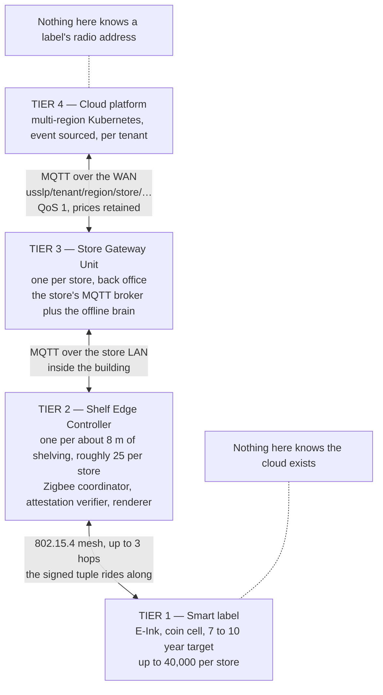
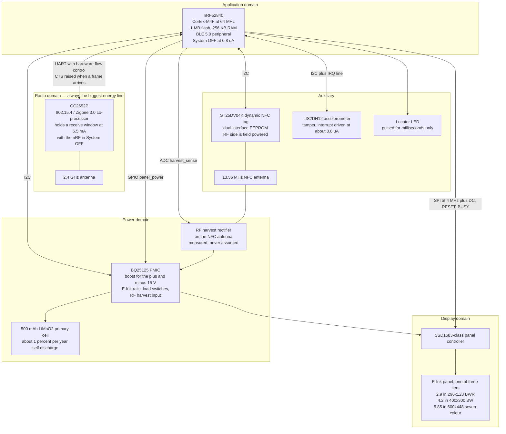
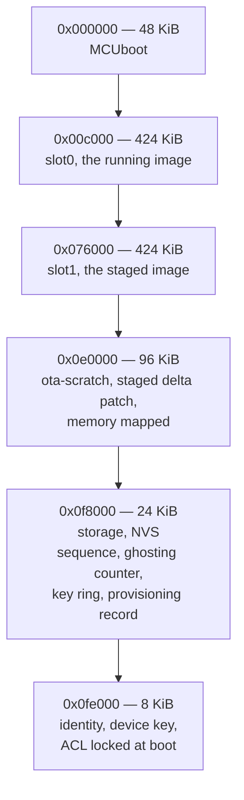
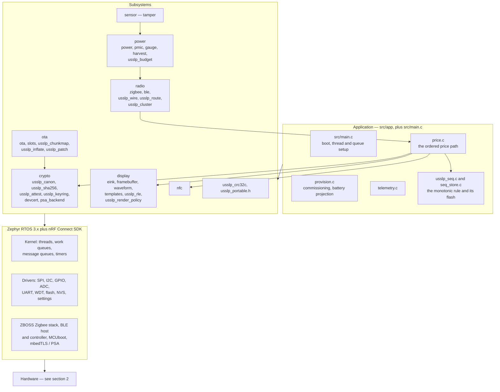
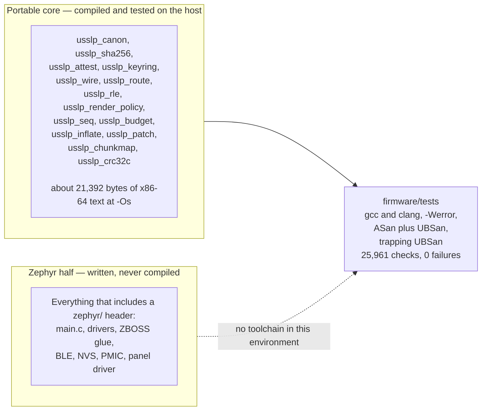
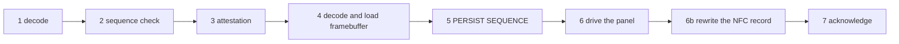
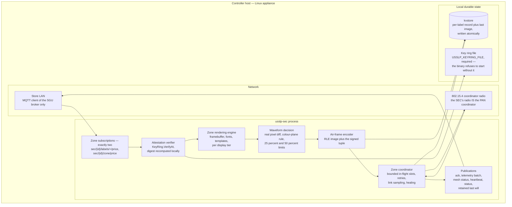
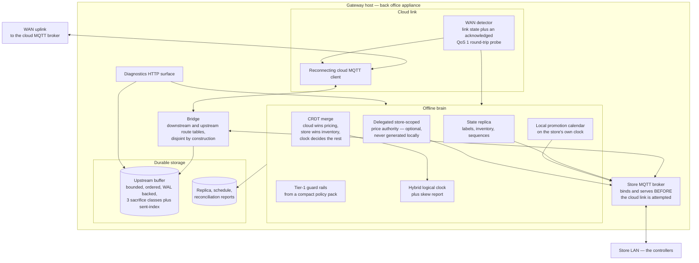

# 04 — Hardware and firmware block diagrams

**Derived from:** `firmware/README.md`,
`firmware/boards/usslp_label_nrf52840.overlay`,
`firmware/boards/tier_*.conf`, `firmware/src/**`, `firmware/prj.conf`,
`firmware/Kconfig`, `edge/labelsim/{eink.go,power.go,label.go,wire.go}`,
`edge/mesh/{network.go,routing.go,radio.go}`, `edge/sec/*.go`, `edge/sgu/*.go`,
`deploy/edge/README.md`, `deploy/edge/config/{sec,sgu}.env.template`,
`docs/architecture/INTERFACE-CONTRACTS.md` §1.

These are the blueprint's figures redrawn, and corrected where the tree diverges
from them. Divergences are called out at the end.

See also: [02 — Containers](02-containers.md) ·
[05 — Sequence diagrams](05-sequence-diagrams.md)

---

## 1. The four tiers

INTERFACE-CONTRACTS §1. A tier only ever talks to the tier directly above and
below it: nothing in the cloud addresses a label's radio, and nothing on a label
knows the cloud exists.

Cardinality, as the code models it: one store per Store Gateway Unit; roughly
25 controllers per store; a controller's Zigbee zone holds up to about 500
labels, and its neighbour table is capped at hardware-realistic sizes
(`mesh.MaxNeighbours = 24` for an end device, `MaxRouterNeighbours = 64` for a
mains-powered relay). A controller transmits to at most eight labels at once,
because a label's radio is off while its panel runs a waveform — that limit is
the store's throughput ceiling and is what `test/load` measures.

---

## 2. Smart-label PCB

nRF52840 revision C board, from the device-tree overlay and the firmware's
hardware table.

**Why there is a second radio chip at all.** The nRF52840 has a perfectly good
802.15.4 radio and a single-chip design would be cheaper in bill of materials.
The CC2652P is there because beacon listening is more than half of this device's
entire energy budget, and the co-processor can hold that window open at 6.5 mA
with the application MCU in System OFF at 0.8 µA. A single-chip build would not
reach the battery target.

**Why harvesting is on the board but not in the projection.** A label under a
continuous EAS/RFID gate harvests on the order of 100 µW against a ~20 µW
average draw, which can extend that label's life indefinitely. A label in the
middle of an aisle — where 95% of them are — sees a phone tap every few days and
harvests about a microamp-hour a year, four parts in a million of the cell. The
seven-to-ten-year claim is therefore made **without** harvesting;
`power/harvest.c` measures what actually arrives and puts it in telemetry.

### Where the energy goes

Modelled in `labelsim.Projection` and reproduced arithmetically in
`firmware/README.md` for the platform's planning workload (10 price updates a
day, 87.5% of them partial, half an NFC tap, 288 telemetry reports, 20 °C,
2.9″ panel):

| Component | Average draw | Share |
|---|---:|---|
| Beacon listening | 3.237 µA | **49%** |
| E-Ink refresh | 1.354 µA | 21% |
| Deep sleep | 0.800 µA | 12% |
| Cell self-discharge | 0.571 µA | 9% |
| Transmit | 0.497 µA | 8% |
| NFC | 0.069 µA | 1% |
| Data receive | 0.056 µA | <1% |
| **Total** | **6.584 µA** | **8.67 years on 500 mAh** |

This table is the projection with `CONFIG_USSLP_REQUIRE_ATTESTATION=n`. The
shipped default has it on, which lengthens the receive window from 40 ms to
60 ms and adds a verify term: data receive becomes 0.083 µA and a Verify row of
0.005 µA appears, for **6.616 µA and 8.63 years**. `edge/labelsim/power.go`
(`DefaultWorkload().EndToEndAttestation = true`) is the model both figures come
from; neither has been measured on hardware.

Half the budget is spent listening for beacons; nothing else is worth
optimising until that is. The blueprint's literal 250 ms beacon interval,
applied always, gives 211.3 µA and **99 days** — the firmware says so rather
than repeating "250 ms" and "seven to ten years" in the same sentence, and
`firmware/tests/test_power.c` asserts it against `labelsim.AlwaysFastPower` so it
cannot quietly stop being true. What makes the target reachable is adaptive duty
cycling: 250 ms only inside an activity window, ~30 s at rest.

The cost of that is stated too: a resting label is on average **half a resting
interval from being reachable at all** — fifteen seconds at the default. The
SEC-to-label budget (§4) is therefore a statement about a zone *in its active
window*, not about a label asleep at three in the morning. A price load is
planned as a window: the controller broadcasts a wake, the zone comes up over one
resting interval, then prices flow inside the budget.

### Flash and OTA partition map

Two full-size slots rather than swap-move: swap-move rewrites the *running* slot
during the swap, so a power loss mid-swap leaves the device depending on
MCUboot's recovery path. On a device that must be physically retrieved if it
does not boot, 424 KiB of flash to keep the running image immutable until the
new one is verified is the right trade. The constraint that matters is the
**slot**, not the part: a build that fits the 1 MB flash and not the 424 KiB
slot cannot be updated over the air, which on a shelf label means it cannot be
updated at all. The 2.9″ build is estimated at ~343 KB, 81% of the slot.

---

## 3. Zephyr firmware layer stack

### The verification boundary

The firmware is deliberately split so that everything whose correctness is
unrecoverable in the field is portable C with no Zephyr dependency.

**This firmware has never been compiled.** No Zephyr SDK, no ARM toolchain, no
nRF Connect SDK in the environment it was written in. Treat the Zephyr half as a
reference implementation a Zephyr developer would recognise as buildable, not as
a build artefact. The portable half builds and passes under two front ends,
`-Werror`, ASan/UBSan and trapping UBSan — the last of which found a real defect
(a left shift of a negative value in the fixed-point trend fit, undefined
behaviour that happens to work on every compiler anyone has tried).

### The one ordering that matters

`app/price.c`:

Step 5 before step 6 is the whole design. A brownout during a 1.5 s refresh is a
real event on a coin cell driving a charge pump. Persisting first loses one
price change and the retry is accepted. Persisting *after* would leave new pixels
on the glass with the old sequence in NVS, the retry would be discarded as
stale, and the label would be showing a price it has told the platform it is not
showing — precisely the state the whole attestation apparatus exists to make
impossible.

Step 2 before step 3 is cheaper reasoning: a duplicate is the common case under
at-least-once delivery, and an Ed25519 verification is 13 ms of a coin cell's
life. Checking the free invariant first costs nothing in safety.

---

## 4. Shelf Edge Controller

An appliance, not a pod. Mains powered, one per ~8 m of shelving; 25 instances
commonly run on one host as `usslp-sec@sec-0001` … systemd template units.

**A controller only ever talks to the broker inside the building.** That is not a
convention: pointing `USSLP_GATEWAY_BROKER_URL` at a cloud broker would work and
would throw away the entire offline story.

**The durable cache is what makes a cold start possible without the cloud.** A
power-cycled controller knows what every label in its zone is displaying, at
what sequence, and what image is on the glass — so it can decide whether a
retained price update arriving on reconnect is news.

---

## 5. Store Gateway Unit

One per store, in the back office. Deployed by systemd (the common case) or K3s
(when the box also runs other retailer workloads, or for an active/standby pair
with lease-based leader election so both do not bridge at once).

**The installer will not generate keys.** The key ring and the local price
authority come from the platform's key ceremony, because a box that mints its
own price-authority key can authorise its own prices, which defeats attestation
entirely.

**Rollback needs no network.** Versioned directories with an atomically swapped
`current` symlink, the previous version still on disk — because the most common
reason to roll back a store gateway is that it can no longer reach the network.
`update.sh` refuses to update a store that is currently autonomous, since
restarting the gateway then takes down the only thing pricing that store's
shelves.

---

## Divergences from the blueprint figures

1. **The firmware tree carries modules the blueprint figures do not show.**
   `ota/usslp_inflate.c` (a full RFC 1951 DEFLATE decoder with the mandatory
   32 KiB window), `ota/usslp_patch.c` and `ota/usslp_chunkmap.c` (delta
   application and resumable chunk tracking), `radio/usslp_route.c` (a
   fixed-point on-device routing and trend fit), `power/usslp_budget.c` (the
   on-device battery projection and `usslp_power_retune`), and
   `display/usslp_render_policy.c` (the label's own last word on the waveform).
   The stack diagram above shows them.

2. **The blueprint's beacon interval and battery life are mutually
   inconsistent, and the firmware says so.** 250 ms always gives 0.27 years. The
   tree implements adaptive duty cycling instead and reports both numbers.

3. **Frame type 4 exists and did not in the original contract.**
   INTERFACE-CONTRACTS §5 places attestation verification at the Shelf Edge
   Controller, and `edge/labelsim/wire.go` type 1 stops the signature at Tier 2.
   The firmware additionally defines `USSLP_FRAME_ATTESTED_UPDATE` carrying the
   signed tuple end to end, verified on the glass; `edge/sec` and
   `edge/labelsim` now implement it, interop was proved by compiling the
   firmware's own decoder against the Go encoder, and
   `CONFIG_USSLP_REQUIRE_ATTESTATION` defaults to `y`. The cost is 199 bytes per
   frame and about 13 ms of verification per update, and it is why §4's
   controller-to-label line item was re-cut from 300 ms to **400 ms** — the
   measurement (331–343 ms at p99) was inside the three-second total all along
   and the line item was the wrong side of the comparison. See
   [05](05-sequence-diagrams.md) §1.

4. **The ack frame gained two status codes and a verdict field, additively —
   and `edge/` now implements them.** Codes 3 (`refused: attestation did not
   verify`) and 4 (`refused: unattested frame, this build requires end-to-end`)
   plus a three-bit attestation verdict in bits 2–4 of the existing flags byte,
   in `edge/labelsim/{wire.go,verdict.go}` and consumed by
   `edge/sec/{coordinator.go,controller.go}`. The frame is still 20 bytes and an
   un-updated controller behaves exactly as it does today. This is what lets an
   operator distinguish a stale key ring (`unknown-key-id` — push the label a
   ring) from actual tampering (`digest-mismatch` — the price on the wire is not
   the price that was signed) without a round trip; those have opposite
   runbooks, which is why they needed different codes. The controller's old
   inference — that a `bad-frame` ack to a frame it had already verified must be
   a label refusal — survives only as a marked secondary fallback for firmware
   that predates the codes, and is lossy in both directions: it escalates a
   genuinely corrupted frame into a weights-and-measures process and cannot see
   a configuration mismatch at all.

5. **The colour panel is not a shippable coin-cell fitting at the planning
   workload.** A 15 s waveform at 35 mA ten times a day is 60.8 µA on its own,
   nine times the whole rest of the budget: 0.86 years. The tree reports it
   rather than averaging it away. Freezer fittings (−20 °C) also miss the 7-year
   target at 6.23 years for the 2.9″ panel and 5.84 for the 4.2″.

6. **The controller keeps one byte per pixel and the label does not.** The SEC's
   `Framebuffer` is byte-per-pixel for clarity; the label packs two 1-bit planes
   into 9,472 bytes, because at one byte per pixel the 2.9″ panel is 37,888
   bytes and the 4.2″ is 120,000, which does not fit alongside two radio stacks.
   The controller can afford clarity; the label cannot.

7. **The host check count is 25,961, and both READMEs now say so.** They did
   not: the root `README.md` carried 24,539 from before the firmware suite grew.
   Running all four configurations — `gcc`, `gcc` under ASan and UBSan, `clang`,
   and trapping UBSan at `-O0` — gives 25,961 in every one of them.
