# 05 — Sequence diagrams and latency budgets

**Derived from:** `docs/architecture/INTERFACE-CONTRACTS.md` §3–§6,
`platform/cmd/usslpd/stack/slo.go`, `platform/internal/uig/pipeline/pipeline.go`,
`platform/internal/label/{app,domain,adapters}`,
`platform/internal/registry/app/provision.go`,
`platform/internal/ota/{app,domain}`, `platform/internal/promotion`,
`platform/internal/label/app/promotion.go`, `edge/sgu/*.go`, `edge/sec/*.go`,
`edge/labelsim/*.go`, `edge/mesh/*.go`, `firmware/src/{app,nfc}/*`,
`test/e2e/*`, `test/load/load_test.go`, root `README.md` "Measured numbers",
`docs/DEMO.md`.

**How to read the numbers.** *Budget* is INTERFACE-CONTRACTS §4, transcribed as
`stack.Budget` and checked against the Markdown by
`TestLatencyBudgetMatchesTheContract`. *Measured* figures come from the tests
named in each section and were taken **on a 2-core container with the Tier 1
and Tier 2 hardware simulated at 1:1 wall-clock pacing**. A latency here is a
real measurement of everything above the radio and a faithful model of the radio
and the panel.

See also: [02 — Containers](02-containers.md) ·
[03 — Components](03-components.md) · [07 — Flows](07-flows.md)

---

## 1. Real-time price update — POS to pixels

The headline claim. `test/e2e/latency_test.go`.

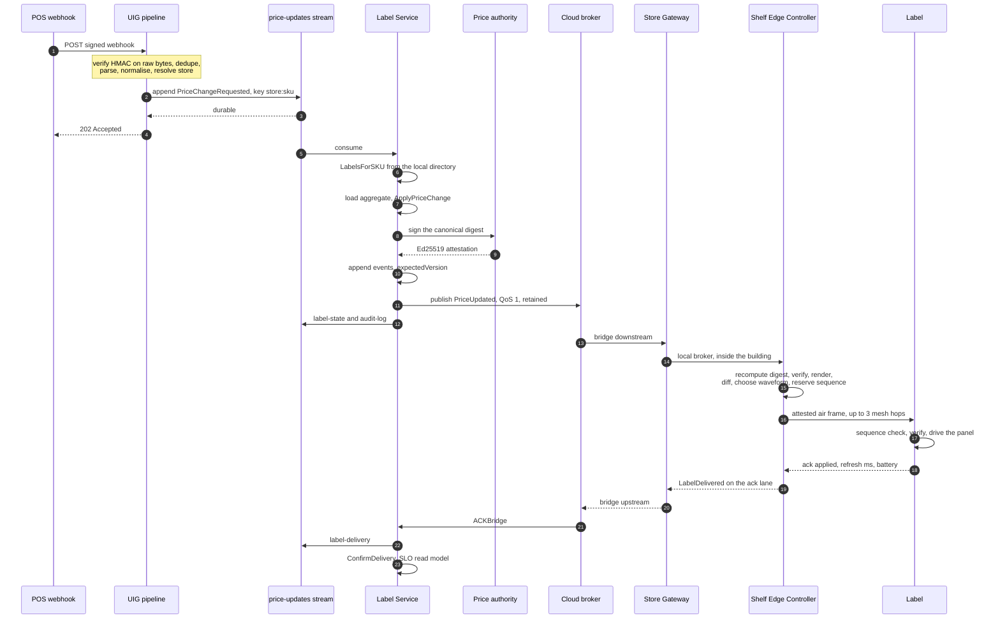

### Budget against measurement

| Hop | Budget §4 | Measured | Source |
|---|---:|---|---|
| POS to UIG | 50 ms | folded into the cloud share below | |
| UIG to stream | 30 ms | " | |
| stream to Label Service | 120 ms | " | |
| Label Service to broker | 100 ms | " | |
| broker to SGU to SEC | 100 ms | " | |
| **First five hops together** | **400 ms** | **8–18 ms** unsaturated; 3–13 ms in `make demo` | root README; DEMO.md |
| SEC to label | 400 ms | **75–244 ms** typical; **331–343 ms at p99** over 1,000 changes | root README |
| label refresh | 2,000 ms | **300 ms** partial, 1,500 ms full (2.9″ tier) | `labelsim.DisplaySpec` |
| ACK back to cloud | 200 ms | included in the end-to-end figure | |
| **Total** | **3,000 ms** | see below | |

**End to end, one change at a time into a settled 36-label store** (40 serial
changes, prices moved so a partial waveform is safe):

| | |
|---|---|
| p50 | **461 ms** |
| p90 | 551 ms |
| max | 583 ms |
| single-change range | 387–548 ms platform, 414–568 ms wall clock |
| cloud plus bridge share | 8–18 ms throughout |

**1,000 price changes at ten in flight into a 100-label store**, three
consecutive runs because a p99 from one run is an anecdote
(`TestPriceLatencyPercentiles`):

| run | p50 | p95 | **p99** | max | delivered |
|---|---|---|---|---|---|
| 1 | 526 ms | 1,823 ms | **2,420 ms** | 3,096 ms | 996/1000 |
| 2 | 529 ms | 1,744 ms | **1,890 ms** | 2,355 ms | 998/1000 |
| 3 | 541 ms | 1,834 ms | **2,441 ms** | 2,919 ms | 998/1000 |

The two to four changes per thousand that never arrive were abandoned by the
radio after three attempts and reported upstream as `label.update.failed` —
visible, not lost.

**The check on the check.** `TestEndToEndLatencyAgreesWithWallClock` times
twenty changes twice, once by the platform and once by a stopwatch outside the
process: median 463 ms against 481 ms, a difference of 18 ms. A latency measured
against a simulated clock is worth nothing until something has compared it with
a real one.

### Walkthrough

The measurement starts at `Envelope.RecordedAt` — the moment USSLP took durable
responsibility — and ends when the pixels settled. That is the only number a
retailer can verify by looking at a shelf.

Steps 1–5 are the UIG's 50 ms and the stream's 30 ms. The caller is answered as
soon as the append returns, not once the delivery has been indexed and filed.

Steps 6–8 are the Label Service's 120 ms, and they are why the service keeps its
own placement directory: resolving 40,000 placements over the network inside a
120 ms slice is not possible, and a Device Registry outage must not stop prices
changing.

Steps 9–12 are the order that is not negotiable. The events are durable **before**
anything is published, so a price on a shelf is always explainable from the
event store. The attestation is computed **before** the append, so the signature
that authorised a price is stored with it rather than re-derived later by a
service that might disagree about what was signed. And the device publish
happens **before** the stream publishes, because the shelf is what the SLO
measures and the analytics pipeline is not.

Step 12 is retained. A controller rebooting after a power cut recovers the
current price of every label in its zone from the local broker without a round
trip to a cloud that may be unreachable.

Steps 14–17 are the controller's work and are covered in §6.

Steps 18–22 close the loop. The ACK bridge subscribes to `canon.FilterAllACKs`
on the cloud broker and republishes onto `label-delivery`; the delivery consumer
folds it into the aggregate and the SLO read model. `DeliveryConfirmed` also
resets a label previously marked offline to active — a confirmation is proof of
reachability and therefore the fastest signal that a label is back.

### A divergence that was here, and how it was closed

The §4 line item for `SEC to label` used to be 300 ms while the platform measured
331–343 at p99, repeatably. The cause is end-to-end attestation: carrying the
signed tuple to the label makes the air frame 199 bytes larger, which is more
airtime per transmission. Since the three-second total holds with room, the line
item was the wrong side of the comparison; §4 now allows this hop **400 ms**, and
takes the 100 ms from `Label Svc → broker` and `broker → SGU → SEC`, which
together measure 8–18 ms against what was a 300 ms allowance.

§4 records the cause as well as the number, because the tempting way back under
300 ms is to shrink the frame — and the 199 bytes are the label's ability to
verify a price without trusting the controller that sent it.

### What the three-second claim does not cover

- **A store that cannot be reached.** Held durably and applied in order when
  the link returns; `make demo` measures one deliberately at 8–9.5 s, most of
  which is the outage. See §4.
- **A store held at saturation.** 36 positions repriced together give p50
  1,847 ms and p99 3,551 ms with two thirds inside budget. See §3 and §9.
- **A delivery the radio has to repeat.** §4 budgets hops, not
  retransmissions. See §7.

---

## 2. Zero-touch device provisioning — factory to first display

`test/e2e/provisioning_test.go`, `platform/internal/registry/app/provision.go`.

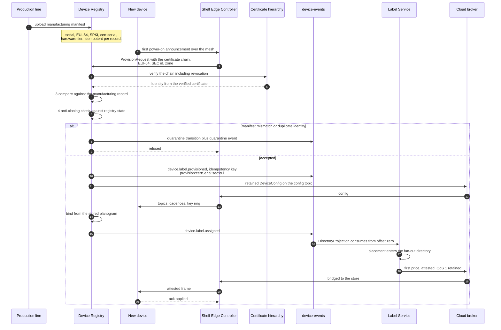

### Budget

There is no §4 budget for provisioning; it is not on the price path. The
platform's operational commitment is different and it is stated in
`docs/DEMO.md`: **"booted" means the store is open for trade** — the `usslpd`
banner does not print until every device has been enrolled through this exact
path, a planogram has been applied, and an opening price book has been delivered
to every label and confirmed by every panel.

### Walkthrough

The order of steps 5–8 is the security design, argued in full in
[03 §3](03-components.md#3-device-registry): verify the chain including
revocation before reading a single field of the request; take the identity from
the verified certificate and never from the body, so a relaying controller
cannot enrol a label into a store it does not serve; compare the manufacturing
record — public key above all, because a certificate that verifies proves only
that some authority signed it while the key proves it is the certificate issued
to the unit that came off the line; and only then consult registry state for
anti-cloning. Failures at the last two **quarantine the identity**: when two
things present the same identity the platform cannot tell which is genuine.

A re-announcement — and the mesh retries, because a label that does not hear its
configuration announces again — is made a no-op by the idempotency key
`provision:{certSerial}:{sec}:{eui}`.

`DeviceConfig` is deliberately complete rather than minimal. A label that has
just joined has no state and no way to ask a follow-up question; its next
transmission window may be five minutes away. So everything it needs arrives in
one retained message: where to listen, where to acknowledge, how often to speak,
and which key ring to verify prices against.

A device that moved between controllers leaves retained configuration on the old
zone topic. The registry is the only component that knows the move happened, so
it clears both the old config and the old price topics with zero-length retained
publishes (INTERFACE-CONTRACTS §3).

---

## 3. Store-wide promotion fan-out

`test/e2e/promotion_test.go`, `platform/internal/label/app/promotion.go`,
`platform/internal/promotion/domain/{dsl.go,compile.go,price.go}`,
`platform/internal/label/service.go` (consumer group `label-service.promotions`).

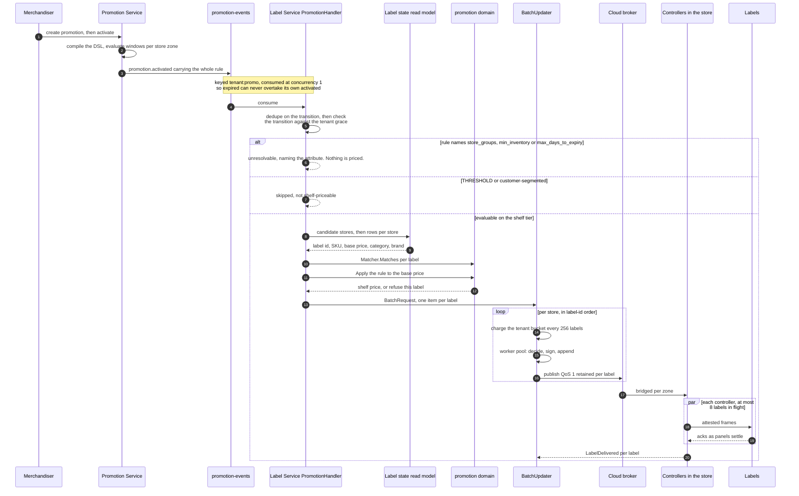

On `promotion.expired` the same handler runs in reverse: it selects labels whose
read-model row still carries this `PromotionID`, and reprices each to its
`BasePrice` with no promotion marker.

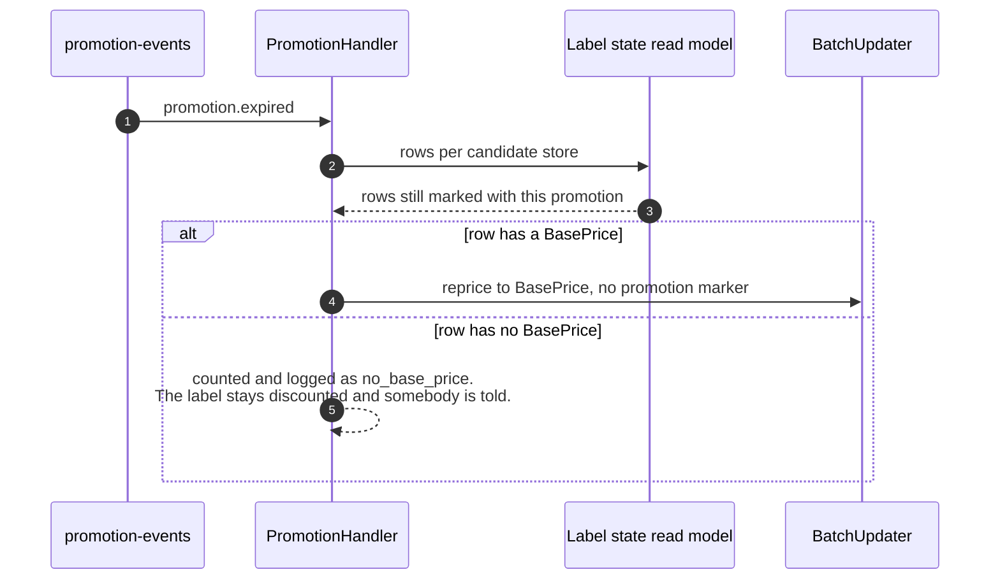

### Budget and measurement

There is no §4 budget for a fan-out; §4 is about *a* price change. What is
measured:

| | Measured | Source |
|---|---|---|
| 24 shelf positions resolved, priced and published | **26 ms** | root README |
| every panel settled | **3.9 s later** | root README |
| 36 items to 36 labels, platform side | **20 ms** | DEMO.md |
| 36 positions repriced together, delivery | p50 **1,847 ms**, p95 3,473 ms, p99 **3,551 ms**, 66.7% inside the 3,000 ms budget | DEMO.md, root README |

**That tail is not a defect.** A store-wide fan-out asks every panel to run a
waveform at once, and a controller transmits to at most eight labels at a time
because a label's radio is off while its panel runs a waveform. The queue is at
the radio, by construction. The three-second budget is a statement about a price
change, not about a store held at its ceiling; `test/load` measures where that
ceiling is (§9).

### Walkthrough

**The rule travels whole, by the producer's design.** `promotion-events` carries
the entire promotion document — conditions and parameters — so that a national
activation does not become two thousand stores' worth of simultaneous lookups
against one service. The Label Service declares its own view of that payload
(`app.PromotionActivation`) and depends on the promotion *domain*, which imports
nothing but `canon`, rather than on the promotion *service*.

**Nothing in the promotion path publishes to a device or appends an event.** The
resolved set becomes a `BatchRequest` and goes through `BatchUpdater`, so the
fan-out gets the same per-tenant rate limiting, attestation, sequencing, guard
rails and per-label failure reporting as a store-wide repricing (§9). The
per-label idempotency key names the *transition* — `{eventType}:{promo}:{instant
ns}:{label}` — so a redelivered activation is a no-op on the aggregate and no
second refresh is driven, while a genuine re-activation later is a different
fact.

**A stale transition is refused once, not forty thousand times.** A transition
older than the tenant's effective-at grace is rejected at the top of the handler
with a named reason. Letting it through would have the aggregate reject each of
forty thousand labels individually and write forty thousand rejection events for
one stale record.

**Reversion is driven by "which labels show this promotion", not by re-matching
the rule.** A label whose category or price changed while the promotion ran
would no longer match, and re-matching would leave it discounted forever. What
went on because of a promotion comes off when it ends, whatever has happened
since. A label with no `BasePrice` cannot be reverted; those are counted and
logged rather than guessed at.

**Precedence is still the Promotion Service's.** When several promotions match
one product, `promodomain.Resolve` applies priority descending; then **best for
the customer**, because a shopper who sees two offers and gets the worse one has
a complaint that is usually also a regulatory one; then most specific; then
promotion id ascending as a stable tie-break. Stacking is orthogonal. See
[07 §B3](07-flows.md#b3-promotion-conflict-resolution).

### Known limitation: overlapping promotions are last-activation-wins at the shelf

`Resolve` arbitrates against the *whole* active set, and only the Promotion
Service holds that set; `promotion-events` carries the rule but not `Resolve`'s
output. `PromotionHandler` deliberately does not re-implement a partial arbiter,
because a second pricing engine eventually disagrees with the first — which is
the failure the split exists to prevent. The consequence is explicit and
predictable: **where two promotions overlap, the most recently activated one is
what the shelf shows**, because it takes the higher per-label sequence. It is
not silent — every applied item names its promotion — but it is not `Resolve`'s
answer either. The fix is to put the resolved outcome on the event, not to add
logic to the consumer.

### A divergence that was here, and how it was closed

Until 2026-08-31 the Label Service did not consume `promotion-events` at all,
though INTERFACE-CONTRACTS §2 listed it as a consumer and the Promotion
Service's package comment said "the Label Service turns those into shelf
updates". A promotion activated and no shelf changed. `usslpd` stood in with a
bridge in its composition root (`stack/promobridge.go`) that called the fan-out
synchronously. The service now has the consumer; the bridge is gone, and
`stack/promotion.go` retains only the ability to activate a promotion and then
*observe* what the shelves show — deliberately, because a report handed back by
the workaround was a number from the workaround rather than from the product.

---

## 4. WAN outage — entering autonomy, operating, and reconciling

`test/e2e/outage_test.go`, `edge/sgu/{wan,autonomy,crdt,hlc,queue}.go`.

### 4a. Detection and entry

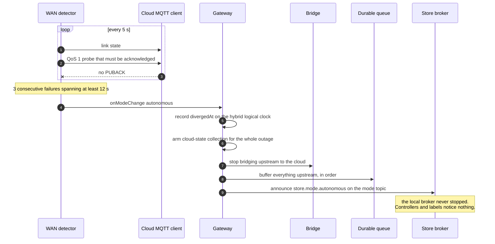

### 4b. Operating alone

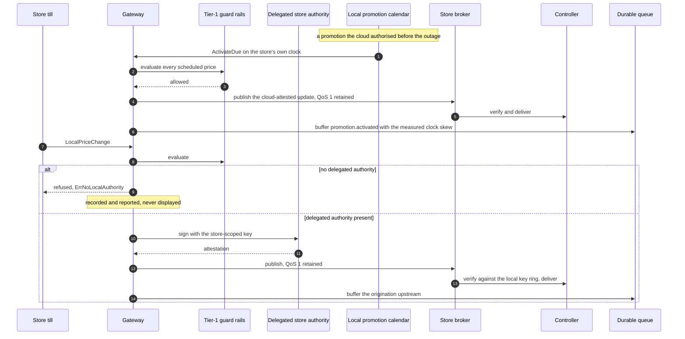

### 4c. Recovery and reconciliation

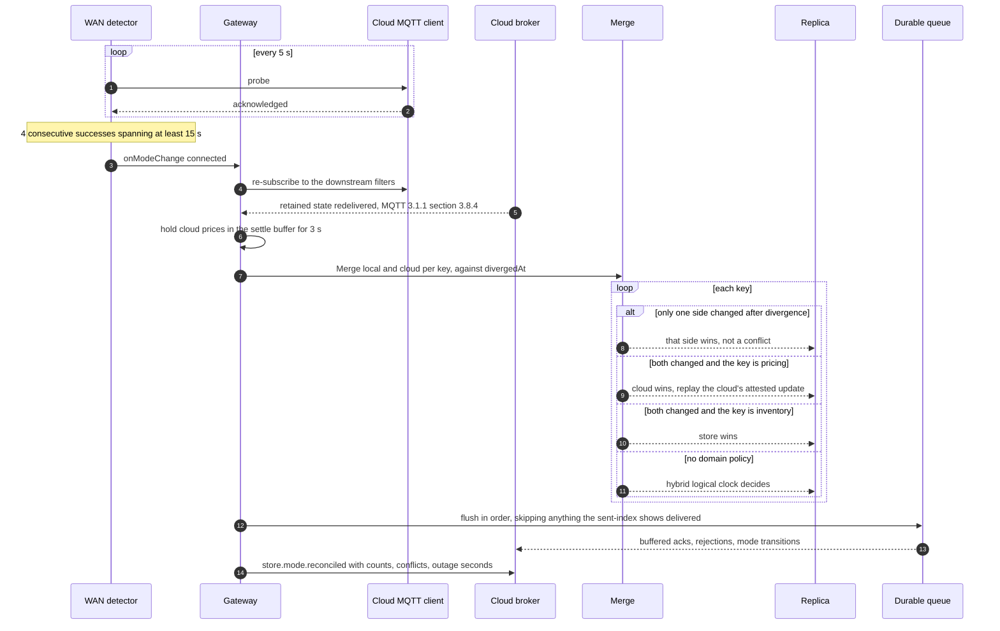

### Budget and measurement

| | Value | Source |
|---|---|---|
| Probe interval | 5 s | `DetectorConfig` defaults |
| Entering autonomy | 3 consecutive failed probes spanning at least 12 s | `wan.go` |
| Leaving autonomy | 4 consecutive successes spanning at least 15 s | `wan.go` |
| Reconciliation settle window | 3 s | `sgu.Config.ReconcileSettle` |
| A price changed during an outage, end to end | **8–9.5 s**, most of it the outage | DEMO.md, root README |
| Label downtime during the outage | **zero** — asserted per label by `TestStoreSurvivesWANOutage` | `test/e2e/outage_test.go` |

### Walkthrough

**Why hysteresis is asymmetric.** Entering autonomy is cheap and reversible and
should happen quickly once the evidence is unambiguous. Leaving it means
replaying a buffer and running a merge, so it waits for the link to prove itself
for longer than it took to fail — a flapping link declared healthy causes a
reconciliation, and a reconciliation interrupted halfway is the one genuinely
messy state in this design.

**Why the probe is a round trip and not a connection state.** The failure this
has to catch is the one a connection state cannot see: a TCP session to a load
balancer that is still open while everything behind it is gone. Requiring the
PUBACK means the probe succeeds only if the store can genuinely still be heard.

**Why merge order is merge-then-flush.** Merging first means the buffer is
flushed against a store whose state already agrees with the cloud's, so the
acknowledgements and rejections in it describe a world the cloud can make sense
of. Flushing first would replay, in order, a series of events about prices the
merge is about to overturn.

**Why pure last-writer-wins is wrong here, in two specific ways.** A key only
one side touched is not a conflict whatever the timestamps say — pure LWW would
let a cloud value that predates the outage overwrite a local change made during
it, purely because the cloud's clock ticked more recently on some unrelated
field; hence `divergedAt`. And where both sides changed, the winner is decided by
what the value *is*: price is the cloud's, because head office owns pricing and a
promotion the merchandising team launched must not be silently reverted because a
till in one store was a second later; inventory is the store's, because the
cloud's figure is a projection of events and the store's is a count of things on
a shelf. Neither follows from a timestamp.

**Why the cloud winning means replaying the cloud's own update.** The gateway
cannot re-sign someone else's price and a label will not display one it cannot
verify, so correcting the shelf means republishing the cloud's attested update
through the ordinary path — one code path for a price reaching a controller
rather than two that can drift apart.

**Why the buffer explains its own overflow.** Three sacrifice classes — `bulk`,
`latest`, `critical` — and dropping a critical message latches a lossy flag so
the reconciliation report says plainly that the cloud's record of this outage has
a hole in it. Detail: [03 §6](03-components.md#6-store-gateway-unit).

---

## 5. Staged OTA rollout, including the cohort-failure rollback

`test/e2e/ota_test.go`, `platform/internal/ota`.

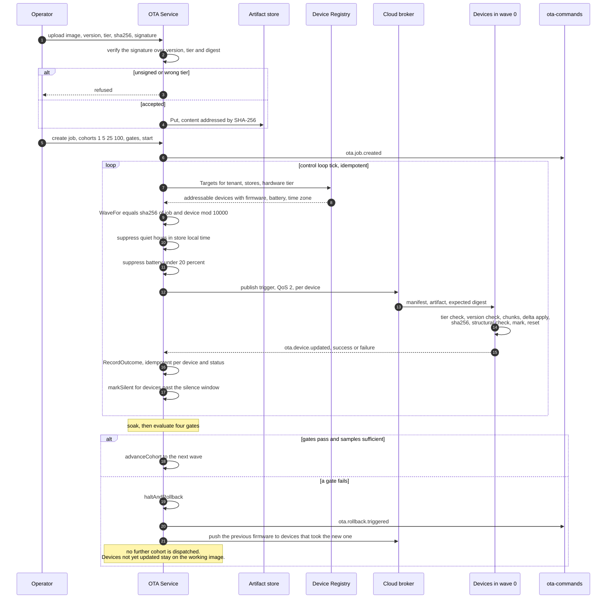

### Gate defaults

`domain.DefaultHealthGates()`:

| Gate | Default | Why |
|---|---:|---|
| `MaxErrorRate` | 2% | High enough that a handful of flat batteries in one aisle does not halt a national rollout, low enough that a genuinely bad image is caught in the first cohort. |
| `MaxBootFailureRate` | 1% | Lower, because a boot failure is a device somebody has to physically retrieve, where a failed update is a device still running its old firmware. |
| `MaxSilenceRate` | 5% | The gate a naive controller misses: it counts successes and failures, sees no failures, and advances a rollout that has killed every device it touched. |
| `MaxBatteryAnomalyRate` | 5% | A bug in the sleep path drains a coin cell in weeks and shows up long before a failure does. |
| `MinSuccessRate` | 95% | Required before widening. |
| `MinCohortSamples` | 20 | Without it, a first wave of three devices with one failure reads as a 33% error rate and halts a rollout on no evidence. |
| `SoakDuration` | 30 min | The failures that matter most take time to appear. A rollout that advances the instant the last acknowledgement lands has tested nothing except the download. |
| `SilenceWindow` | 15 min | How long a dispatched device may say nothing. |

Default cohorts are cumulative: **1%, 5%, 25%, 100%**. Cumulative is the form an
operator reasons in ("we're at 25%") and it makes a wave's membership stable when
a later wave's size is changed mid-rollout.

### Walkthrough

**There is no budget here and there should not be.** An OTA rollout is measured
in hours and days by design; the soak is the point.

**The tier check is first, before any flash is erased.** An image built for the
4.2″ panel flashed onto a 2.9″ one drives the wrong waveform tables, and a wrong
waveform can bake a permanent shadow into a panel — a failure not visible for
weeks and not recoverable at all. That is also why the artifact signature covers
version, hardware tier *and* digest together: a correct image cannot be flashed
onto the wrong panel.

**"Confirmed" means joined the mesh and applied one price update**, not
"booted". An image that boots and cannot join is exactly as unreachable as one
that does not boot.

**The pre-swap check on the label is not an authenticity check, and does not
claim to be.** `usslp_slot_verify_signature` checks that the assembled image is
structurally an image — header magic, declared size against bytes written, TLV
trailer — plus the SHA-256 against the manifest. That catches a corrupt transfer
while the label is still awake instead of after two reboots and a failed swap on
a coin cell. A *forged* image passes it and fails at boot, where MCUboot checks
the signature; Zephyr does not expose MCUboot's verifier to the application, and
moving it there would mean moving the key there.

**Two rollout transitions are deliberately missing** — `halted → running` and
`rolled_back → anything`. See [06 §8.4](06-data-architecture.md#84-ota-rollout)
for the state machine and the argument.

---

## 6. Price attestation verification, including refusal

`test/e2e/attestation_test.go`, `test/e2e/fleet_attestation_test.go`,
`canon/attestation.go`, `edge/sec/controller.go`, `edge/labelsim/label.go`.

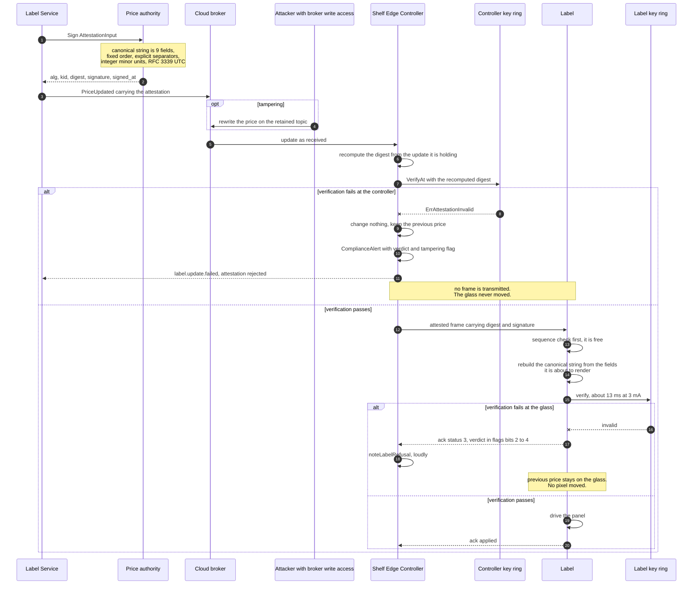

### Budget

| | Value | Source |
|---|---:|---|
| Ed25519 verification on the label | ~13 ms at 3 mA, about 11 nAh | `labelsim.PowerProfile.VerifyDuration`, `firmware/src/crypto/psa_backend.c` |
| Air-frame growth from carrying the signed tuple | +199 bytes | root README |
| Channel utilisation per zone, before and after end-to-end attestation | 1.55% to **2.08%** | root README |
| Effect on the §4 `SEC to label` line | the line item was **raised from 300 ms to 400 ms** to match the measured 331–343 ms at p99; the 100 ms came from the two cloud hops, which have 8–18 ms of measured traffic in a 300 ms allowance | root README, INTERFACE-CONTRACTS §4 |

### Walkthrough

**The digest is recomputed locally at both checks, never read from the wire.**
That is what makes substituting a valid signature from a different price fail:
the recomputed digest will not match what was signed. `canon.Verify` compares
the transmitted digest with the locally recomputed one *first*, so a mismatch is
reported as tampering rather than as a signature failure — the two have
different runbook entries.

**The canonical string is deliberately dull.** Fixed field order, explicit
separators, integer minor units, RFC 3339 UTC to the second, no optional
whitespace, no map iteration. The firmware implements the same nine lines in C
(`crypto/usslp_canon.c`); if the two disagree by one character, every label in
the fleet refuses every update and keeps showing yesterday's price — correctly,
quietly and forever, with no telemetry signature that distinguishes it from an
attack. `firmware/tests/test_canon.c` therefore compares the **bytes**, not the
hash of them, against vectors the Go implementation produced, including
pre-epoch timestamps, `INT64_MIN`, non-ASCII SKUs, and the separator-collision
case where store `"ab"`/label `"c"` must not hash the same as store
`"a"`/label `"bc"`.

**Why the second check exists.** The first check's trust boundary has a
controller inside it. A shelf label is a device the public can stand in front
of; a controller is a box in a back room that can be rooted or physically
swapped. Verifying only at the controller means the last hop is protected by the
thing an attacker would replace. Verifying at the glass means a price is
provable at the point a shopper reads it, which is the point a trading standards
officer asks about.

**The refusal path is the point, not an error path.** The only correct behaviour
is to change nothing. A blank shelf edge and an unverified price are both worse
than a stale one. An attacker with write access to the store's broker can
therefore prevent a price from changing, which is visible within three missed
heartbeats — they cannot change one.

**Two refusal codes and eight verdicts, because the runbooks are opposite.** Ack
status 3 is a compliance incident; status 4 is a fleet configuration mismatch,
and the coordinator stops transmitting unattested frames to that label rather
than spending the zone's airtime once per update per label. The three-bit
verdict distinguishes a stale key ring from actual tampering without a round
trip, and the two land in separate alert queues on the controller so neither
buries the other. Frame and ack layout:
[04 divergence 4](04-block-diagrams.md#divergences-from-the-blueprint-figures).

**Sequence check before attestation, on the label.** A duplicate is the common
case under at-least-once delivery and a verification is 13 ms of a coin cell's
life. Checking the free invariant first costs nothing in safety.

---

## 7. Mesh self-healing — predictive reroute and reactive recovery

`test/e2e/mesh_test.go`, `edge/sec/{predict.go,coordinator.go}`,
`edge/mesh/routing.go`.

### 7a. Predictive — before the link fails

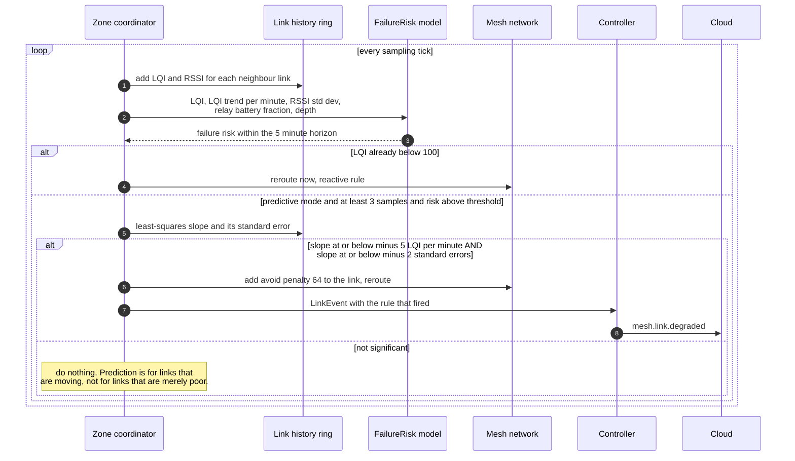

### 7b. Reactive — after a relay dies

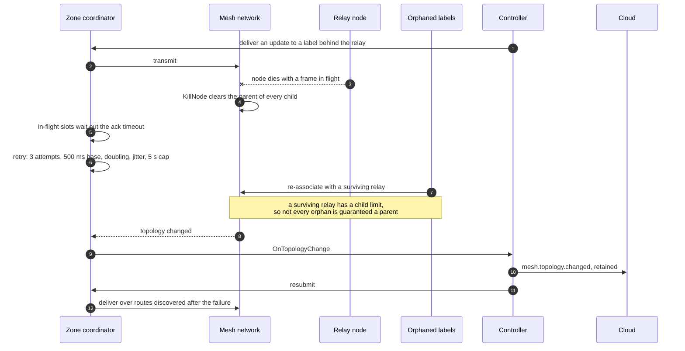

### Budget and measurement

| | Value | Source |
|---|---|---|
| Prediction horizon | 5 minutes | `sec.PredictionHorizon` |
| Reactive threshold | LQI below 100 | `sec.RerouteThreshold` |
| Minimum trend before prediction may act | −5.0 LQI/minute **and** at least 2 standard errors | `sec.MinDegradationTrend`, `sec.TrendSignificance` |
| Application-layer retry | 3 attempts, 500 ms base, ×2, jitter, 5 s cap | `sec.CoordinatorConfig.Retry` |
| First-attempt deliveries after a heal | **1,779–2,105 ms**, comfortably inside 3,000 ms | `TestMeshReroutesAroundADeadRelay` |
| Deliveries needing a second or third attempt after a reroute | about **one in six** | root README |
| A third attempt on top of a 1,500 ms full waveform | **3.2–4.3 s**, over the budget | root README |

### Walkthrough

**The reactive rule every Zigbee deployment ships with works, and is always
late.** By the time LQI has crossed 100 the link is already dropping frames, and
every price update in flight over it has to be retried or lost. The predictive
model moves that decision earlier: a logistic regression over five features the
controller already samples, with coefficients fitted offline and embedded as
constants. Inference is six multiply-adds and one exponential.

**What the coefficients encode**, stated rather than presented as inscrutable
weights: a smooth version of "extrapolate the LQI trend three minutes forward
and compare it with the reroute threshold", adjusted by the variance of the RSSI
(a link fluttering between good and bad is about to settle on bad), the relay's
remaining battery, and the node's depth in the tree.

**Why two guards on the trend and not one**, and how the floor was chosen from
the measurement noise: see
[03 §7](03-components.md#7-shelf-edge-controller). The short version is that a
fixed threshold four standard errors late in the sample window is well under one
early in it — exactly when a controller has just started and has three samples —
and an untested version of this model rerouted a fifth of a healthy store in its
first minute.

**Prediction never replaces the reactive rule.** It is armed in both modes: a
link that has already failed must be moved whether or not a model saw it coming.
`HealReactive` exists so the platform's claim to be better than a stock stack is
measurable rather than asserted; `HealOff` still lets routes change when a node
dies, because that is the mesh repairing itself rather than the controller
steering it.

**The avoid penalty is 64**, which exceeds the worst plausible path cost (7 per
hop over a 5-hop radius), so an avoided link is used only when there is genuinely
no alternative — the label keeps working, degraded, rather than going dark
because a prediction was pessimistic.

### Divergence

`edge/mesh.KillNode` orphans a relay's children but does not schedule their
rejoin; `TestMeshReroutesAroundADeadRelay` drives re-association itself. That is
a limitation of the radio model, not of the platform: the controller's link
event, the reroute, the retry, the sequence rule and the attestation are all
real. The test also polls the rejoin count until it stops moving rather than
until it reaches the whole set, because a surviving relay has a child limit and
a backbone with a quarter of its capacity spare cannot always absorb every child
of a failed peer — a real property of a Zigbee tree, reported rather than
asserted away.

---

## 8. POS ingest through the UIG, with a redelivered webhook

`test/e2e/idempotency_test.go`, `platform/internal/uig/pipeline/pipeline.go`.

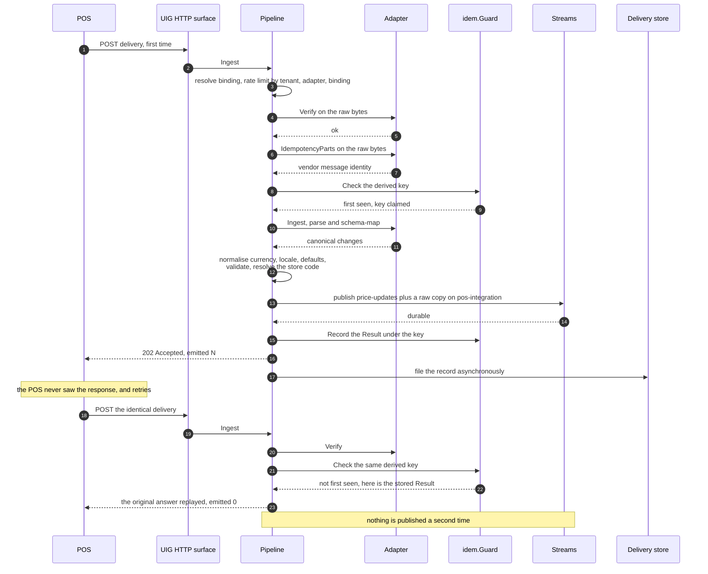

### Budget

| Hop | Budget §4 | Note |
|---|---:|---|
| POS to UIG | 50 ms | The pipeline's own `LatencyBudget`; exceeding it increments `BudgetExceeded` per adapter. |
| UIG to stream | 30 ms | Durable append with `acks=all`. |

Measured: the first five contract hops together are **8–18 ms** in the settled
case and **33–49 ms at p50** in an unsaturated store under load; the dedupe path
is a hash lookup and does not parse.

### Walkthrough

**Verification precedes everything, on the raw bytes** — see
[03 §2](03-components.md#2-universal-integration-gateway) for why, and why the
body is never re-encoded (a JSON round-trip that reorders keys invalidates every
HMAC the platform is asked to check, which is the single most common way a
webhook integration is broken).

**Deduplication precedes parsing**, because the expensive stage is parsing and
the common case in retail integration is redelivery: an SAP ALE queue resending
a 6,000-segment IDoc costs a hash lookup here, not a parse.

**The dedupe key always mixes in tenant, binding and adapter name**, because two
retailers whose POS systems number their messages identically — which, with
sequential integer message ids, they routinely do — must never dedupe each
other's traffic. With no vendor identity available the key falls back to a
SHA-256 of the exact bytes: always correct, merely coarser.

**The duplicate is answered with the original response, verbatim**, apart from
this delivery's own identity, so a retrying producer sees the outcome it would
have seen first time and stops retrying. `Emitted` is forced to zero on a
duplicate whatever the original did. If the original is still in flight on
another replica the honest answer is 202 with no emitted changes and a detail
saying so — telling the producer "accepted" would be a lie and telling it
"failed" would cause a duplicate.

**Any path that does not durably publish releases the key.** Holding it after a
failure would suppress every retry for 24 hours and lose the price change
silently, which is the worst failure mode a pricing system has.

**Per-event idempotency keys downstream.** The envelope's key is
`{dedupeKey}/{index}`, not the delivery key, because a delivery carrying 400
variants must not collapse to one event on replay; the Label Service derives a
further per-label `{base}#{labelID}`. The four boundaries are tabulated in
[06 §1](06-data-architecture.md#1-the-event-streams).

### Known gap this sequence does not close

A *distinct* POS delivery carrying the price already displayed still refreshes
the panel. All four documented idempotency boundaries hold and none covers this
case: the aggregate applies the change and the label runs a full waveform to
redraw the same number. A full waveform is roughly a hundred times the energy of
anything else a label does, so a POS that republishes its price book nightly
would spend the fleet's battery budget on it.
`TestDistinctWebhookWithAnUnchangedPriceStillRefreshes` records the behaviour so
that fixing it is visible.

---

## 9. Batch price fan-out — worker pool and per-tenant rate limiting

`platform/internal/label/app/{batch.go,ratelimit.go}`, `test/load/load_test.go`.

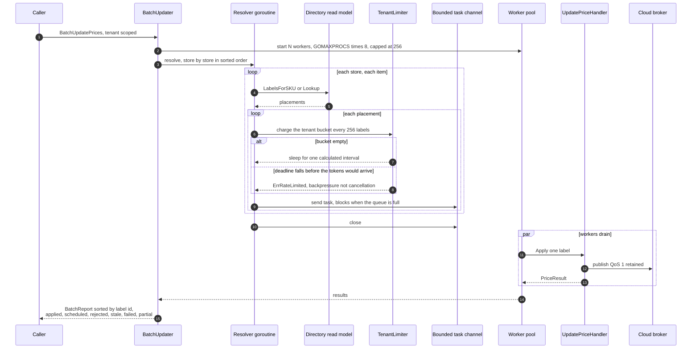

### Configuration and measurement

| | Value | Source |
|---|---:|---|
| Workers | `GOMAXPROCS × 8`, capped at 256 | `MaxBatchWorkers` |
| Task queue depth | 1,024 | `DefaultBatchQueue` |
| Rate-limiter charge granularity | 256 labels | `DefaultStoreChunk` |
| Per-tenant sustained rate | 10,000 label updates/s | `DefaultTenantRate` |
| Per-tenant burst | 40,000 — one store's worth of labels | `DefaultTenantBurst` |

**Sustained load: two stores, 480 labels, 40/s offered for 45 s**, two runs
(`test/load`):

| | run 1 | run 2 |
|---|---|---|
| delivered | 37.6/s, 1,796 of 1,800 | 37.7/s, 1,796 of 1,800 |
| end to end | p50 1,378 ms, p99 2,697 ms, max 3,751 ms | p50 1,405 ms, p99 2,706 ms, max 3,843 ms |
| inside the 3,000 ms SLO | 99.61% | 99.61% |
| bottleneck | dispatch queueing at the edge, not the cloud tier | the same |

At this rate the first five contract hops — everything from the POS to the
controller — are **922 ms at p50 against a 400 ms budget**, and that excess is
queue, not service time: the same hops are 33–49 ms at p50 when the store is not
saturated.

### Walkthrough

**Three properties matter more than throughput**, and each shows in the diagram
above.

*Bounded memory.* The queue is a smoothing buffer, not a holding pen: a deep
queue would let the resolver race ahead, materialise every task in memory, and
turn a cancelled request into tens of thousands of orphaned allocations. At 1,024
the resolver blocks as soon as the workers fall behind — backpressure applied
where it costs nothing.

*Per-tenant fairness.* Without a per-tenant bound, one tenant's overnight
repricing occupies every worker for minutes while another tenant's single urgent
change — a mispriced item a manager is standing next to — waits behind it. A
global limiter would just mean the loudest tenant consumes the whole global
budget. The bucket carries one store's worth of labels and refills at the
sustained rate, because a promotion is not a steady stream, it is a cliff.

*Honest partial failure.* A label that fails is reported as that label failing;
the batch does not abort, because forty thousand correct price changes must not
be thrown away by one unreachable controller. The caller branches on
`BatchReport.Partial`: the decision after "one controller was unreachable" is
completely different from the decision after "the whole batch was rejected".

**Grouping by store is not cosmetic.** One store's labels stay adjacent in the
queue, so the workers touching them hit the same directory pages and the same
broker session, and the limiter charge becomes one lock acquisition per 256
labels instead of one per label.

**Shutdown drains.** `Service.Shutdown` calls `batch.Drain` first. A process that
exits mid-fan-out leaves a store half repriced, with some shelves showing the new
promotion and some the old price, which is worse than not having started.

**The concurrency in the benchmark is chosen below the store's ceiling on
purpose.** Offering more measures a queue rather than a price change. At sixteen
in flight the same benchmark reports a p99 of about 3.3 s, and every millisecond
of the excess is a transmission slot being waited for — which is the experiment
`test/load` runs deliberately.

---

## 10. NFC shopper tap

`firmware/src/nfc/nfc.c`, `firmware/src/app/price.c`,
`edge/labelsim/label.go`, `edge/sec/controller.go`,
`platform/internal/analytics/{app/ingest.go,domain/tables.go}`.

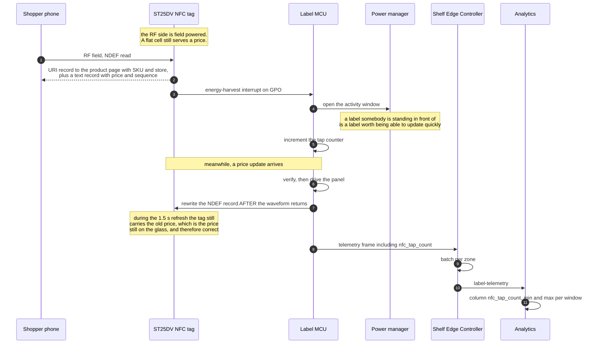

### Budget

| | Value | Source |
|---|---:|---|
| MCU wake cost per tap | 8 mA for 1,500 ms | `labelsim.PowerProfile.NFCMA`, `NFCTapDuration` |
| Contribution to the battery budget at 0.5 taps/day | 0.069 µA, about 1% | `firmware/README.md` |
| Telemetry batching | per controller, not per label | INTERFACE-CONTRACTS §3 |

There is no latency budget for a tap. The tag is field powered and the MCU is
not in the loop for a read: the phone gets its answer from EEPROM at NFC speed
whatever the label is doing.

### Walkthrough

**The invariant is that the NFC record follows the glass and never leads it.** A
shopper who taps a label and gets a price the panel is not showing has been shown
two different prices by the same device, which is the exact weights-and-measures
failure the whole attestation apparatus exists to prevent. So the record is
rewritten only *after* `usslp_eink_refresh` returns.

**Why the MCU wakes at all.** Not to serve the read — the tag does that — but
because the harvest interrupt is how the label learns a shopper is present, and a
label somebody is standing in front of is worth being able to update quickly. The
tap opens the activity window, the same mechanism a controller uses before a
price load.

**The write path arbitrates with the RF side.** An I²C write to the tag's EEPROM
takes about 5 ms per page and must not overlap an RF access; the ST25DV returns a
NACK, which almost always means a phone is holding the RF interface, so the write
backs off and retries. Failing would leave the tag carrying a stale price.

**Taps are a real signal and cost nothing to count.** A label with a hundred taps
a day is on a product people are uncertain about. The counter rides in telemetry,
is batched per controller (forwarding per label would be 13 million messages per
second across the modelled fleet, and is 0.08 messages/second per store batched),
and lands in the analytics store as `nfc_tap_count`, reported as first and last
per window so a rate can be derived without storing every reading.
