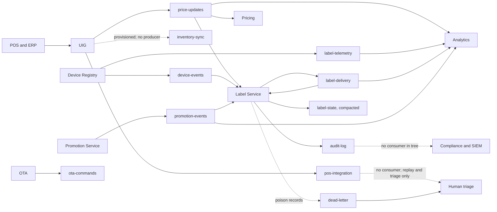
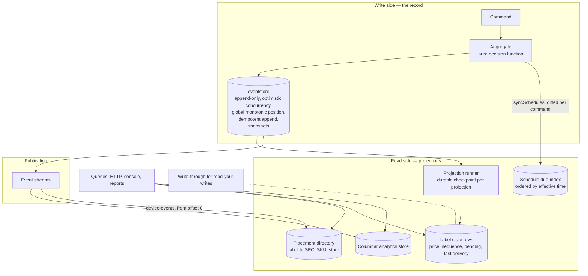
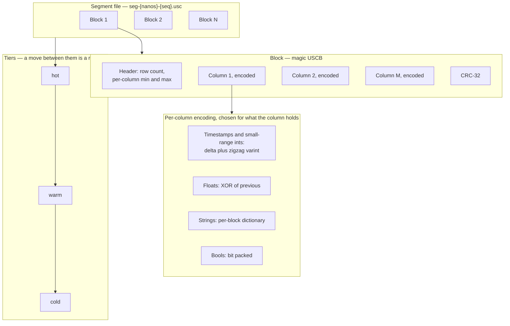
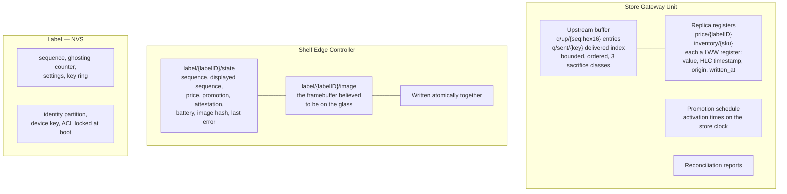
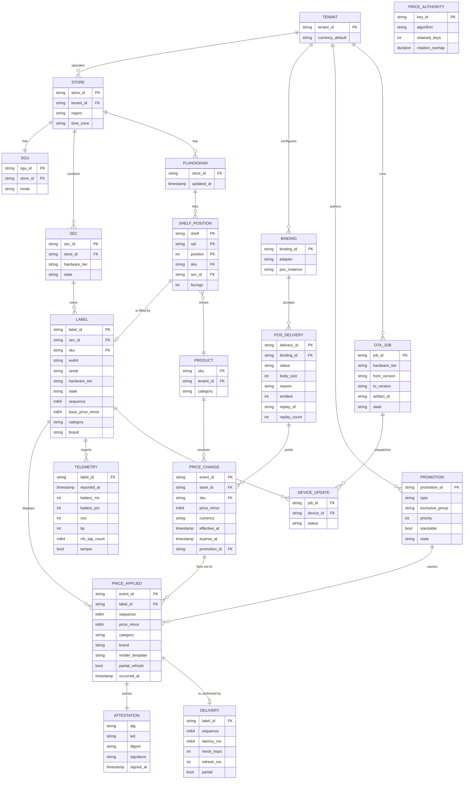
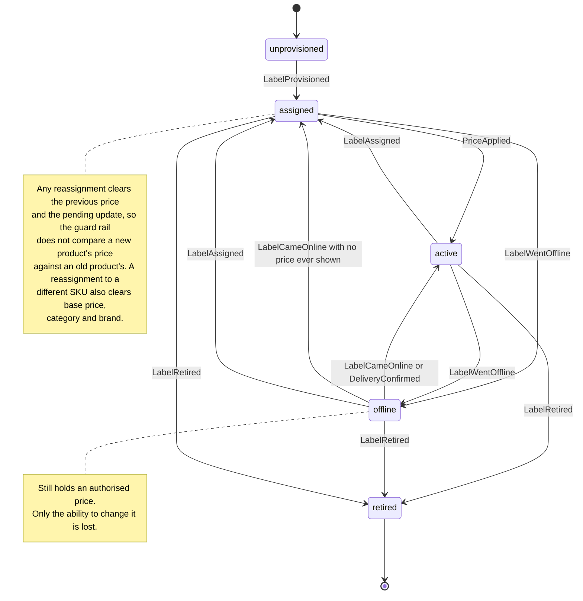
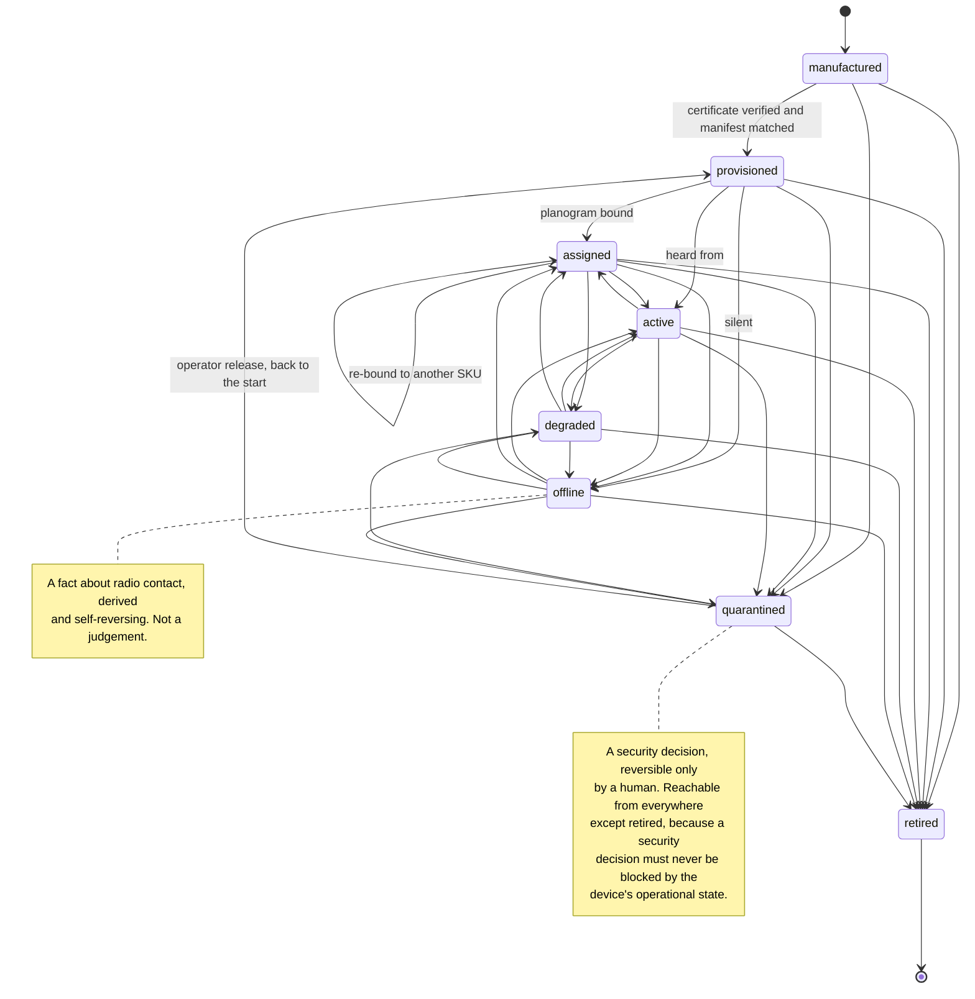
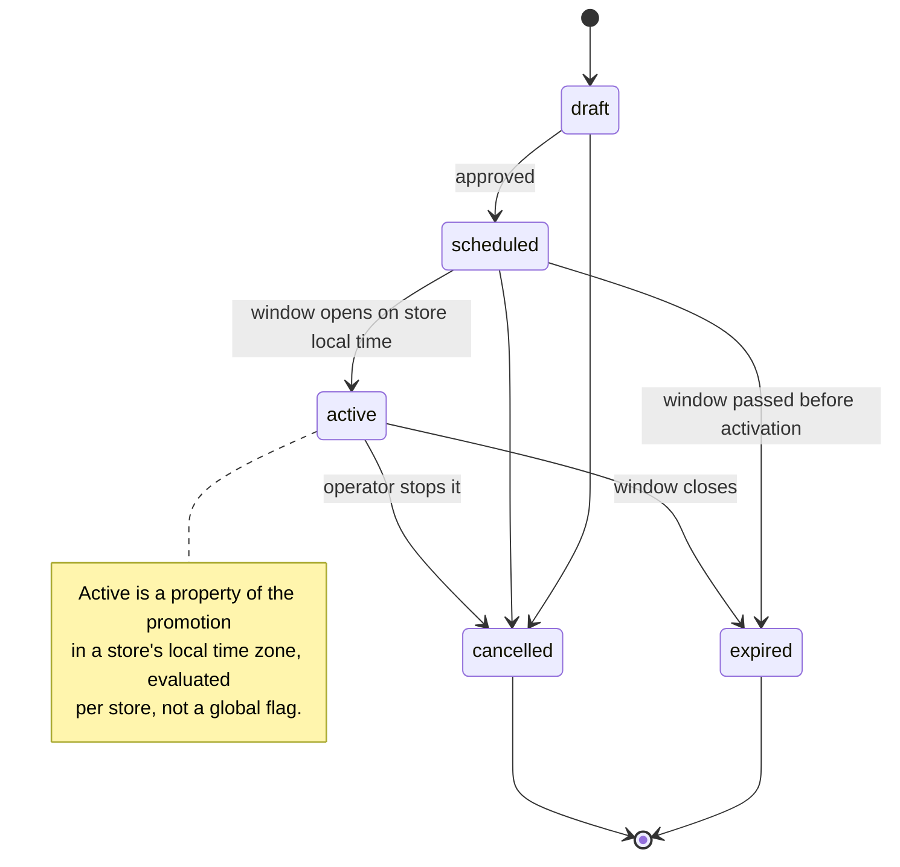
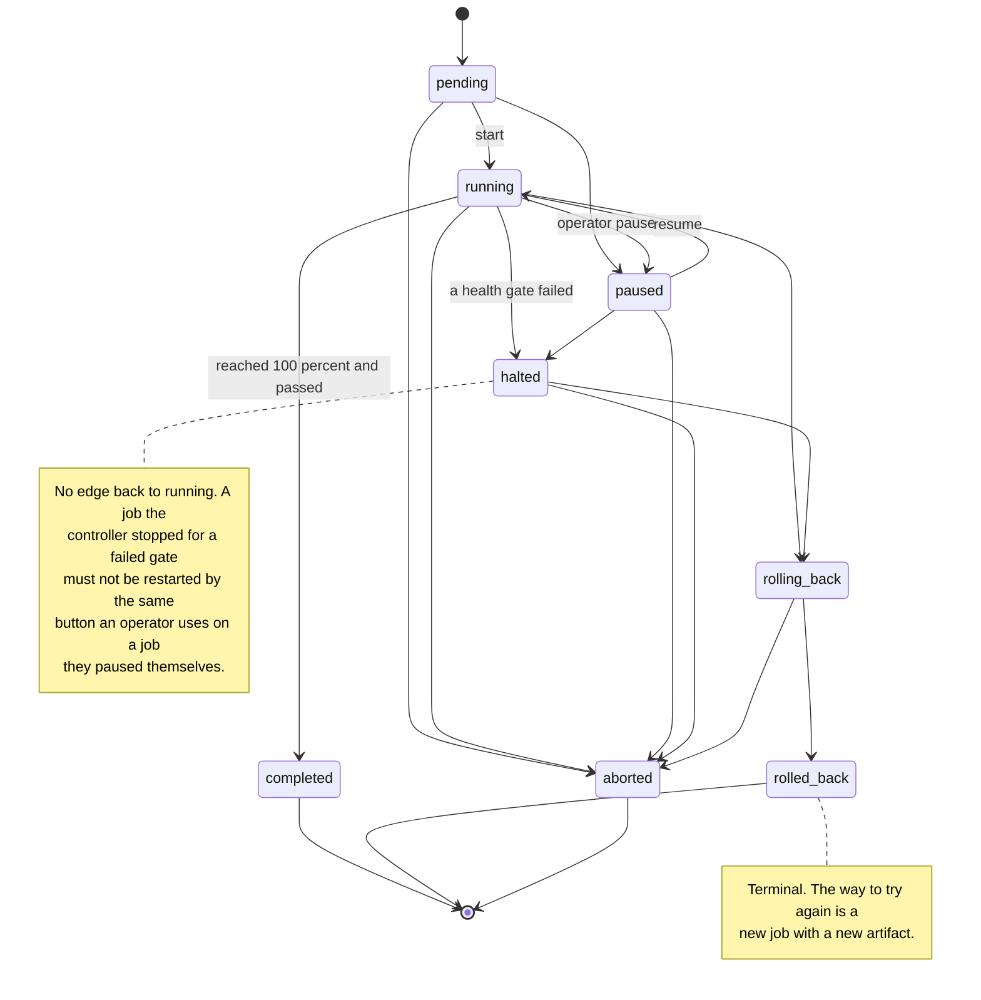

# 06 — Data architecture

**Derived from:** `platform/pkg/canon/{topics.go,events.go,ids.go,money.go,attestation.go}`,
`platform/pkg/{eventstore,eventlog,kvstore}` package documentation,
`platform/internal/label/{domain,ports,adapters}`,
`platform/internal/registry/domain/{device.go,events.go}`,
`platform/internal/ota/domain/{job.go,events.go,cohort.go}`,
`platform/internal/promotion/domain/{lifecycle.go,dsl.go}`,
`platform/internal/analytics/{domain/tables.go,domain/slo.go,columnar/*}`,
`platform/internal/uig/{pipeline/pipeline.go,deliveries/store.go}`,
`edge/sgu/{replica.go,queue.go,crdt.go,hlc.go}`, `edge/sec/controller.go`,
`docs/architecture/INTERFACE-CONTRACTS.md` §2 and §6.

See also: [02 — Containers](02-containers.md) ·
[03 — Components](03-components.md) ·
[05 — Sequence diagrams](05-sequence-diagrams.md)

---

## 1. The event streams

Defined once in `canon.AllStreams()`. The Helm chart, the compose topic job and
the MSK Terraform module each transcribe it, and `make verify-topics` fails if
any has drifted by a single partition.

| Stream | Partitions | Retention | Compacted | Key | Produced by | Consumed by |
|---|---:|---:|---|---|---|---|
| `price-updates` | 1,024 | 7 d | no | `store:sku` | UIG | Label Service, Pricing, Analytics, Audit |
| `label-telemetry` | 2,048 | 3 d | no | `label_id` | Device Registry, from edge batches | Analytics, anomaly detection |
| `device-events` | 512 | 30 d | no | `device_id` | Device Registry | Label Service, OTA, Monitoring |
| `label-delivery` | 512 | 7 d | no | `label_id` | Label Service, from edge ACKs | Analytics, SLO, Audit |
| `label-state` | 512 | **infinite** | **yes** | `label_id` | Label Service | read-model rebuilds |
| `pos-integration` | 256 | 3 d | no | `tenant:store` | UIG | Audit, Analytics |
| `inventory-sync` | 256 | 14 d | no | `store:sku` | UIG | Pricing, Analytics |
| `promotion-events` | 128 | 90 d | no | `tenant:promo` | Promotion Service | Label Service, Analytics |
| `ota-commands` | 128 | 7 d | no | `device_id` | OTA Service | Device Registry, edge |
| `audit-log` | 64 | 365 d | no | `tenant` | every service | Compliance, SIEM |
| `dead-letter` | 32 | 14 d | no | original key | every consumer | human triage |

Partition counts are sized from the capacity model in the source: 52,000 price
updates/second at peak and 167,000 telemetry events/second at 50 M labels.
`pos-integration` is retained for 3 days rather than 7 because it carries the
raw request body — the only thing that settles "the retailer says they sent
1.99".



### The two guarantees, and what they force

**Ordering is per partition key only.** `store:sku` keying means two price
changes for the same product in the same store are strictly ordered, while
different products proceed in parallel across 1,024 partitions. Nothing in the
platform may assume global ordering. `Envelope.PartitionKey()` derives the key
without fully decoding the payload — it peeks at the SKU, falls back to the
aggregate id, then to the tenant.

**Delivery is at least once.** Every consumer must be idempotent. Three
mechanisms carry that (§6):

| Boundary | Mechanism | Owner |
|---|---|---|
| POS to UIG | `idem.Guard`, 24 h window, key from adapter-supplied parts mixed with tenant, binding and adapter name | UIG |
| UIG to event store | `Envelope.IdempotencyKey`, no-op re-append | eventstore |
| Command to aggregate | `expectedVersion` optimistic concurrency | Label Service |
| Cloud to label | per-label monotonic `Sequence` | label firmware and simulator |

A label discards any update whose sequence is not greater than the one it is
displaying. That is what makes at-least-once mesh delivery safe: a duplicated
frame is a no-op, and a reordered one cannot roll a price backwards.

### The envelope

Every record is a JSON-encoded `canon.Envelope`. The fields that matter to a
consumer without opening the payload:

| Field | Why it exists |
|---|---|
| `event_id` | Sortable, time-prefixed (`NewULID`, a UUIDv7 in all but name) so event-store inserts stay at the right edge of the index. |
| `event_type` | Routed on via the `usslp-event-type` header so a consumer never deserialises a payload it was not addressed by. |
| `aggregate_type`, `aggregate_id`, `version` | Optimistic concurrency on the write side. |
| `occurred_at` vs `recorded_at` | The source system's clock vs the moment USSLP took durable responsibility. They differ during backfills and after a WAN outage, and analytics must never confuse them — confusing them produces negative latencies after a gateway resyncs its clock. |
| `trace_id`, `span_id`, `correlation_id`, `causation_id` | One POS webhook is one trace across nine hops. |
| `source` | "uig/shopify", "label-service". Audit reviewers ask this first. |
| `schema_version` | Consumers accept any version they know and **skip**, not fail on, higher ones — which is what makes rolling upgrades across 200 consumer nodes possible. |
| `idempotency_key` | Ingress dedupe and no-op re-append. |

A structurally unusable envelope is routed to `dead-letter` rather than retried:
replaying it will never succeed and retrying poisons the consumer group.

---

## 2. The CQRS write/read split



**Why event sourced at all.** Pricing is a regulated activity. A price on a
shelf edge has to be explainable months later — who changed it, from what, on
whose authority, and in what order relative to every other change — and a
mutable row in a table cannot answer that. Here the events *are* the record;
current state is a projection that can be thrown away and rebuilt, while the
stream is immutable and is what the weights-and-measures audit reads. A
*rejection* is itself an event, because "why does this shelf still show the old
price" is asked weeks later by someone who cannot read rotated logs.

**Event store key layout** (`pkg/eventstore`, all keys byte-ordered inside
`kvstore`):

```
g\0<position:be8>            the full serialised record
s\0<stream>\0<version:be8>   the position of that event
h\0<stream>                  current version of the stream
i\0<stream>\0<idemkey>       position of the event that claimed the key
p\0<stream>                  latest aggregate snapshot
c\0<name>                    a projection's durable checkpoint
m\0pos                       the last assigned global position
```

The full record lives under the *global* key and the per-stream key holds only a
pointer. `ReadAll` is the high-volume path — every projection, every
subscription and every audit export walks it — so it gets a single ordered scan
with no indirection, while `ReadStream` pays one extra lookup per event on a
path that snapshots keep short anyway.

**Two projections, joined differently.** The placement directory is built from
`device-events` **from offset zero**, because it is a read model derived from the
whole history of that stream. The label-state projection is built from the
event store's global order with a durable checkpoint, and is caught up **before
any consumer starts**, so a replica never serves a query from a read model it is
still building.

---

## 3. Event-sourced aggregates

| Aggregate | Stream id | Events |
|---|---|---|
| **Label** (`label/domain`) | `label/{labelID}` | `device.label.provisioned`, `device.label.assigned`, `label.price.updated`, `label.price.scheduled`, `label.price.schedule_cancelled`, `label.price.rejected`, `label.update.delivered`, `label.update.failed`, `device.status.offline`, `device.status.online`, `device.label.retired` |
| **Device** (`registry/domain`) | `device/{deviceID}` | `device.label.provisioned` / `device.sec.provisioned` / `device.sgu.provisioned`, `device.label.assigned`, `device.label.unassigned`, `device.state.changed`, `device.security.quarantined`, `device.lifecycle.retired`, `device.battery.critical`, `mesh.link.degraded` |
| **Planogram** (`registry/domain`) | `planogram/{storeID}` | `planogram.updated` |
| **OTA job** (`ota/domain`) | `ota-job/{jobID}` | `ota.job.created`, `ota.job.state.changed`, `ota.device.dispatched`, `ota.device.updated`, `ota.cohort.advanced`, `ota.rollback.triggered` |

Three event names are internal to the Label aggregate and deliberately not in
`canon`: `label.price.scheduled`, `label.price.schedule_cancelled` and
`device.label.retired`. Nothing outside the Label Service subscribes to them, so
adding them to the shared kernel would enlarge a public contract that is only
ever added to and never renamed.

`DecodeEvent` treats an **unknown event type as an error, not a skip**. A label
stream written by a newer deployment and replayed by an older one would
otherwise rebuild an aggregate that silently omits a price change, and the first
symptom would be a shelf disagreeing with a till.

### Three fields on the Label aggregate that exist for promotions

`BasePrice`, `Category` and `Brand` (`label/domain.Label`) carry no weight on the
price path and are load-bearing on the promotion path.

**`BasePrice` is the last non-promotional price.** It is tracked separately from
`PreviousPrice` because the two answer different questions: `PreviousPrice` is
"what was on the glass a moment ago", which after two consecutive promotions is
another *promotional* price. `BasePrice` is "what this product costs when nothing
is running" — the only price an expiring promotion can safely fall back to, and
the only price a second promotion may discount from. Without it an ending
promotion would restore whatever the previous promotion charged and the shelf
would stay discounted forever. A reassignment to a different SKU clears it, along
with the category and brand, because none of the three is a claim about the new
product.

**Category and brand ride the price feed.** They arrive as
`PriceChangeRequested.Attributes["category"]` and `["brand"]`, are folded onto
the aggregate through `PriceApplied.Category` / `.Brand`, and are also copied
onto `RenderSpec.Fields` by `DecideRender` — from a **closed** pass-through list
(`domain.passthroughFields`), because an open pass-through would let a tenant's
mapping put arbitrary bytes into a message that reaches 50 million
battery-powered devices. The analytics ingest reads
`Render.Fields["category"]` off every price update, which is how the
`price_updates` table gets its `category` column without a catalogue join.

A change that omits them leaves the previous values in place, so a label's
category does not vanish because one feed was sparse. They are only ever as good
as the last price change that carried them — which is exactly why a promotion
rule constrained on an attribute no label has recorded resolves to **nothing**
rather than to everything.

The Promotion Service is *not* event sourced — its rules live in `kvstore` under
a per-promotion key, with the explicit note that `kvstore` atomicity is per key,
not per sequence. Pricing keeps models in a registry and features in a
point-in-time store rather than an aggregate.

---

## 4. Read models

| Read model | Backed by | Built from | Purpose |
|---|---|---|---|
| **Placement directory** (`KVDirectory`) | `kvstore` | `device-events` from offset 0 | `LabelsForSKU` — the fan-out set for a price change. Never a network call on the hot path. |
| **Label state** (`KVStateStore`) | `kvstore` | event-store global order plus a write-through | The query-side row: price on the glass, **base price**, **category and brand**, sequence, state, pending sequence, last delivery latency, last failure reason, rejected count, scheduled count, aggregate version. It is also the promotion consumer's label set — `ListByStore` plus `Stores` is how a rule resolves what it touches. |
| **Schedule due-index** (`KVScheduleStore`) | `kvstore` | maintained by diffing the aggregate before and after each command | "What is due in the next tick" across millions of labels — the only affordable shape is an index ordered by effective time. |
| **Idempotency guards** (`idem.KVBackend`) | `kvstore`, same store as the read models | ingress | One write-ahead log means the guard's claim and the row it protects are one fsync, not two. |
| **Delivery store** (`uig/deliveries`) | `kvstore` | UIG pipeline | Quarantined deliveries with their bodies, for triage and replay. |
| **Registry projections** | `kvstore` | device event streams | Roster, fleet summary, mesh view, battery runway. |
| **Columnar tables** | `analytics/columnar` | four streams | Reports and SLO attainment. |

`LabelState.Version` is carried deliberately: it lets a caller tell a stale read
model from a stale aggregate.

`syncSchedules` reconciles the due-index by **diffing** rather than reacting to
individual events, because three different things remove a schedule — an
explicit cancellation, a supersession folded away by a newly applied price, and
an activation — and a rule per event type is a rule that will eventually miss
one and leave the runner waking for a change that no longer exists.

---

## 5. The columnar analytics store

`<dir>/<table>/<tier>/seg-<nanos>-<seq>.usc`. One file per flushed batch of
blocks, named by the earliest timestamp it holds. Files are immutable once
written: no compaction, no merge, no rewrite — the simplification a store fed by
append-only event streams can make, and what lets retention be an `unlink`
rather than a rewrite of a terabyte.



**The three things that make it fast.** Column-major layout, so a latency
percentile touches two columns of a fifteen-column table and reads about a
seventh of the bytes. Per-column compression matched to the data. And a
per-block min/max for every column, so a query with a time range or an equality
filter skips whole blocks without decompressing them — on a week-scoped query
over a year of data, a fiftyfold reduction in work before a single row is
decoded.

### Tables and retention

| Table | Time column | Source stream | Hot | Warm | Cold |
|---|---|---|---:|---:|---:|
| `label_telemetry` | `reported_at` | `label-telemetry` | 7 d | 90 d | 365 d |
| `label_delivery` | `delivered_at` | `label-delivery` | 31 d | 396 d | 3 y |
| `price_updates` | `effective_at` | `price-updates` | 90 d | 2 y | 7 y |
| `promotion_events` | `at` | `promotion-events` | 90 d | 3 y | 7 y |

Both `occurred_at`-style and `recorded_at` columns are kept on every table and
the reports say which they used, precisely because confusing them produces
negative latencies after a gateway resyncs its clock.

Two column choices worth naming. `label_delivery.outcome` keeps failures in the
same table as successes, which makes the success rate a single query rather than
a join across two. `price_updates.price_delay_seconds` — how long the shelf took
to show a price after the decision was made — is what lets the shrinkage report
correlate waste with pricing latency, which is the argument the whole platform
is sold on.

Schema evolution is deliberately out of scope: the four tables are defined by the
platform's own event contracts, which are versioned and only ever added to.

### SLO catalogue

`analytics/domain.DefaultSLOs()`:

| Objective | Target | Window | Definition |
|---|---:|---|---|
| `price_latency` | 99.5% | 30 d | Price changes reach the shelf within 3,000 ms of the platform accepting them, measured to the moment the pixels settle. |
| `delivery_success` | 99.9% | 30 d | Price updates are confirmed by the label rather than failing after retries. |
| `label_availability` | 99.5% | 30 d | Labels are reporting telemetry, and therefore reachable and showing a verified price. |

99.5% rather than 99.9% on latency is not comfort: at 52,000 price updates a
second a 99.9% target gives an error budget of 52 events a second, which a single
store's controller rebooting would burn through — a normal event that should not
page anybody. Burn-rate thresholds are 14.4 (fast, wakes somebody; a 30-day
budget consumed in about two days) and 3.0 (slow, a ticket; about ten days), and
the burn rate is divided by the elapsed fraction of the window so it is
comparable from the first hour of the month to the last.

---

## 6. Edge durable stores

Everything at the edge that must survive a power cut is on `pkg/kvstore`:
write-ahead log, skip-list MVCC index, periodic checkpoints. Durability is
stated precisely because "durable" is a compliance word here — `SyncAlways`
fsyncs before acknowledging and is the correct setting for the pricing queue on
a store gateway.



**Why the queue key is fixed-width hexadecimal.** `kvstore` iterates in byte
order: a key of `q/up/9` would sort after `q/up/10` and the buffer would flush
out of order, which is the one property it exists to guarantee.

**Why `MarkSent` is written before the queue entry is removed.** The window in
which a crash could cause a duplicate becomes the window between the broker's
acknowledgement and that write, rather than the whole flush.

**Why the controller's record and image are one atomic write.** A record
claiming sequence 42 alongside the image from sequence 41 would make the next
partial-refresh decision wrong, and a wrong partial refresh is a price a shopper
cannot read. The image is persisted only *after* delivery is confirmed, because
only then is it what is on the glass and the next diff is against exactly that.

**Known gap: `DisplayedSequence` is not a safe test for "the shelf is showing a
price".** The radio model drops acknowledgements as readily as it drops updates.
When an ack is lost the label has applied the price and the controller has not
heard so; its retransmission of the same sequence is answered `stale-sequence`,
which the coordinator records as a failed delivery. The shelf is right and the
controller's `DisplayedSequence` is wrong until the next update. This is
faithful hardware behaviour rather than a platform defect — reconciling it is
what delivery-failure reporting and the registry's health derivation exist for —
but `usslpd` asks the panel instead (`stack.unpricedLabels`).

---

## 7. Logical domain model



**Money is never a float.** `canon.Money` is integer minor units plus an ISO 4217
code, and the currency of a label is fixed at provisioning — a label cannot show
two. A price whose currency differs from the store's trading currency is
refused, and a was-price in a different currency from the price is refused.

**Every identifier is a distinct Go type.** A `StoreID` can never be silently
passed where a `LabelID` is expected, which removes an entire class of bug from
a system whose hot path fans one message out to millions of devices. `ValidID`
rejects the separator characters used by the MQTT and Kafka key namespaces —
identifiers arriving from a POS are attacker-adjacent input, and a `/` or `#` in
a store id would let a tenant subscribe outside its own namespace.

---

## 8. State machines

### 8.1 Label lifecycle

`label/domain.State`. Offline is **not** terminal and does not stop price
changes: a label out of the mesh still has an authorised price, the update is
still attested and still published retained, and the local broker delivers it
the moment the label comes back. Refusing to price an offline label would mean a
store coming back from a mesh fault shows yesterday's prices.



### 8.2 Device lifecycle

`registry/domain.DeviceState`. Eight states with enumerated transitions.
`Addressable()` — the single predicate the Label Service contract and the OTA
targeting rules both hang on, so "do not talk to a quarantined device" cannot be
implemented two different ways — is true for `assigned`, `active`, `degraded`
and `offline`.



Retired is terminal, so a decommissioned serial can never be resurrected by a
stray provisioning request; a refurbished unit comes back with a new certificate
and a new manifest entry.

Health thresholds (`DefaultHealthPolicy`): a 30-second beacon, three missed
beacons to offline, 10% or 2,400 mV to a critical battery, and a 5%
end-of-life floor for the runway estimate.

### 8.3 Promotion lifecycle

`promotion/domain.State`.



Expired and cancelled are distinguished because "it ran and finished" and
"somebody stopped it" are different facts for a finance reconciliation.

### 8.4 OTA rollout

`ota/domain.JobState`.



---

## Divergences

1. **`usslpd` overrides partition counts and nothing else.** A Store Gateway Unit
   running the same binary for one store has one consumer, and a partition per
   consumer goroutine at 1,024 wide costs more in scheduling than the store
   produces in work. `TestDevStreamsPreserveTheCatalogue` asserts that the
   names, retentions, compaction flags and the set of streams remain canon's,
   because a gateway later re-pointed at a real Kafka cluster has to find the
   catalogue it expects.

2. **Postgres, ClickHouse and Redis are provisioned and unused.** Nothing in the
   Go tree connects to any of them; the event store and every read model are on
   `pkg/kvstore`. The prod-like compose profile and the Terraform provision all
   three with the schemas the documented ports expect, so the adapters have
   something to be written against.

### Closed since this document was written

- **`promotion-events` had no Label Service consumer** (closed 2026-08-31). The
  stream table above now records the Label Service as a consumer because it is
  one: consumer group `label-service.promotions`, at concurrency 1 so an
  `expired` cannot overtake its own `activated` within a partition. The
  `usslpd` bridge that stood in has been removed. See
  [05 §3](05-sequence-diagrams.md#3-store-wide-promotion-fan-out).
