# 07 — Application and user flows

**Derived from:** `platform/internal/apigw/routes.go`,
`platform/internal/apigw/{console.go,stream.go,rbac.go,doc.go}`,
`tools/usslpctl/{main.go,commands.go,ops.go}`,
`platform/internal/registry/{app,domain}`,
`platform/internal/promotion/domain/{conflict.go,dsl.go,lifecycle.go}`,
`platform/internal/pricing/{service.go,app,domain}`,
`platform/internal/label/domain/{render.go,policy.go}`,
`edge/sec/render.go`, `edge/labelsim/eink.go`, `edge/sgu/wan.go`,
`platform/internal/uig/{adapter,gateway,deliveries}`,
`deploy/observability/prometheus/rules/*.yaml`, `deploy/runbooks/*.md`,
`deploy/edge/{README.md,RUNBOOK.md}`, `docs/DEMO.md`.

See also: [05 — Sequence diagrams](05-sequence-diagrams.md) ·
[03 — Components](03-components.md)

---

# Part A — human flows

## A1. The store manager's day

Everything here goes through the API Gateway, which derives the tenant from the
credential and scopes every store-path route against the principal's store list.
A manager of store 7 asking for store 9 gets **404, not 403** — confirming that
an identifier exists somewhere in the platform is itself a cross-tenant leak.

### A1.1 Morning health check

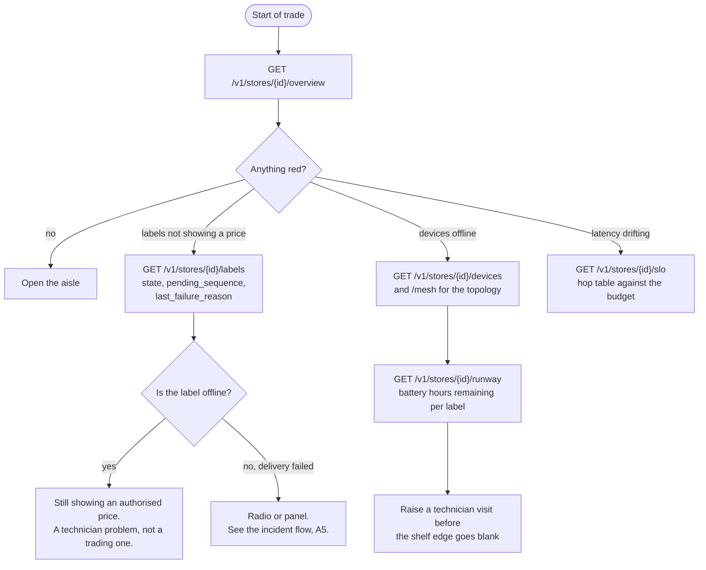

`LabelState.Healthy()` is `state == active` **and** `pending_sequence == 0`
**and** `last_failure_reason == ""`. Nothing else counts as green.

### A1.2 Running a promotion

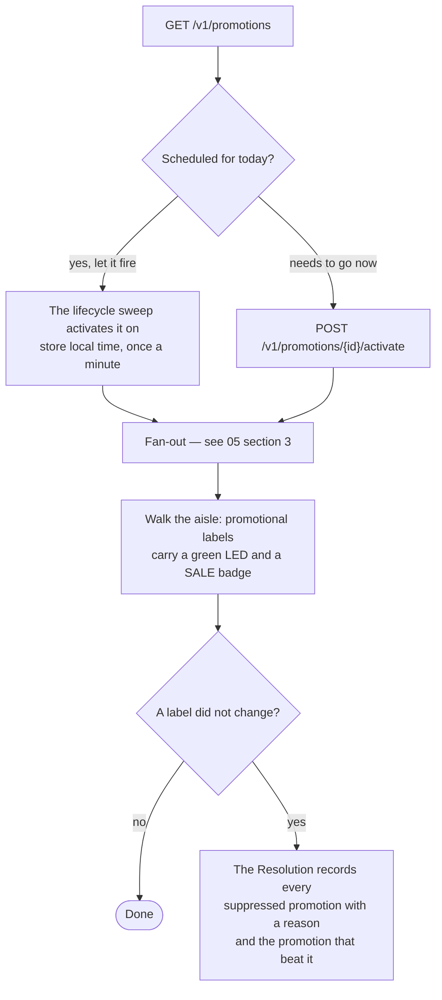

### A1.3 Acknowledging an alert

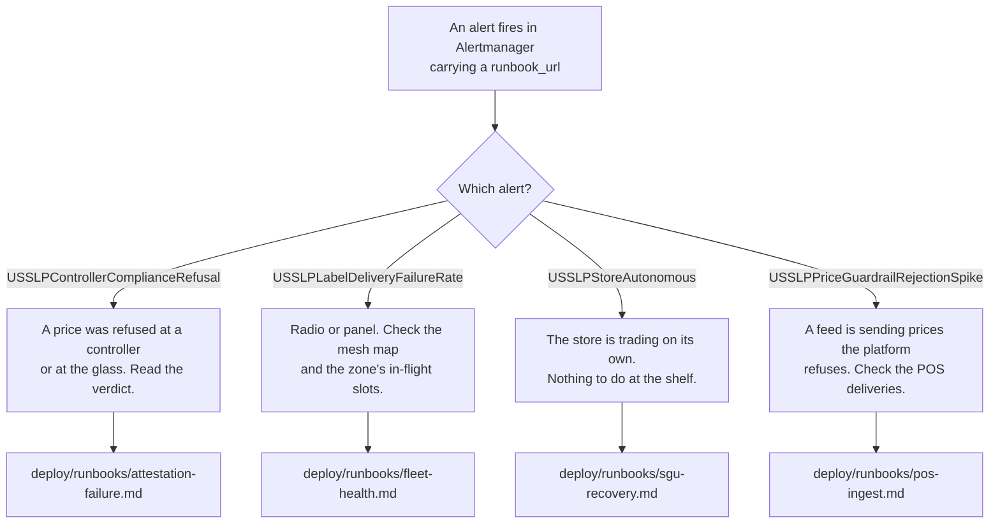

**On "acknowledgement".** There is no in-platform alert-acknowledgement
endpoint. The route table has no such route, and neither the controller's
`ComplianceAlerts`/`OperationalAlerts` lists nor the registry expose one — those
lists are bounded rings an operator reads, not a workflow. Acknowledgement
happens in Alertmanager, and every alert rule carries a `runbook_url` pointing
into `deploy/runbooks/`. That is the truth of the code; a reader expecting an
"acknowledge" button will not find one.

---

## A2. The field technician's day

### A2.1 Battery replacement

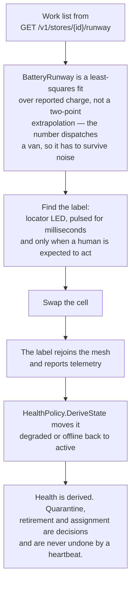

### A2.2 Device swap and commissioning

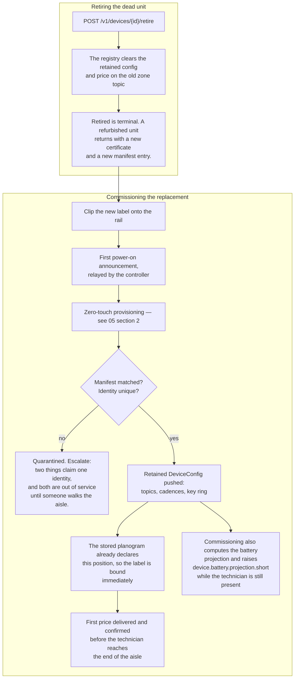

**Quarantine is a one-way door back to the beginning.**
`POST /v1/devices/{id}/release` returns a quarantined device to `provisioned`,
not to whatever it was doing when it was seized: releasing it restores its
operational life from the start rather than restoring a state nobody has
re-verified.

---

## A3. The pricing analyst's flow

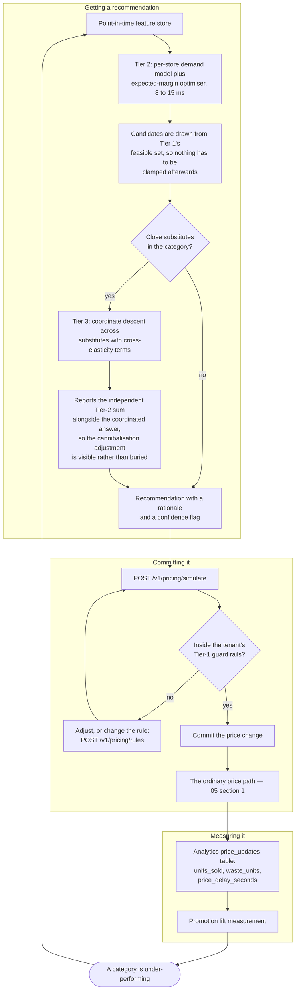

**The caveat an analyst must be told.** Every model in `pricing/ml` — the
elasticity regression, the gradient-boosted trees, the isolation forest and the
LSTM — is trained and validated on synthetic data generated by its own tests,
against known-truth generators. The algorithms are tested; no model here has
seen a real retailer's transactions, and none of the demand curves should be
quoted as a finding about retail.

---

## A4. Integration engineer onboarding a new POS

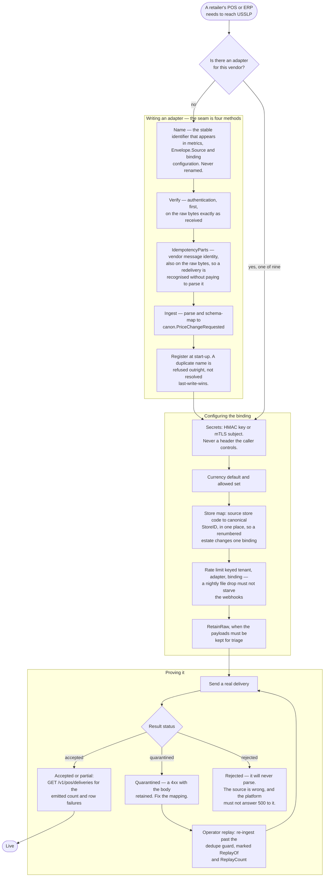

**Why the four-method split is the whole design.** An adapter is a parser and a
signature check. It does not get to decide how deduplication works, whether a
store code is resolved, what a 4xx means, or when a caller is acknowledged. Nine
adapters with nine slightly different opinions about idempotency would be nine
different production incidents.

---

## A5. The operator's incident flow

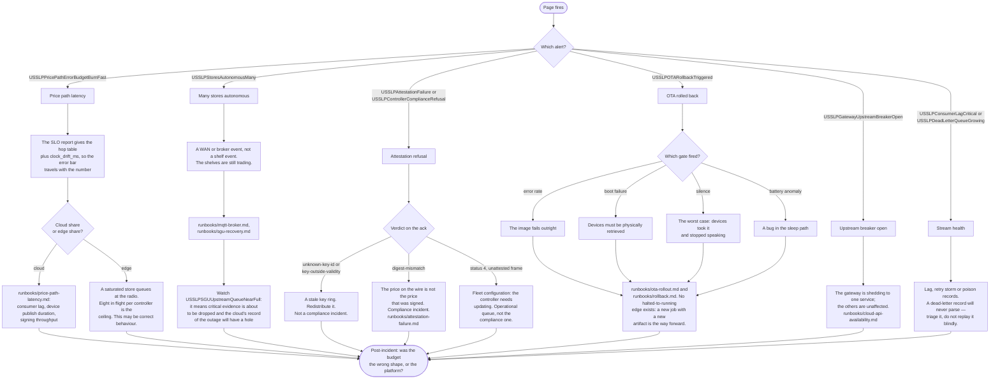

**Check this before believing a latency number.** Every latency the platform
reports is the difference between a wall-clock timestamp the cloud stamped and a
simulated-clock timestamp the controller stamped. `edge/sim` is a discrete-event
engine whose clock only moves when an event fires, so on a quiet store a price
arriving during a lull is timestamped in the past and its latency is
under-reported — far enough, on a two-core container, to come out negative.
`usslpd` bounds it with a 20 ms heartbeat per store engine, which brings observed
drift under 120 ms, and publishes `clock_drift_ms` in every SLO report.

---

# Part B — the platform's own decision flows

## B1. Partial versus full E-Ink refresh

Three components decide, in order, and the **label has the last word**. A full
waveform is ~1,500 ms on the 2.9″ tier and roughly a hundred times the energy of
anything else a label does; a partial is 300 ms. Inside a three-second budget
whose largest single line item is the refresh, that 1.2 s is the difference
between meeting the SLO and missing it — and on a shelf of forty labels updating
together, the flash is the difference between "the prices changed" and
"something is wrong with the shelf".

### B1.1 Cloud — `label/domain.DecideRender` decides whether to *offer* a partial

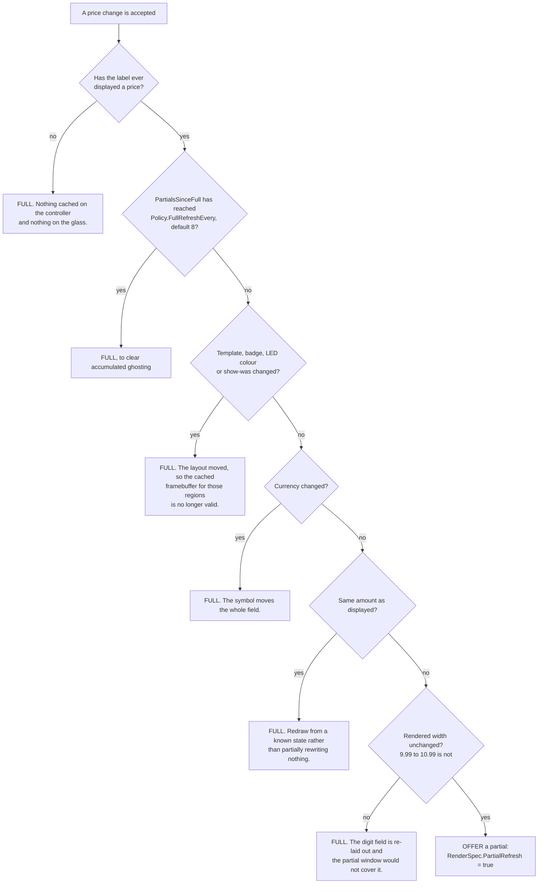

At the default of 8, a label repriced twice a day is fully cleared every four
days, and a promotion-heavy label repriced hourly every eight hours — inside the
ghosting threshold measured on the platform's panels with margin.

### B1.2 Controller — `sec.DecidePartial` decides from a real pixel diff

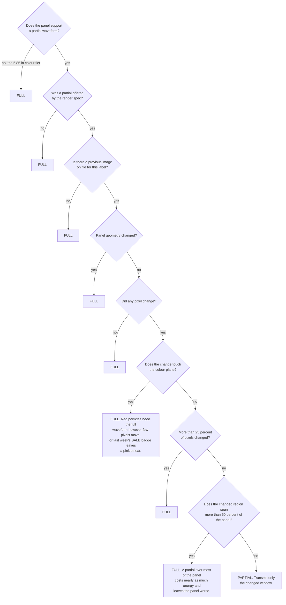

### B1.3 Label — `planRefresh` has the last word

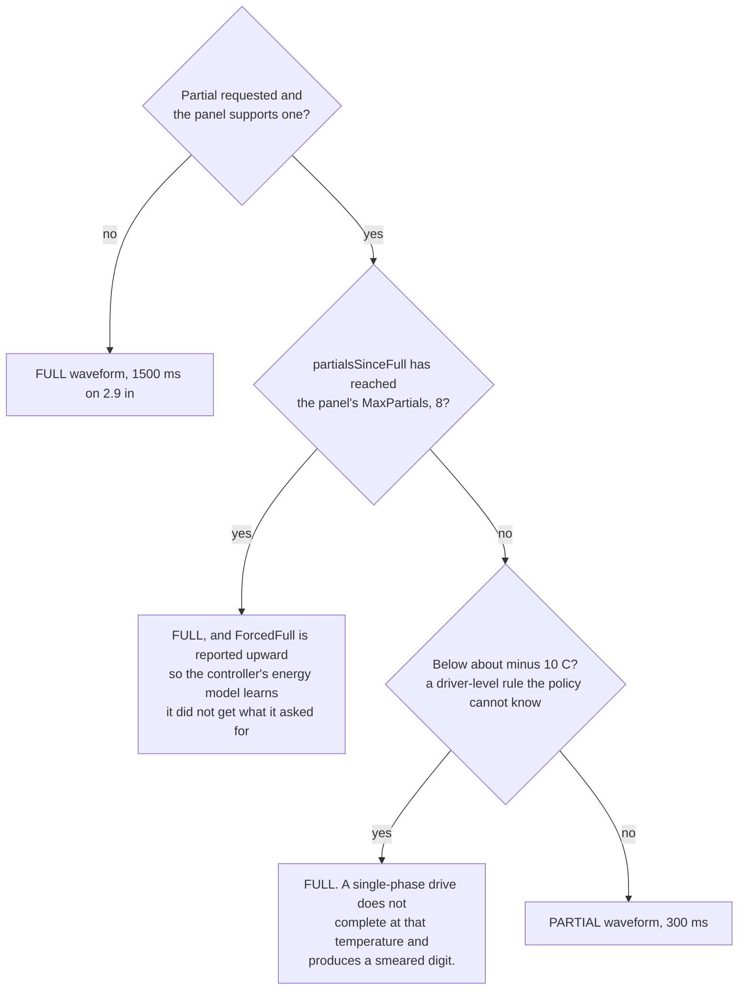

**Why the label has the last word.** Only the label knows how many partials
actually reached the glass; the controller's count is an estimate that a lost
frame, a reboot or a manual refresh invalidates. A disagreement in the
controller's favour means a shopper can read the previous price ghosted behind
the current one — a weights-and-measures problem, not a cosmetic one. The
counter is persisted alongside the sequence because an E-Ink panel is bistable,
so the residue survives a reboot even though RAM does not.

---

## B2. The three-tier pricing decision

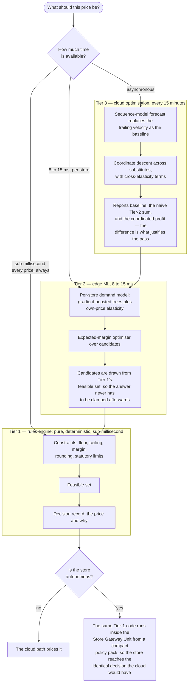

**Why Tier 3 is a separate pass and not Tier 2 in a loop.** Given a category of
close substitutes, Tier 2 will happily recommend discounting all of them: each
recommendation looks like it wins volume, and collectively they win nothing but
a lower average selling price. The cross-elasticity term is the only thing that
makes the category-level answer differ from the sum of the line-level answers.

---

## B3. Promotion conflict resolution

`promotion/domain.Resolve`. A documented contract rather than an implementation
detail, because a retailer's finance team reconciles against it.

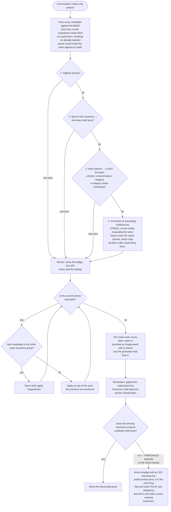

**Why "best for the customer" is rule 2 and not rule 4.** A customer who sees
two offers and gets the worse one has a complaint that is usually also a
regulatory one, whereas giving the better one is at worst a margin decision.

**Why suppression is recorded rather than discarded.** An operator's first
question when a promotion does not show on a shelf is "why", and `Suppressed`
with its `Reason` and `BeatenBy` is the answer.

**Where this flow does *not* run today: at the shelf.** `Resolve` needs the whole
active set, and only the Promotion Service holds it. `promotion-events` carries
the rule but not `Resolve`'s output, so the Label Service's promotion consumer
prices each activation against the label's base price on its own. Where two
promotions overlap, the shelf therefore shows **the most recently activated
one** — it takes the higher per-label sequence — rather than the winner this
flow would pick. The fix is to put the resolved outcome on the event; see
[05 §3](05-sequence-diagrams.md#3-store-wide-promotion-fan-out). Two further
constraints the shelf tier applies before it prices anything: a rule scoped by
`store_groups`, `min_inventory` or `max_days_to_expiry` is **refused by name**,
because the shelf has never been told those attributes and both ways of guessing
are wrong; and `THRESHOLD` or customer-segmented rules are skipped as not
shelf-priceable.

---

## B4. Autonomous-mode entry and exit hysteresis

`edge/sgu/wan.go`. Deliberately asymmetric.

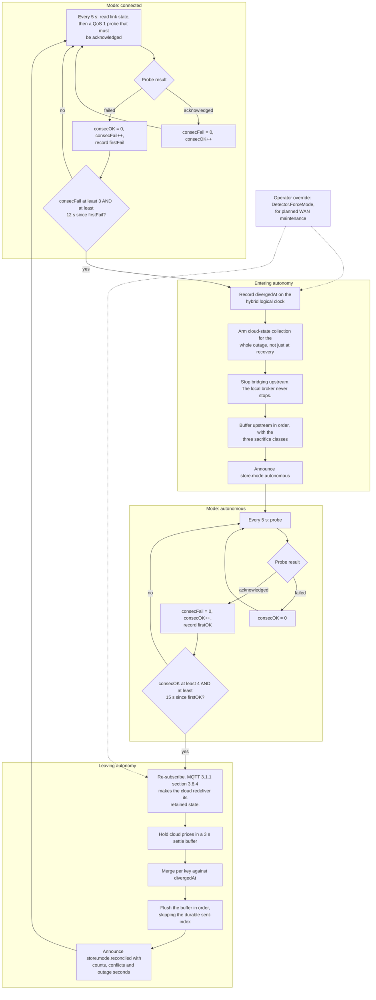

**Why the thresholds differ.** Entering autonomy is cheap and reversible and
should happen quickly once the evidence is unambiguous — three probes at five
seconds is fifteen seconds of unambiguous evidence, long enough that a
two-second blip cannot trigger it and short enough that a store notices a real
outage before the first scheduled promotion of the morning. Leaving it means
replaying a buffer and running a merge, so it waits longer: a flapping link
declared healthy causes a reconciliation, and a reconciliation interrupted
halfway is the one genuinely messy state in this design.

**Why `FailFor` and `RecoverFor` exist alongside the counts.** They are minimum
wall-clock spans, so shortening `Interval` for a test does not accidentally
shorten the hysteresis.

**Why the probe is a round trip.** The failure it has to catch is the one a
connection state cannot see: a TCP session to a load balancer that is still open
while everything behind it is gone.

**Why there is an operator override.** An engineer who knows the WAN is about to
be cut for maintenance can put a store into autonomy deliberately rather than
let it discover the outage. Relatedly, `deploy/edge/update.sh` refuses to update
a store that is currently autonomous, because restarting the gateway then takes
down the only thing pricing that store's shelves.
