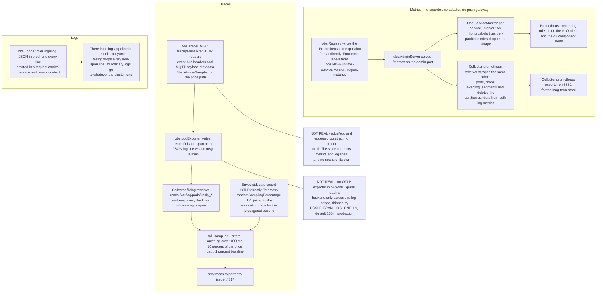
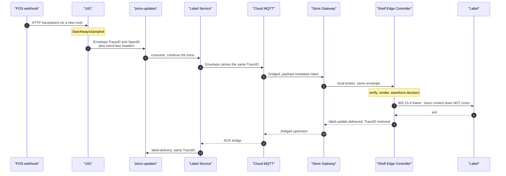
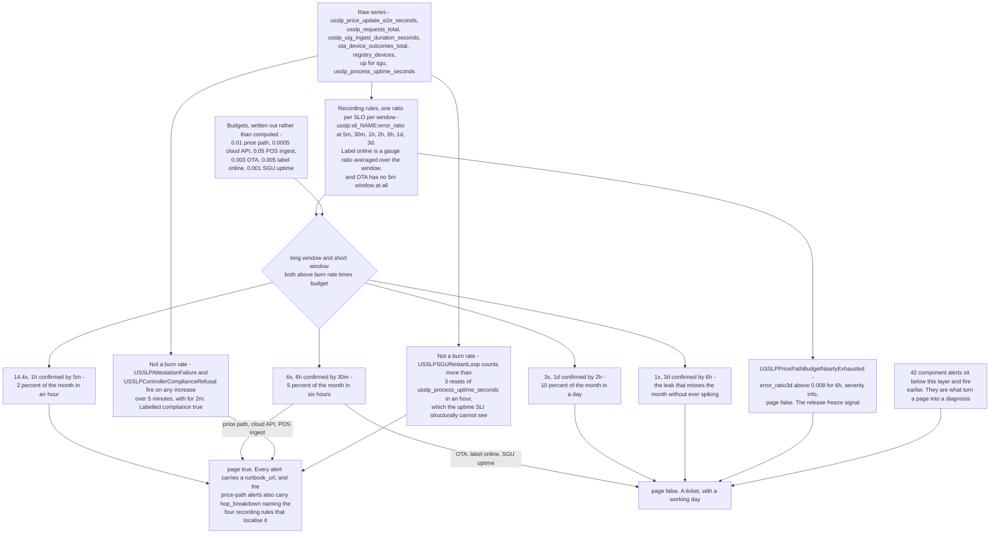
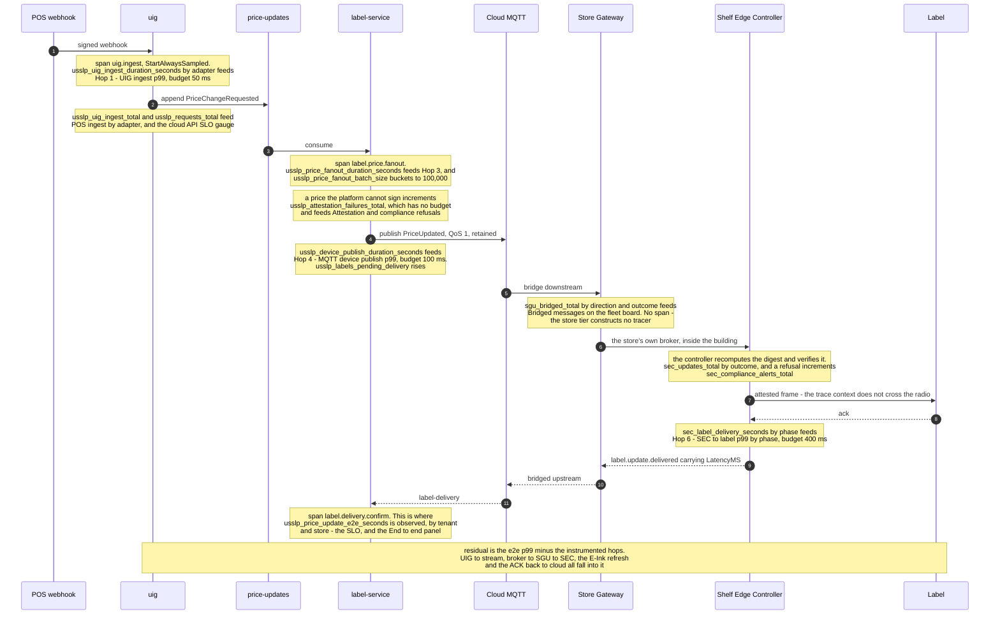

# USSLP observability

The three pillars as implemented in `platform/pkg/obs` and
`deploy/observability`, with the real metric names, the real alert rules and an
honest account of what is not observable today.

The single most useful property of this layer is that it is **checked against the
code**: `make verify-metrics` extracts every metric registered through
`obs.Registry` and fails CI if any alert rule or dashboard names a metric — or a
*label* — that does not exist. A plausible metric name in an alert produces an
expression that evaluates to nothing, forever, silently, and an alert that can
never fire looks exactly like coverage.

Where each signal starts, what carries it, and where it stops. Two of the three
arrive somewhere useful; the third is drawn as it actually is.



---

## 1. Metrics

### The implementation

`obs.Registry` writes the **Prometheus text exposition format directly**. No
exporter, no adapter, no push gateway: Prometheus scrapes the process. The
registry `panic`s on a duplicate metric name, deliberately, because a duplicate
registration would otherwise produce two conflicting series under one name.

Every series carries four const labels attached by `obs.NewRuntime`: `service`,
`version`, `region`, `instance`. Without `region` in particular, a p99 computed
across three regions is a meaningless average of unrelated populations.

`version` does double duty: it is what the Argo Rollouts analysis templates
filter on to separate canary from stable, which is more robust than a Kubernetes
pod-hash label because it survives aggregation through a recording rule that
dropped the pod label.

### Standard series, on every binary

`obs.StandardMetrics` — a dashboard built on these works for a service that did
not exist when the dashboard was written.

| Metric | Type | Labels |
|---|---|---|
| `usslp_requests_total` | counter | `transport`, `operation`, `outcome` |
| `usslp_request_duration_seconds` | histogram | `transport`, `operation` |
| `usslp_events_published_total` | counter | `topic`, `event_type` |
| `usslp_events_consumed_total` | counter | `topic`, `group`, `outcome` |
| `usslp_event_handler_duration_seconds` | histogram | `topic`, `group` |
| `usslp_event_retries_total` | counter | `topic`, `group` |
| `usslp_events_dead_lettered_total` | counter | `topic`, `group`, `reason` |
| `usslp_consumer_lag_records` | gauge | `topic`, `group`, `partition` |
| `usslp_process_uptime_seconds` | gauge | — |
| `usslp_go_goroutines`, `usslp_go_heap_bytes`, `usslp_go_gc_pause_p99_seconds` | gauge | — |

`outcome` on `usslp_requests_total` is set by
`StandardMetrics.ObserveRequest` **from the handler's own error return**, not
from a status code. That is the platform's own verdict on the request, and the
cloud-API SLO is written against it for that reason.

`usslp_event_handler_duration_seconds` next to `usslp_consumer_lag_records` is
the pair that distinguishes *we are slow* from *we are behind*.

### The price path

| Metric | Owns | Notes |
|---|---|---|
| `usslp_price_update_e2e_seconds` | **the SLO** | Seconds from durable acceptance to pixels settled. Labelled `tenant`, `store` — because a retailer verifies the SLO by looking at one shelf, in one building |
| `usslp_uig_ingest_duration_seconds` | hop 1, budget 50 ms | Labelled `adapter` |
| `usslp_price_fanout_duration_seconds` | part of the 120 ms Label Service slice | |
| `usslp_price_fanout_batch_size` | | Buckets to 100,000 — a store-wide 40,000-label batch is the design point, and without tail buckets a degrading pipeline looks identical to a healthy one |
| `usslp_device_publish_duration_seconds` | hop 4, budget 100 ms | The MQTT hop |
| `sec_label_delivery_seconds` | hop 6, budget 300 ms | Labelled `phase`, so radio and waveform separate |
| `usslp_price_updates_total` | | `outcome` is a **closed set**: `applied`, `scheduled`, `rejected`, `stale`, `republished`, `error` — so a dashboard can compute acceptance without knowing every reason |
| `usslp_label_delivery_confirmations_total` | | Labelled `store`, `outcome` |
| `usslp_labels_pending_delivery` | | A rising floor is the earliest sign of a store falling off the mesh |
| `usslp_attestation_failures_total` | **no error budget** | Prices the platform could not sign |
| `sec_compliance_alerts_total` | **no error budget** | Updates a controller refused |
| `usslp_price_guardrail_rejections_total` | | Broken out because it is the one rejection reason a merchandising team, not an engineer, needs |

### Everything else

165 metric names are registered. The full inventory is
`python3 deploy/observability/verify-metrics.py --list`. The families, by prefix:

| Prefix | Component |
|---|---|
| `usslp_gateway_*` | API Gateway: auth, RBAC denials, rate limits, breaker state, upstream failures, panics, WebSocket streams and evictions |
| `usslp_uig_*` | Ingest, dedupe hits, parse errors, quarantines, replays, circuit breaker, latency-budget breaches, verify failures |
| `usslp_mqtt_broker_*` / `usslp_mqtt_client_*` | Connections, sessions, subscriptions, retained messages, in-flight, drops, ack timeouts |
| `usslp_pricing_*` | Tier latency, decisions, elasticity, anomalies, model loads |
| `usslp_promotion_*` | Transitions, conflicts, fan-out, active |
| `usslp_analytics_*` | Rows ingested and dropped, blocks, **compression ratio**, query seconds, retention |
| `registry_*` | Devices by state, provisioning rejections, telemetry readings, label assignments |
| `ota_*` | Jobs, dispatches, device outcomes, downloads in flight, rollbacks, artifacts accepted/rejected |
| `sec_*` | Updates, refreshes, render seconds, mesh deliveries, hops, reroutes, **link failure risk**, compliance alerts |
| `sgu_*` | Store mode, bridged messages, upstream queue depth, merge conflicts, rule evaluation seconds |
| `eventlog_*` | Records and bytes appended, consumer lag, handler duration, retries, dead letters, segments |
| `*_kvstore_*` / `edgekv_*` | Keys, WAL bytes, compactions, snapshot age, active snapshots — one namespaced family per store |

---

## 2. Traces

### What is implemented

`platform/pkg/obs/trace.go` implements **W3C trace context** — `traceparent`
format — propagated through HTTP headers, event-bus headers **and MQTT payload
metadata**, so the context survives crossing from HTTP to the event stream to
MQTT to a Zigbee frame. `canon.Envelope` carries `TraceID` and `SpanID` as
first-class fields alongside `CorrelationID` (everything caused by one external
request) and `CausationID` (the event that directly caused this one).

A malformed `traceparent` from an upstream system yields an *invalid* context
rather than an error, so it starts a new trace and never drops the request.

**The price path is always sampled.** `Tracer.StartAlwaysSampled` exists because
at 52,000 updates per second head sampling at 1% is right for volume and wrong
for the one update a regulator asks about. Provisioning and OTA use it too, on
the same reasoning: every trace is evidence.

### The propagation path



The trace survives every hop **except the radio**. A 127-byte 802.15.4 frame
already fragments carrying a 199-byte attestation; a 55-byte `traceparent` is not
going on it. The controller holds the context across the gap and restores it on
the acknowledgement, so one trace still spans POS to ACK — with the radio hop
represented as a span the controller times rather than as a propagated context.

### What is *not* real, and this is the significant gap

`obs.NewRuntime` wires the tracer with `obs.LogExporter`: **spans go to the
structured log, and the OTel collector's `filelog` pipeline reconstructs them.**
There is still no OTLP exporter, so this remains a bridge rather than a tracing
tier.

It used to be a bridge with nothing on it. The exporter emitted at *debug* on
the service's own logger and `config.LoadService` defaults `LOG_LEVEL` to `info`
for `prod`, so in a production cluster **no span line was ever written** and the
`filelog` pipeline received nothing.

The span log now has its own severity and its own rate, neither of which moves
when an operator changes `USSLP_LOG_LEVEL`: `USSLP_SPAN_LOG_LEVEL` (default
`info`, `off` to disable) and `USSLP_SPAN_LOG_ONE_IN` (default 100 in
production, 1 elsewhere). The second is a second sampler and it is deliberate:
`Tracer.StartAlwaysSampled` bypasses head sampling on the price path, so
"always sampled" and "always written to a log" cannot be the same setting at
52,000 updates a second. What is *recorded* is unchanged — an unsampled span
reaches no exporter — and thinning is keyed on the trace id so a trace is never
half-present.

The collector's **tail sampling** is worth understanding regardless, because it
is the right design for a 3-second budget: head sampling cannot keep a trace
*because* it turned out to be slow, since the decision is made before the latency
is known. Tail sampling waits for the whole trace, and the interesting traces are
the slow ones and the failed ones, which are rare.

**What is real today:** trace context propagates, so Envoy's spans carry the same
trace id the application logs, and a `trace_id` in a log line correlates across
services. **What is not:** there is no trace backend receiving anything in
production. The fix is an OTLP exporter in `pkg/obs`, at which point the
`filelog` receiver and its pipeline entry are deleted and nothing else changes.

---

## 3. Logs

`obs.Logger` wraps `log/slog`. Every line is JSON, every line carries the service
identity (`service`, `version`, `region`), and every line emitted while handling
a request carries the trace and tenant context — which is what makes it possible
to pull one tenant's records out of a shared log index without a full text
search.

Format is `json` in production and `text` on developer terminals, chosen by
`config.LoadService` from the environment.

The log is currently doing three jobs: application logging, span export (on its
own logger at its own level, so the two do not gate each other), and — for the
compliance path — the human-readable record of a refusal. A refusal line looks like this, from
`TestTamperedPriceIsRefused`:

```
level=ERROR msg="refusing an unverifiable price; the label keeps its previous price"
  service=sgu region=local sec=…-sec-01 label=…-lbl-00000 sku=SKU-0D5D8A-01-001
  sequence=3 kid=usslp-price-c6b4ad9325effa3d held_price="21.75 USD"
  error="canon: price attestation invalid: digest mismatch (transmitted price differs from signed price)"
```

Every field an operator needs to decide whether this is a stale key ring or an
attack is on the line: the key identifier, the sequence, the price actually being
held, and the specific verifier error.

---

## 4. Health and readiness

Every binary exposes `/metrics`, `/healthz`, `/readyz` on its own admin port
(`obs.AdminServer`), plus `pprof` when enabled.

**Liveness and readiness are deliberately different questions**, and
`INTERFACE-CONTRACTS` §7 makes it normative:

- `/healthz` answers 200 unconditionally. It asks only whether the process is
  scheduling goroutines.
- `/readyz` runs the registered dependency checks **and** requires start-up to
  have finished — a pod is not sent traffic while it is still rebuilding a read
  model.

Dependency checks are registered on **readiness only**. Registering one on
liveness is how a five-second broker wobble becomes a cluster-wide restart storm.

`/readyz` names the failing check in its body rather than returning a bare 503, so
the runbook says "read the body" rather than "guess":

```json
{"status":"not ready","checks":{
  "_startup":"ok",
  "store-broker":"the store's MQTT broker is not listening",
  "durable-store":"ok",
  "upstream-buffer":"ok"}}
```

Istio outlier detection is the same philosophy one layer out: a pod that has
started failing is routed around and comes back on its own. `maxEjectionPercent`
is capped at 50% everywhere — set it to 100 and a correlated failure ejects every
endpoint, leaving the service down with no endpoints at all, which is strictly
worse than sending traffic to pods that are struggling.

---

## 5. SLO catalogue

| SLO | Objective | Error budget | SLI | Fast-burn threshold |
|---|---:|---:|---|---:|
| Price update reaches the glass ≤ 3 s | 99% | 1% | `usslp_price_update_e2e_seconds` buckets | 14.4% late |
| Cloud API availability | 99.95% | 0.05% | `usslp_requests_total{outcome}` | 0.72% errors |
| POS ingest durable ≤ 500 ms | 95% | 5% | `usslp_uig_ingest_duration_seconds` | 72% late |
| OTA success | 99.7% | 0.3% | terminal device outcomes | 4.32% failed |
| Label online | 99.5% | 0.5% | `registry_devices` ratio, a **gauge average** | 7.2% offline |
| SGU uptime | 99.9% | 0.1% | `up{service="sgu"}` | 1.44% unreachable |
| **Price attestation accuracy** | **100%** | **none** | `usslp_attestation_failures_total`, `sec_compliance_alerts_total` | **any increase** |

Three of these have a non-obvious SLI and the rules say why:

- **Label availability is a level, not a rate**, so the SLI is a gauge ratio
  averaged over the window rather than a ratio of events. The burn-rate
  arithmetic is identical. Its shortest window is **30 minutes, not 5**, because
  the registry's health sweep needs three missed beacons at 30-second intervals
  to move a device to offline — a 5-minute window would measure the sweep's
  latency rather than the fleet's health.
- **OTA has no 5-minute window at all.** A rollout dispatches in waves with
  quiet-hour gaps, so a 5-minute rate is frequently zero and frequently
  unrepresentative. Its pairs are 30 m / 2 h.
- **POS ingest's 72% fast-burn threshold looks alarming and is correct.** With a
  5% budget you genuinely have to be failing most requests to burn 2% of the
  month in an hour. The component alert on
  `usslp_uig_latency_budget_exceeded_total` fires far earlier and is what catches
  a gateway drifting past its own 50 ms slice.

---

## 6. Multi-window, multi-burn-rate alerting

The naive alert is "page when p99 > 3 s for 5 minutes". It is wrong in both
directions at once, and `slo-alerts.yaml` says so in its header:

- **Too sensitive.** At 52,000 price updates a second, a 5-minute window is a
  large sample and a brief regional blip consuming 0.01% of a month's budget
  still crosses a raw threshold. Paging on that teaches people to close pages
  without reading them.
- **Not sensitive enough.** A service that sits at 98.9% for a week never crosses
  a "p99 > 3 s" threshold — every window looks nearly fine — and has burned the
  entire month's budget with nobody paged.

A burn rate asks one question instead: at the rate we are currently failing, how
long until the whole month's budget is gone?

```
burn_rate = observed_error_ratio / error_budget
```

Rate 1 exhausts the budget in exactly 30 days. Rate 14.4 exhausts 2% of it in an
hour.

| Pair | Meaning | Severity |
|---|---|---|
| 14.4× over 1 h, confirmed by 5 m | 2% of the budget in one hour | page |
| 6× over 6 h, confirmed by 30 m | 5% of the budget in six hours | page |
| 3× over 1 d, confirmed by 2 h | 10% of the budget in a day | ticket |
| 1× over 3 d, confirmed by 6 h | the slow leak that misses the month without ever spiking | ticket |

The same scheme as a path from a raw series to somebody's phone. The two
exceptions and the informational group are on it deliberately: they are the
parts that do not follow the pattern.



**The short window in each pair is what makes the alert stop.** A 1-hour-window
alert with no short-window conjunct keeps firing for an hour after resolution,
which is how an on-call engineer learns to ignore the resolution notification
too.

Thresholds are **written out rather than computed** (`14.4 * 0.01 = 0.144`), so
reading a rule at 3 a.m. tells you the number it compares against without doing
arithmetic in your head.

### The two deliberate exceptions

**`USSLPAttestationFailure` and `USSLPControllerComplianceRefusal` are not burn
rates.** A burn-rate alert says "you may fail this much"; the attestation
contract says a label never displays a price it cannot verify, so the acceptable
number is zero and there is nothing to burn. They fire on any increase over
5 minutes, with `for: 2m` so a single scrape-boundary artefact does not page.

**`USSLPSGURestartLoop` is not a burn rate either**, and for a related reason: a
gateway that restarts every four minutes has ~100% scrape availability and is
nonetheless broken — which is precisely what the uptime SLI structurally cannot
see. `resets(usslp_process_uptime_seconds{service="sgu"}[1h]) > 3` counts
restarts directly.

### Component alerts

Forty-two alerts in `component-alerts.yaml` sit below the SLO layer: consumer
lag, dead-letter growth, retry storms, MQTT drops and ack timeouts, gateway
breakers and panics, UIG quarantine spikes, pricing tier budget breaches,
promotion transition stalls, mesh delivery failures, provisioning rejection
rates, OTA rollbacks, goroutine leaks, GC pauses, and stale KV snapshots. They
fire earlier than an SLO alert and are what turn a page into a diagnosis.

Every alert carries a `runbook_url` into `deploy/runbooks/`. The price-path
alert additionally carries a `hop_breakdown` annotation naming the four recording
rules that localise the problem in one glance.

---

## 7. Dashboards

Four boards, provisioned by the compose profiles.

| Board | The question it answers |
|---|---|
| `platform-overview.json` | Is the platform healthy? Four stat panels — price path % within 3 s, cloud API availability, labels online, stores autonomous — then throughput, event stream and MQTT |
| `price-path-latency.json` | Where in the 3-second budget did the time go? Per hop against its budget, plus a **residual** panel |
| `fleet-health.json` | Which stores are unhappy and why? A sortable "stores ranked by unhappiness" table, plus bridge and reconciliation, mesh (including predicted link failure risk for the top 10 links) and OTA |
| `slo-error-budget.json` | How much budget is left, and should we deploy? Six gauges, four burn-rate charts, and the attestation panel with no budget |

One price change, traced through what it emits rather than what it does. Read
down the notes: every panel above is fed from this single path, and the gaps in
it are the residual.



**The residual panel is the most useful single thing here.** It is end-to-end
latency minus the sum of the instrumented hops, and a residual that grows while
every measured hop stays flat means the problem is at the far end of the mesh,
not in the cloud. The load harness reports the same quantity, and it is what
identified dispatch queueing — 949 ms at p50 against a 400 ms budget under
sustained load, versus 33–49 ms unsaturated — as the bottleneck rather than any
cloud service.

---

## 8. The verifier, and why it earns its place

```bash
make verify-metrics
python3 deploy/observability/verify-metrics.py --list
```

It extracts every metric registered through `obs.Registry`'s `Counter`, `Gauge`
and `Histogram` constructors — including names registered via string constants in
`pkg/mqtt/metrics.go` and the namespaced families `pkg/kvstore` builds from a
caller-supplied prefix — and checks every **name** and every **label selector**
in the rules and dashboards against them.

The label check catches the subtler failure. A selector on a label the metric
does not declare matches *every* series, because an absent label compares equal
to `""` — so the alert either never fires or always does. It caught two real
mistakes while the rules were being written: `usslp_promotion_conflicts` is
labelled `severity`, and `usslp_promotion_transitions_total` is labelled `to`,
not `state`.

The canonical rules live in `deploy/observability/prometheus/rules/`. The Helm
chart embeds a generated copy in `deploy/helm/usslp/files/rules/`, because Helm's
`.Files` cannot reach outside a chart. `make helm-sync-rules` regenerates it and
`make verify-rules` fails CI if the two have drifted, and also runs
`promtool check rules` over the PromQL.

---

## 9. What is not observable today

Ordered by how much it would cost an incident.

1. **No OTLP exporter.** Spans reach the trace backend through the collector's
   `filelog` bridge rather than over OTLP — a working stopgap, and still a
   stopgap: it costs a log line per exported span and it is rate-limited by
   `USSLP_SPAN_LOG_ONE_IN` rather than by the tracer's own sampling. **Fix:** an
   OTLP exporter in `pkg/obs`, after which the bridge and that knob are deleted.
   Everything else is already in place — W3C propagation, always-on price-path
   sampling, a collector with tail sampling configured. (Until recently this gap
   was worse than a stopgap: the exporter wrote at debug and production's `info`
   default meant **nothing at all** reached a trace backend.)
2. **The ACK-back-to-cloud hop.** `INTERFACE-CONTRACTS` §4 budgets it 200 ms and
   the e2e report says **"not separately observable"**. It falls into the
   residual along with four other hops.
3. **The first five hops individually.** The e2e report measures POS→UIG,
   UIG→stream, stream→Label Service, Label Service→broker and broker→SGU→SEC as
   *one* 400 ms residual. Three of the five have their own metric
   (`usslp_uig_ingest_duration_seconds`, `usslp_price_fanout_duration_seconds`,
   `usslp_device_publish_duration_seconds`) so Prometheus can separate them in
   production; the test harness cannot, because it has no scrape.
4. **Clock drift, outside the SLO report.** The simulated store engines' drift is
   published as `clock_drift_ms` in the SLO report but is not a Prometheus
   metric. Every latency the platform reports is a wall-clock timestamp minus a
   simulated-clock timestamp, so the error bar matters and it does not travel
   with the metric.
5. **Per-label observability at fleet scale.** `usslp_price_update_e2e_seconds`
   is labelled `tenant` and `store`, deliberately — a per-label dimension would
   be 50 million series. So "which label is slow" is answerable from
   `label-delivery` and the columnar store, and not from Prometheus. That is the
   right trade, and it means the fleet-health board answers *which store*, never
   *which label*.
6. **Anything about the cloud tier under real load.** No measurement in this
   repository ran the cloud services near their capacity model, so their
   saturation signals — CPU on the fan-out, consumer lag under 1,024 partitions,
   broker session count at 100,000 gateways — have never been observed doing
   anything.
7. **`analytics-service` metrics are registered and not charted.** The binary
   registers `usslp_analytics_*` and no dashboard plots them. That used to have
   an excuse — the service was `enabled: false` and out of both image matrices —
   and no longer does: it is enabled everywhere, it ships, and the gateway's
   breaker for it is a real signal rather than a permanently open one. The
   dashboards are the gap now.
