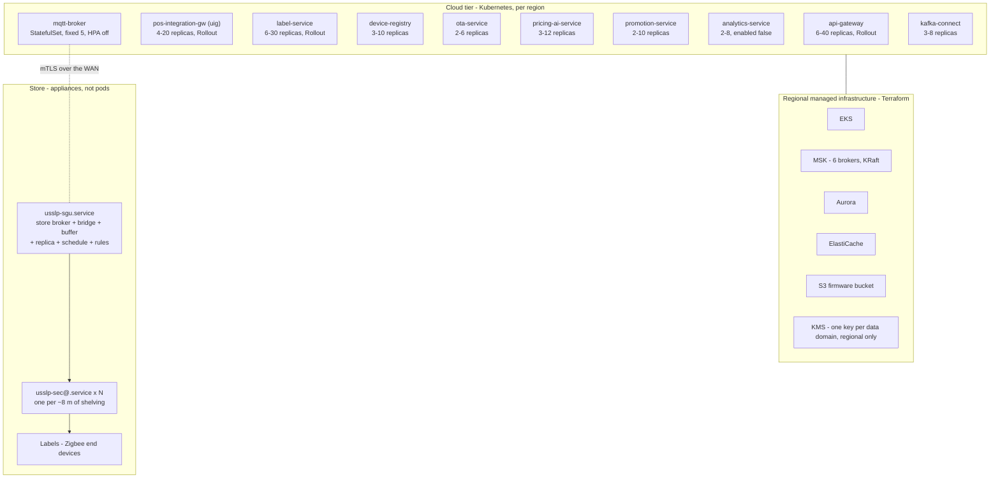
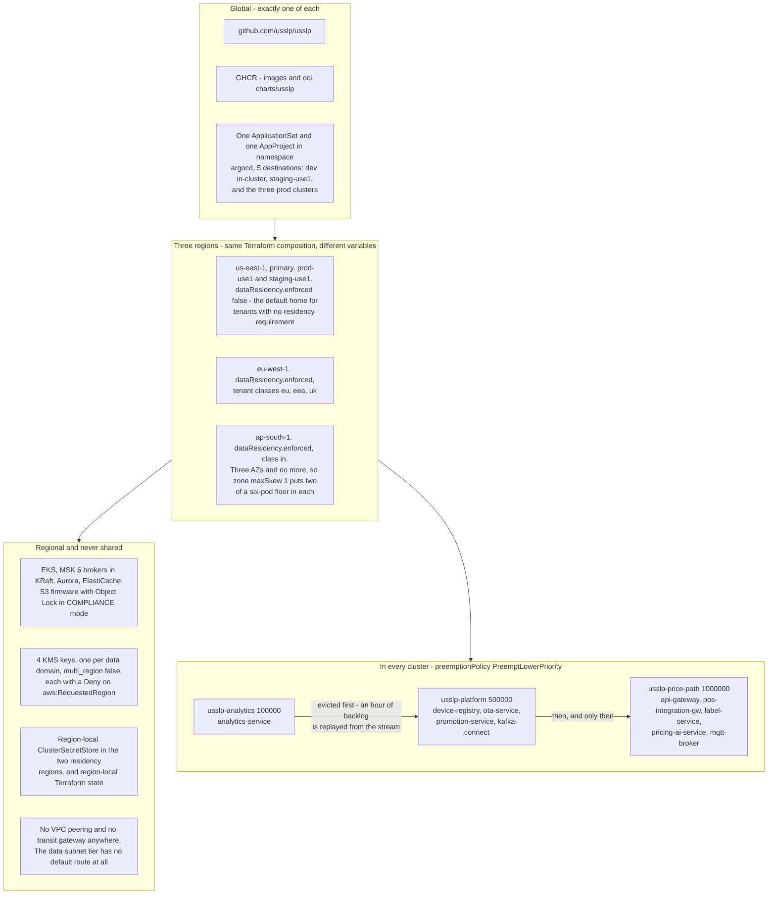
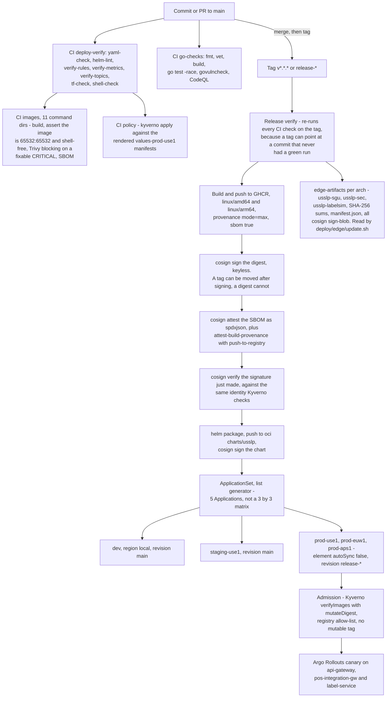
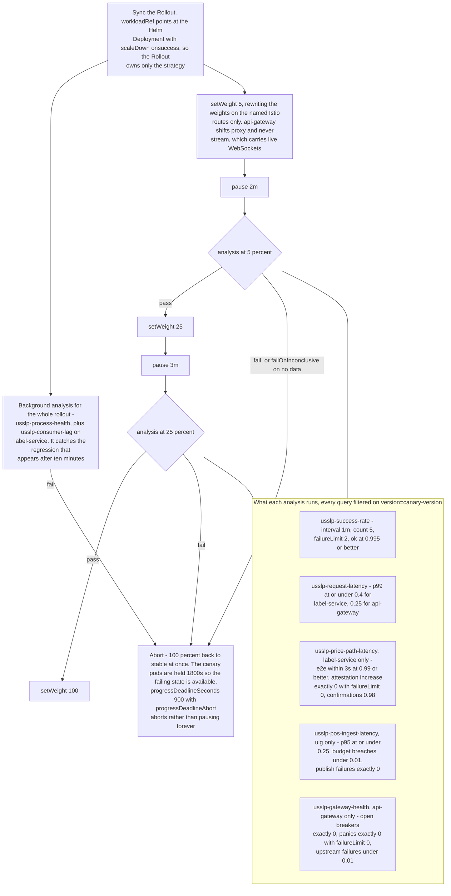

# USSLP operations

How the platform is deployed, released, run and repaired. Everything here is
implemented in `deploy/` and `.github/workflows/`; where a procedure is
provisioned but untested at scale, it says so.

---

## 1. Deployment topology

USSLP deploys as **two very different things**, and conflating them is the source
of most operational surprises.



**Cloud tier.** Nine workloads from one Helm chart, in three regions
(`us-east-1`, `eu-west-1`, `ap-south-1`), each with its own values file. Every
pod: non-root UID 65532, `readOnlyRootFilesystem`, all capabilities dropped,
`seccompProfile: RuntimeDefault`, `automountServiceAccountToken: false`. A
service that needs to write gets an explicit `emptyDir` or PVC for
`USSLP_DATA_DIR` — anything else crashes at start-up, which is the point: it
surfaces as a failed rollout rather than an unauditable writable layer.

**Store tier.** systemd units on an appliance, or K3s where the box also runs
other retailer workloads. Neither is a fallback for the other: systemd is right
for one box in a store with no on-site technical staff (it is already there, its
hardening directives are stronger than any PodSecurity standard, and there is no
cluster to go wrong at 2 a.m. in another time zone); K3s is right when one
scheduler has to cover shrink analytics and camera inference too, and for a
large-format store with an active/standby gateway pair, where the lease-based
leader election in `k3s/usslp-sgu.yaml` stops both bridging to the cloud at once.

### Priority classes: the platform's statement of what it will lose

| Class | Value | Workloads |
|---|---:|---|
| `usslp-price-path` | 1,000,000 | `pos-integration-gw`, `label-service`, `mqtt-broker` |
| `usslp-platform` | 500,000 | `device-registry`, `ota-service`, `kafka-connect` |
| `usslp-analytics` | 100,000 | analytics and reporting — preemptible |

Under node pressure the kubelet evicts by priority. Losing a price-path pod stops
prices reaching shelves, which is regulatory exposure; an hour of missing
analytics is a reporting gap recovered by replaying the stream.

The same table read as a picture, next to the thing it depends on: almost
nothing in this platform is shared between regions, so an eviction decision is
always a decision inside one region.



### Spread, and one non-obvious choice

Zone and node topology-spread constraints are both `ScheduleAnyway`, never
`DoNotSchedule`. `DoNotSchedule` on a zone constraint turns a single-AZ outage
into an inability to reschedule the pods that survived it, which is precisely
backwards.

### Names that differ by layer, and will bite you

| Concept | Workload name | Image name | Metric `service` label |
|---|---|---|---|
| Pricing | `pricing-ai-service` | `pricing-service` | `pricing-service` |
| POS ingest | `pos-integration-gw` | `uig` | `uig` |

Each is correct in its own place. A query or a canary analysis using the wrong
one silently matches nothing.

---

## 2. GitOps flow

Two workflows and one controller. Nothing here deploys: the release makes a
signed artifact available, and a human decides when a region takes it.



**The ApplicationSet uses an explicit list, not a matrix.** A 3×3 matrix would
produce nine Applications, six of which do not exist — there is no staging
cluster in eu-west-1 and no dev cluster in ap-south-1 — and six permanently
unhealthy rows is how people learn to stop reading the ArgoCD UI. Adding a region
is adding an entry.

**Sync waves are annotations on the objects, not on the Application:**

| Wave | Objects |
|---:|---|
| −20 | PriorityClasses (cluster-scoped, referenced by everything) |
| −10 | ServiceAccounts, RBAC, NetworkPolicies |
| −6 | The topic job's ServiceAccount |
| −5 | ConfigMaps, ExternalSecrets, the topic-provisioning PreSync hook |
| 0 | `mqtt-broker` StatefulSet and its headless Service |
| 5 | Services |
| 10 | Deployments |
| 15 | HPAs, PDBs |
| 20 | Ingress/HTTPRoute, ServiceMonitor, PrometheusRule |

The principle: nothing that consumes a thing syncs before the thing. A Deployment
whose ExternalSecret has not reconciled starts, fails to read its projected
credential and crash-loops, and whoever is debugging it at 3 a.m. sees a service
bug rather than a sync-ordering bug.

**Secrets are never templated.** The chart contains no `Secret` with `data`;
every credential is an `ExternalSecret` pointing at a `ClusterSecretStore`, so a
`helm template` of the chart cannot leak one.

**Mesh and admission policy are applied separately** from the chart, because they
have a different blast radius from an image bump: a bad DestinationRule takes out
every caller of a service at once.

```bash
kubectl apply -f deploy/istio/
kubectl apply -f deploy/policy/gatekeeper/constrainttemplates.yaml
kubectl apply -f deploy/policy/gatekeeper/constraints.yaml   # one residency constraint per cluster
kubectl apply -f deploy/policy/kyverno/policies.yaml
```

### Supply chain

The release workflow signs every image with cosign, generates and attaches an
SBOM attestation, builds a provenance attestation, **verifies the signature it
just made**, and packages and signs the Helm chart. Kyverno verifies image
signatures at admission; Gatekeeper and Kyverno both allow-list registries and
both reject `:latest`.

Both matrices carry one entry per command directory with Go source in it,
`analytics-service` included, and each workflow's "Resolve the command path" step
fails the job if an entry has none — so the lists cannot drift away from the tree
without breaking the build.

---

## 3. Rollout procedure

### Cloud, price-path services

`api-gateway`, `pos-integration-gw` and `label-service` deploy through Argo
Rollouts:

```
5% → pause 2m → analysis → 25% → pause 3m → analysis → 100%
```

The two-minute pause before the first measurement is not padding: the analysis
templates use two-minute rate windows, and measuring sooner measures the previous
weight.

Analysis runs `usslp-success-rate`, `usslp-request-latency` and — for
`label-service` — `usslp-price-path-latency`, with the p99 gate at **0.4 s**
(the service owns 120 ms of the price path; 400 ms leaves room for the batch
endpoint without letting a genuine regression through). Queries filter on the
`version` const label, which separates canary from stable and survives
aggregation through a recording rule that dropped the pod label.

Every template sets a `count`. That matters: an analysis whose query names a
metric that does not exist returns "no data", and the default `failOnNoData`
behaviour is to **pass**. A canary gated on a typo is a canary with no gate and
looks identical to a working one on the dashboard — which is why
`verify-metrics.py` checks the analysis queries too.

The steps and the gates in one place, because the gates are the part that is
easy to get wrong and impossible to see on a dashboard.



`pricing-ai-service` is on the price path and deliberately does **not** get a
Rollout: the Label Service falls back when a pricing decision does not arrive
inside its budget, so a bad pricing canary degrades optimisation rather than
stopping prices reaching shelves. A plain Deployment with `maxUnavailable: 0` is
the right amount of machinery.

### Cloud, everything else

Plain Deployments, `maxUnavailable: 0`, PDBs. `label-service`'s PDB is
`minAvailable: 4` of a 6-pod floor — four pods carries peak price traffic for one
region with one AZ lost, so a node drain may take two and is refused a third.

**One trap the chart guards against:** `label-service`'s drain is a compile-time
constant, `const shutdownGrace = 20 * time.Second` in
`platform/cmd/label-service/main.go`, with no environment variable.
`terminationGracePeriodSeconds` must exceed it or the drain is pointless — a
store-wide fan-out in flight when SIGTERM arrives has up to 40,000 labels left to
publish. The `usslp.validate` helper fails the render if it does not.

### The edge fleet

```bash
sudo /usr/local/lib/usslp/update.sh            # or the timer
sudo /usr/local/lib/usslp/update.sh --list
sudo /usr/local/lib/usslp/update.sh --rollback
sudo /usr/local/lib/usslp/update.sh --version v1.4.2
```

Versions install side by side under `/usr/local/lib/usslp/<version>/` with
`current` as a symlink. Update is: download → verify SHA-256 → install to a new
directory → swap the symlink atomically → restart → poll `/readyz`. Rollback is:
swap the symlink back and restart.

**The old version stays on disk, so a rollback needs no network** — which matters,
because the most common reason to roll back a store gateway is that it can no
longer reach the network.

Two refusals are absolute:

- **A checksum mismatch stops the update, including with `--force`.** A binary
  that does not match its published digest is either corrupt or hostile and
  there is no third option.
- **A store that is currently autonomous is not updated.** Restarting the gateway
  then takes down the only thing pricing that store's shelves, and flushes the
  upstream queue holding the outage record mid-write. Skipped, retried next slot.

**The update window is randomised on purpose.** `usslp-update.timer` fires at
02:00 local with up to four hours of jitter and `FixedRandomDelay=true`, so a
store's slot is stable across reboots. A fleet of 100,000 stores that all check
at 03:00 is a thundering herd against the artifact endpoint and — far worse — a
fleet that all applies the same bad update within one minute, with no window in
which anyone notices the first few hundred failing and stops the rest. Spread
over four hours, a bad version reaches about **1% of the fleet in the first two
and a half minutes**, and the version pin in the manifest stops the rest: one
central change, not 100,000 timers.

### Firmware

A different mechanism again — see
[ADR 0016](../adr/0016-staged-ota-with-signed-manifest.md). Cohorts 1% → 5% →
25% → 100%, a 30-minute soak between waves, four health gates, four concurrent
downloads per controller, inside the store's local quiet hours. A fleet update is
measured in days, and firmware is the one thing on this platform that **cannot be
rolled back over the air**: a device that does not boot needs a person.

Two mechanisms that look similar and share nothing. The gateway's updater is a
shell script and a timer; the label's is a controller with four health gates and
no way back.

```mermaid
flowchart TB
  subgraph BIN["Gateway and controller binaries - deploy/edge"]
    TMR["usslp-update.timer - 02:00 local,<br/>RandomizedDelaySec 4h, FixedRandomDelay so a store's<br/>slot is stable, Persistent, AccuracySec 1h"]
    MAN["update.sh takes USSLP_TARGET_VERSION, or the version<br/>field of the manifest at USSLP_UPDATE_MANIFEST_URL.<br/>Clearing that pin stops every store that has not checked"]
    AUTO{"is the store autonomous?<br/>sgu_store_mode is 1"}
    SKIP["Skipped. Restarting now takes down the only thing<br/>pricing this store and flushes the upstream queue<br/>mid-write. Retried at the next slot"]
    DL["Download, then SHA-256 against the published digest"]
    MIS["Mismatch - refuse, including with --force.<br/>Corrupt or hostile, and there is no third option"]
    INST["Install beside the others under<br/>/usr/local/lib/usslp/version, swap current atomically"]
    RST["Restart usslp-sgu.service, then usslp-sec@ instances,<br/>poll /readyz for USSLP_READY_TIMEOUT"]
    OK["Ready. Prune to the last three versions"]
    RB["Not ready - swap back and restart. The old version is<br/>still on disk, so the rollback needs no network"]
  end
  subgraph FW["Label firmware - ADR 0016"]
    UP["Upload. Unsigned artifacts are refused here, not at<br/>rollout. The signature covers version, hardware tier<br/>and digest, so an image cannot be re-declared as<br/>another tier"]
    C["Cohorts 1, 5, 25, 100 percent, cumulative.<br/>Membership is sha256 of jobID and deviceID mod 10000 -<br/>a pure function, nothing stored, nothing to drift"]
    DISP["Dispatch inside the store's local quiet hours,<br/>4 concurrent downloads per controller"]
    GATE{"health gates, in diagnostic order"}
    WAIT["Wait - fewer than 20 outcomes, or not every dispatched<br/>device has reported, or soaking through 30 minutes"]
    NEXT["Advance to the next cohort"]
    HALT["Halt or roll back. There is no halted to running edge,<br/>and a flashed image is not recoverable over the air"]
  end
  TMR --> MAN
  MAN --> AUTO
  AUTO -->|"yes"| SKIP
  AUTO -->|"no"| DL
  DL -->|"mismatch"| MIS
  DL -->|"match"| INST
  INST --> RST
  RST -->|"/readyz answers"| OK
  RST -->|"timeout"| RB
  UP --> C
  C --> DISP
  DISP --> GATE
  GATE -->|"not enough evidence yet"| WAIT
  WAIT --> DISP
  GATE -->|"pass"| NEXT
  NEXT --> DISP
  GATE -->|"boot failures above 1 percent, then silence above 5,<br/>then battery anomaly above 5, then error rate above 2"| HALT
```



---

## 4. Day-2 operations

### The daily and weekly rhythm

| Cadence | Task |
|---|---|
| Continuous | Alerts page from `slo-alerts.yaml`; component alerts open tickets |
| Daily | Error budget board before any risky deploy; `USSLPPricePathBudgetNearlyExhausted` is informational and is the freeze signal |
| Daily | Dead-letter queue triage — `dead-letter` preserves the original key |
| Weekly | Fleet health: stores ranked by unhappiness; battery runway per store (`GET /v1/stores/{id}/runway`) |
| Weekly | CRL distribution to the edge fleet — **manual today; see the roadmap** |
| Per release | `make verify` in CI: lint, tests, and the deployment-layer checks |
| Quarterly | Price-authority key rotation, inside the 30-day overlap |
| Annually | Service-CA and firmware signing key rotation |

### Routine operations and where they live

| Operation | How |
|---|---|
| Add a store | `deploy/edge/install.sh` with `--store --tenant --region --controllers --cloud-broker`. Keys come from the key ceremony; the installer will not generate them |
| Add a label | Nothing. Zero-touch provisioning: powered on to trading in 1.8 s, measured |
| Move a label between controllers | Planogram update. **Clear the old retained topic** or a controller reboot resurrects a stale placement ([ADR 0015](../adr/0015-retained-messages-for-cold-start.md)) |
| Add a POS vendor | One adapter implementing four methods (`uig/adapter`) |
| Add a retailer | Configuration: a tenant, bindings, keys, an MQTT credential scoped to `usslp/{tenant}/#` |
| Add a region | An entry in the ApplicationSet list, a Terraform region directory, a values file, and a Gatekeeper residency constraint if it enforces one |
| Add an alert | `deploy/observability/prometheus/rules/`, a metric that exists, a label the metric declares, a `runbook_url`, then `make helm-sync-rules && make verify-deploy` |
| Change a partition count | **You cannot.** `pkg/eventlog` refuses (`ErrPartitionsChanged`) and the provisioning Job uses `--if-not-exists`, never `--alter`. A changed count re-maps every key and destroys per-key ordering |

### Configuration

`config.Loader` with the `USSLP_` prefix, and **every value also resolvable from
`NAME_FILE=/run/secrets/x`** — because a Store Gateway Unit takes its credentials
from a mounted secret on a device that is not running Kubernetes.

### Deployment traps, collected

Each was found by reading the Go source rather than assuming, and each would
otherwise be a silent misconfiguration.

1. **Three binaries default to `127.0.0.1`.** `device-registry` (8081, 9101),
   `ota-service` (8082, 9102), and the SGU diagnostics port (8080). Correct for
   an appliance, useless in a pod. The chart and both compose files override
   every one.
2. **`api-gateway`'s admin port is `:9080`, not `:9090`** — the only binary that
   overrides the shared default. The chart pins it to 9090 so the shared
   ServiceMonitor, probes and NetworkPolicy need no special case.
3. **`USSLP_UIG_ADDR` means two different things.** To `uig` it is its own listen
   address; to `api-gateway` it is the UIG upstream's URL. A ConfigMap shared
   between them silently breaks one.
4. **Two services start "successfully" while refusing to do their job.**
   `label-service` with no `USSLP_PRICE_AUTHORITY_DIR` generates an ephemeral
   signing key whose attestations verify against no key ring in the field;
   `ota-service` with no `USSLP_OTA_SIGNING_KEYS` refuses every artifact upload.
   Both log it once at boot and then look healthy.
5. **Binding the SGU diagnostics port to the LAN has consequences.**
   `/pos/price` accepts price changes and `/mode` changes whether the store
   prices autonomously.

---

## 5. Runbook index

Every `runbook_url` annotation in the alert rules points into this table.

| Situation | Alerts | Runbook |
|---|---|---|
| Price updates are slow | `USSLPPricePathErrorBudgetBurn*` | [`price-path-latency.md`](../../deploy/runbooks/price-path-latency.md) |
| Cloud API errors | `USSLPCloudAPIErrorBudgetBurn*` | [`cloud-api-availability.md`](../../deploy/runbooks/cloud-api-availability.md) |
| POS ingest slow or refusing | `USSLPPOSIngest*`, `USSLPUIG*` | [`pos-ingest.md`](../../deploy/runbooks/pos-ingest.md) |
| A price could not be signed or verified | `USSLPAttestationFailure`, `USSLPControllerComplianceRefusal` | [`attestation-failure.md`](../../deploy/runbooks/attestation-failure.md) |
| Labels offline, stores autonomous | `USSLPLabelAvailability*`, `USSLPStores*` | [`fleet-health.md`](../../deploy/runbooks/fleet-health.md) |
| A gateway is down or looping | `USSLPSGU*` | [`sgu-recovery.md`](../../deploy/runbooks/sgu-recovery.md) (cloud view) and [`edge/RUNBOOK.md`](../../deploy/edge/RUNBOOK.md) (on-site) |
| An OTA rollout is failing | `USSLPOTA*` | [`ota-rollout.md`](../../deploy/runbooks/ota-rollout.md) |
| The broker is dropping or disconnecting | `USSLPMQTT*` | [`mqtt-broker.md`](../../deploy/runbooks/mqtt-broker.md) |
| A deploy went wrong | — | [`rollback.md`](../../deploy/runbooks/rollback.md) |

**The edge runbook opens with the distinction that matters most** and it is worth
repeating here: *a store whose cloud link is down is not an outage.* Find out
whether the shelves are wrong or only the cloud's picture of them, because those
need completely different responses and the second has no urgency at all. Its
ninety-second triage table maps `/readyz`, `/mode` and `/queue` output straight
onto a section.

### What a rollback does not undo

- **Event-stream records.** Everything published is published. Consumers are
  idempotent so replay is safe, but a bad price that was accepted and fanned out
  is on shelves until a corrected one replaces it.
- **Prices already on glass.** Rolling back the Label Service does not roll back
  what labels display. Publish the correction.
- **Firmware already flashed.** Not recoverable over the air.
- **Schema or partition changes.** See above — the platform refuses them.

---

## 6. Capacity planning

The model and its measured reality are in
[`scalability.md`](scalability.md). What an operator does with it:

### Scaling signals

| Workload | HPA metric | Why that one |
|---|---|---|
| `label-service` | CPU 70% | The fan-out is CPU-bound: Ed25519 signing plus JSON encoding per label, 40,000 labels for a store-wide promotion |
| `api-gateway` | RPS | `usslp_requests_total` is the inbound counter |
| `ota-service` | Queue depth | `ota_downloads_in_flight` is a real gauge |
| `kafka-connect` | Consumer lag | Connect's own `records_lag_max` |
| `pricing-ai-service` | Custom | `usslp_pricing_tier_seconds` |
| `mqtt-broker` | **HPA disabled** | EMQX rebalances sessions on a membership change, and an autoscaler that adds and removes nodes during a price fan-out moves the sessions the fan-out is publishing to. Enable only with the rebalance API configured |

`label-service`'s scale-up stabilisation window is **60 s rather than 0 s**,
deliberately: a store-wide batch is a legitimate CPU spike that finishes on its
own, and scaling out mid-batch adds consumers to a partition set that is already
assigned. Scale-down is 600 s at 25% per 120 s.

### The numbers to plan against

| Resource | Per unit | Planning note |
|---|---|---|
| WAN, per store | ~10 kbit/s each way steady state | Connectivity is an availability problem here, not a capacity one |
| WAN, per store, full reprice | 47.8 MB for 40,000 labels | 19 s on a 20 Mbit/s link, best case. Plan it as a window |
| Zigbee, per controller | 8 concurrent transmissions | Ceiling is 8 ÷ waveform: 26.7 labels/s all-partial, 5.3 all-full |
| Kafka partitions | 5,472 total, 16,416 replicas at RF 3 | 2,736 per broker at 6 brokers, against MSK's 4,000 ceiling and the module's own 3,500 precondition |
| Kafka storage | 6 × 12,000 GB default | 72 TB, sized in `scalability.md` §2.4. Holds only under two stated assumptions: producers compress at 3:1 or better, and `audit-log` keeps a 7-day broker window with the year archived off-cluster |
| Cloud MQTT sessions | 100,000 gateways over 5 fixed replicas | 20,000 per broker |

### Growth triggers

- **Consumer lag rising while handler duration is flat** → add consumers (bounded
  by partition count).
- **Handler duration rising while lag is flat** → the service is slow, not
  behind; profile it.
- **The price-path residual growing while every instrumented hop is flat** → the
  problem is at the far end of the mesh. That is what the residual panel is for.
- **`sgu_upstream_queue` never draining fully** → the store's uplink cannot keep
  up with its own telemetry, not just with outages.
- **`edgekv_snapshot_age_seconds` rising** → checkpointing has stopped, and a
  gateway that has run six months without one replays six months of price
  changes at boot.

---

## 7. On-call model

**Two rotations, because the two tiers have different clocks and different
skills.**

| | Platform on-call | Field operations |
|---|---|---|
| Covers | The cloud tier, the event stream, the brokers, releases | Store gateways, controllers, labels, physical faults |
| Pages from | The seven SLO alert groups | `USSLPSGU*`, `USSLPMeshDeliveryFailures`, `USSLPDevicesQuarantinedSpike` |
| Follows | `deploy/runbooks/` | `deploy/edge/RUNBOOK.md` |
| Timezone | Follow-the-sun across the three regions | Store local hours, plus an out-of-hours escalation |

**What pages and what does not.** Every alert carries an explicit
`page: "true"|"false"` label, and the discipline behind it is worth stating:

| Pages | Does not page |
|---|---|
| Price path burning at 14.4× or 6× | Price path at 3× (a ticket, with a working day) |
| Cloud API at 14.4× or 6× | The slow 1× leak (a ticket) |
| **Any** attestation failure or controller compliance refusal | Error-budget-remaining alerts (informational, they gate releases) |
| SGU uptime at 14.4×, or a restart loop | Label availability leak at 1× — that is battery end-of-life, not an incident |
| OTA at 14.4× | OTA at 6× or 3× |
| POS ingest at 14.4× or 6× | Component alerts, unless they escalate |

`USSLPLabelAvailabilityLeak`'s description says it directly: a steady 0.5%
offline that never spikes is what a fleet reaching the end of its battery life
looks like — check the runway endpoint before treating it as a fault.

**Escalation.** A compliance alert (`compliance: "true"` on the label) escalates
to the security and compliance owner in parallel with engineering, not after it,
because the clock on a weights-and-measures exposure starts when the shelf goes
wrong, not when engineering finishes triaging.

---

## 8. Incident severity

| Sev | Definition | Examples | Response |
|---|---|---|---|
| **SEV1** | Shoppers can be charged a price the shelf does not show, or a fleet is unrecoverable | Price authority key unreadable (the whole price path stops); a firmware rollout that bricked devices past the first cohort; a confirmed cross-tenant data leak; a compromised signing key | Immediate page, incident channel, compliance owner in parallel, exec notification. Roll back first, diagnose after |
| **SEV2** | The price path is degraded but correct, or a region is impaired | Price path burning at 14.4×; cloud API at 14.4×; a regional broker outage; >7.2% of the fleet offline; a controller compliance refusal that is a stale key ring | Page, incident channel. Restore, then diagnose |
| **SEV3** | A store or a component is impaired; shelves are correct | A single gateway down or crash-looping; a zone's controller down; a POS adapter refusing; an OTA rollout halted by its own health gates working correctly | Ticket, business hours unless it spreads |
| **SEV4** | Visibility or convenience is impaired | Dashboards stale; the analytics breaker open; dead-letter queue growing slowly; a flaky test | Backlog |

**The severity rule that is specific to this platform:** *stale is not wrong.* A
store that has gone autonomous, a controller that has rebooted, a WAN outage — in
every one of those the shelves are still showing a price a label verified. That
is SEV3 at most. A price that is *wrong*, or a price the platform cannot verify,
is SEV1 regardless of how few labels it affects.

`USSLPStoresAutonomousMany` is the exception that upgrades: one autonomous store
is weather, and a hundred at once is a platform problem.

---

## 9. Store installation

```bash
make build
sudo deploy/edge/install.sh \
  --store store-0001 --tenant acme --region us-east-1 \
  --controllers 25 \
  --cloud-broker tls://mqtt.us-east-1.usslp.example:8883
```

The installer, in order: creates the `usslp` system user and directory layout;
installs binaries into a versioned directory and symlinks `current`; installs the
systemd units and configuration templates; starts the gateway and waits for
`/readyz`; then starts each controller and waits for each.

It is **idempotent**, and it deliberately does two things not:

- **It does not generate keys.** The key ring and the local price authority come
  from the platform's key ceremony. A box that mints its own price-authority key
  can authorise its own prices, which defeats attestation entirely. It warns
  loudly when they are absent, and `edge/cmd/sec` declares `USSLP_KEYRING_FILE`
  required, so the controllers will not start without one.
- **It does not overwrite an existing `/etc/usslp/*.env`.** Re-running it on a
  configured store must not silently reset its store id.

### Commissioning sequence, in the aisle

1. Rack and power the gateway; confirm `/readyz` 200 and `/mode` `connected`.
2. Mount controllers, roughly one per 8 m of shelving; each joins the store
   broker with its own certificate.
3. Clip labels to brackets. Each provisions itself: chain verified against the
   platform's hierarchy, identity taken from the certificate, manufacturing
   record compared, anti-cloning check run, planogram slot assigned. **No human
   step.**
4. Commission the planogram slot over BLE (a technician's phone) or NFC. The
   commissioning characteristic can set a label's identity; **it cannot set what
   the label displays.**
5. `app/provision.c` computes the label's battery projection from its own tier
   and shelf temperature and raises `device.battery.projection.short` **while the
   technician is still standing in the aisle** — rather than letting the fleet
   discover it in year one. A colour panel or a freezer fitting will trip it.
6. Push the opening price book. The store is open for trade when the last
   waveform has settled.

### Hardening the appliance

The threat model is a hostile store network and a physically accessible box:
somebody can plug a laptop into the same switch, and the cleaner can reach the
cabinet.

Both units run as `usslp` with `ProtectSystem=strict`, **no capabilities at
all**, `PrivateUsers`, `MemoryDenyWriteExecute`, a `@system-service` syscall
filter, and `RestrictAddressFamilies=AF_INET AF_INET6 AF_UNIX` — no raw sockets,
so a compromised gateway cannot become a sniffer for the store's network.

The controller unit is stricter in one specific way: **`IPAddressAllow` permits
only RFC1918 space.** A controller talks to exactly one thing — the store's
broker, inside the building — and has no business reaching the internet. A
compromised controller cannot exfiltrate a store's prices.

Neither unit needs `CAP_NET_BIND_SERVICE`: every port is above 1024.

### Ports

| Port | Bound | Purpose |
|---|---|---|
| 1883 | `0.0.0.0` | The store's MQTT broker, so controllers on the LAN reach it |
| 8090 | `127.0.0.1` by default | SGU diagnostics: `/status` `/mode` `/queue` `/secs` `/labels` `/rules` `/pos/price` |
| 9090 | — | `obs` admin: `/metrics` `/healthz` `/readyz` |

---

## 10. Field service

### Triage before dispatching anyone

```bash
systemctl status usslp-sgu.service
curl -s http://127.0.0.1:9090/readyz | jq     # what the gateway thinks
curl -s http://127.0.0.1:8090/status  | jq    # what the store looks like
curl -s http://127.0.0.1:8090/mode            # autonomous or not
curl -s http://127.0.0.1:8090/queue   | jq    # how much is buffered
```

`readyz` **names** the failing check in its body. Read it rather than guessing.

| What you see | What it means |
|---|---|
| 200, autonomous, small queue | The WAN is down. **The store is fine.** |
| 200, autonomous, queue near capacity | Long outage; the outage record is about to be lost |
| 503, `store-broker` failing | The broker is not listening. **The store's labels are frozen.** |
| 503, `durable-store` failing | The state store will not write |
| `activating (auto-restart)` | Crash loop — usually a corrupt WAL failing recovery |
| Gateway fine, one zone stale | A controller is down or its mesh is broken |
| Prices refused, `sec_compliance_alerts_total` rising | Attestation is failing: a stale key ring or a security incident |

### Field tasks

| Task | Procedure |
|---|---|
| Replace a label | Retire the old device (registry), clip the new one. It provisions itself in under two seconds |
| Replace a controller | Install, provision, subscribe. It recovers its zone's prices from the broker's **retained** set — no cloud round trip, no 40,000 waveforms |
| Replace a gateway | Reinstall; restore key material from the key ceremony. **The store's labels keep their prices throughout** — they are bistable |
| Diagnose one label in the aisle | BLE read-only characteristic: serial, sequence, battery, parent link, **last attestation verdict** |
| A quarantined device | Two things presented one identity. Both are out of service until a human decides which is genuine. Do not un-quarantine without establishing that |
| A shelf reset | Planogram update. Moving between controllers within a store is explicitly *not* clone evidence — it happens every week |

### Battery and end of life

The runway endpoint (`GET /v1/stores/{id}/runway`) predicts replacement per store.
The projections that matter, from `firmware/README.md`'s arithmetic:

| Fitting | Projection | Meets 7–10 y? |
|---|---:|---|
| 2.9″ BWR, ambient 20 °C | 8.67 y | yes |
| 2.9″ BWR, chiller 4 °C | 7.71 y | yes |
| 2.9″ BWR, freezer −20 °C | 6.23 y | **no** |
| 4.2″ BW, ambient | 8.14 y | yes |
| 4.2″ BW, freezer −20 °C | 5.84 y | **no** |
| 5.85″ colour, 10 updates/day | 0.86 y | **no** |
| 5.85″ colour, 1 update/day | 4.4 y | no |

**Freezer aisles and colour panels are planned replacements, not faults.** A
fleet plan that ignores the chemistry derating finds its freezer aisle dying
three years early, and the colour tier is a mains-powered or low-cadence fitting.

Every current in that table is a datasheet or blueprint figure. The arithmetic
over them is verified by `firmware/tests/test_power.c` against
`labelsim`'s model to within 1 nA per component; **the figures themselves have
never been measured on hardware.**
