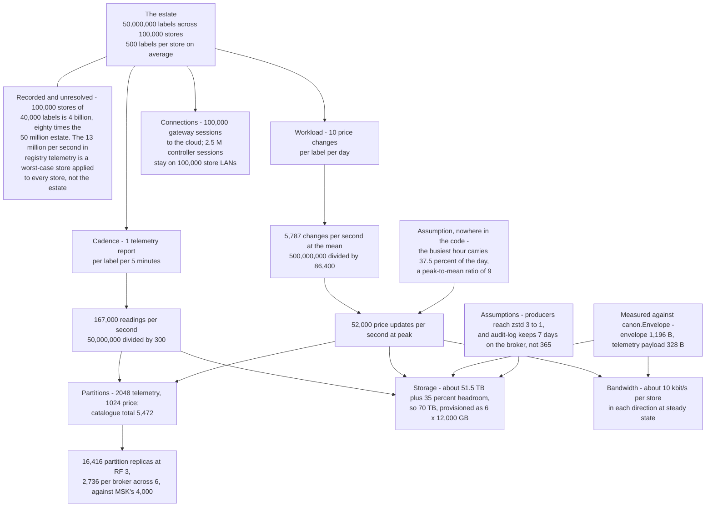
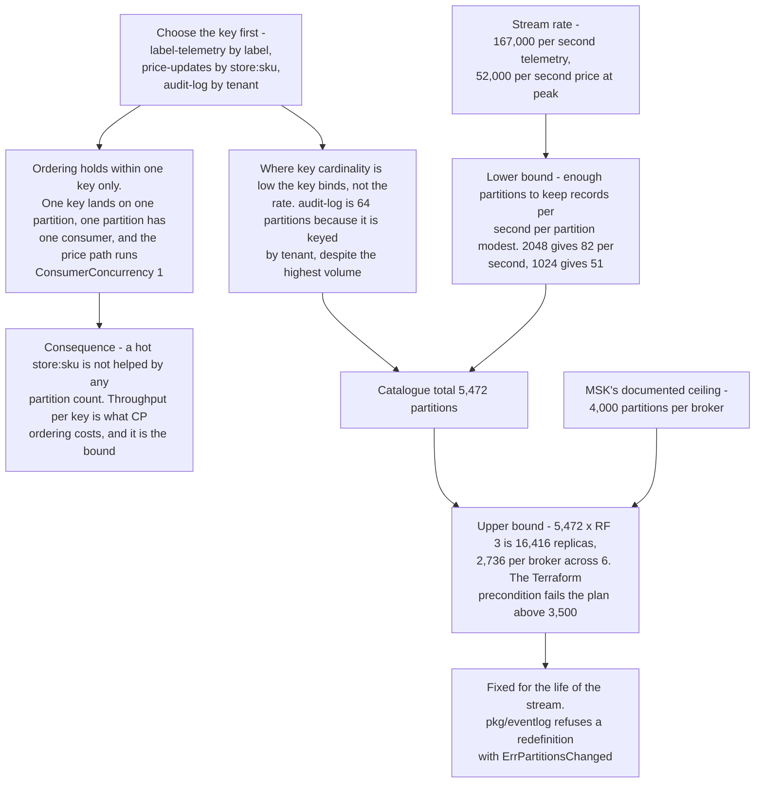
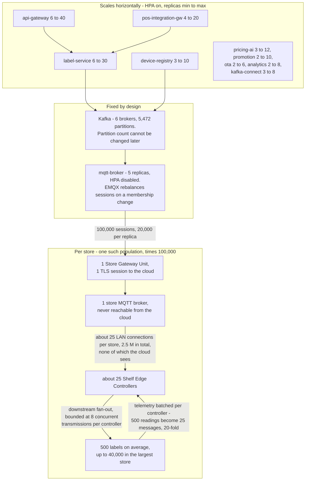
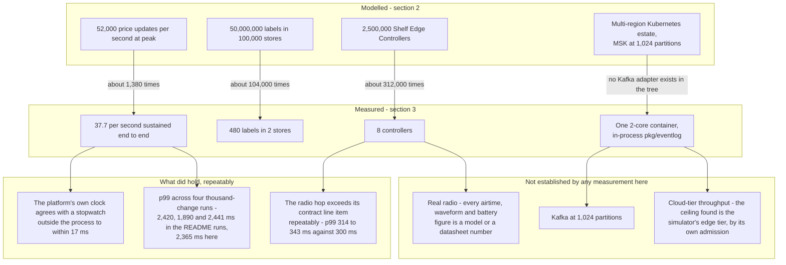

# USSLP scalability

The capacity model the platform is *sized* against, derived from first
principles; the numbers this repository has actually *measured*; and the gap
between the two, stated plainly.

Read section 3 before quoting anything from section 2.

---

## 1. The estate, and its internal inconsistencies

Every capacity number in the tree traces back to one design estate. The figures
are scattered across package comments, so here they are in one place — together
with the places where they do not add up.

| Quantity | Value | Where it comes from |
|---|---|---|
| Labels in the fleet | **50,000,000** | `canon/topics.go`, `ota/domain/cohort.go`, `pki/revocation.go` |
| Stores | **100,000** | `registry/app/telemetry.go` |
| Labels in the largest store | **40,000** on ~25 controllers | `label/adapters/messaging.go`, `registry/domain/health.go` |
| Price changes per label per day | **10** | `firmware/README.md` planning workload |
| Telemetry cadence | **1 report per label per 5 minutes** (288/day) | `firmware/README.md`, `registry/app/telemetry.go` |
| Peak price updates | **52,000 / second** | `canon/topics.go`, cited by six packages |
| Telemetry rate | **167,000 / second** | `canon/topics.go`, `analytics/columnar/encoding.go` |

**Two inconsistencies, reported rather than smoothed over.**

1. **100,000 stores × 40,000 labels is 4 billion labels, eighty times the
   50 million estate.** `registry/app/telemetry.go` multiplies exactly those two
   figures to reach "13 million messages per second" for unbatched telemetry.
   That figure is therefore a *worst-case store applied uniformly to every
   store*, not the estate. The estate's average is **500 labels per store**.
2. **"One controller per ~8 m of shelving" and "~25 controllers per store with
   up to 40,000 labels" cannot both hold.** 40,000 labels at a realistic shelf
   density needs on the order of a kilometre of shelving, which at 8 m spacing
   is roughly 125 controllers, not 25. One of the two figures is for a different
   store.

Neither is resolved here, because resolving either means picking a blueprint
figure this repository has no authority to pick. What has changed is that they
are no longer repeated without comment: the root `README.md`,
`INTERFACE-CONTRACTS.md` §1, `canon/topics.go` and `registry/app/telemetry.go`
point at this section wherever they quote one of them.

A third inconsistency listed here until recently — `stack/streams.go` claiming
5,568 partitions against a catalogue of 5,472 — is **fixed**. The comment was the
wrong side; the catalogue is 5,472, and
`stack.TestCatalogueTotalMatchesTheCommentAndTheClusterSizing` now asserts the
total so the figure cannot drift away from `canon.AllStreams()` again.

Everything below uses **50 million labels across 100,000 stores, 500 labels per
store on average**, because that is the only reading in which the two headline
rates are both derivable.

---

## 2. The capacity model, derived

Every number in this section descends from one estate figure through one of two
rates. The chain is short enough to draw, which is the point: change the estate
and everything below it moves, and the two places where an unstated assumption
enters are the two places worth arguing about.



### 2.1 Telemetry: 167,000 events per second

This one is exact and it needs no assumptions beyond the cadence.

```
  50,000,000 labels ÷ (5 min × 60 s)
= 50,000,000 ÷ 300
= 166,667 readings per second          → the 167,000 figure
```

The number that matters operationally is not that one but the one that never
happens, and the reason it never happens.

```
  unbatched, per-label forwarding from every store:
    500 labels ÷ 300 s               =    1.67 msg/s per store
    × 100,000 stores                 =  167,000 msg/s of MQTT traffic

  batched per controller (what the platform actually does):
    ~25 controllers ÷ 300 s          =    0.083 msg/s per store
    × 100,000 stores                 =    8,300 msg/s of MQTT traffic
                                          — a 20-fold reduction
```

`INTERFACE-CONTRACTS` §3 states the rule: telemetry is batched per controller,
which is under one message per second per store. The Device Registry then
**unpacks the batch** before publishing to `label-telemetry`, because the stream
is keyed per label — a consumer computing a per-label anomaly baseline must have
its partition ordered by label, not by whichever controller happened to relay it.
So the 167,000/s lands on the event stream and never on MQTT.

### 2.2 Price updates: 52,000 per second at peak

This one requires an assumption, and the code does not state it — the figure is
transcribed from a specification's capacity table into `canon/topics.go` and then
cited by six packages. The arithmetic that reproduces it:

```
  50,000,000 labels × 10 price changes/day     = 500,000,000 changes/day
  mean rate: 500,000,000 ÷ 86,400              =       5,787 /second

  a retail day is not flat. Overnight price loads and morning promotion
  activations concentrate the traffic. If the busiest hour carries 37.5% of
  the day:

  500,000,000 × 0.375 ÷ 3,600                  =      52,083 /second
                                                      ↑ the 52,000 figure
```

That is a **peak-to-mean ratio of 9**, which is the assumption the whole cloud
tier is sized on. It is not written down anywhere in the code, and it should be:
a chain whose nightly load is compressed into thirty minutes instead of sixty
doubles the peak without changing a single other number.

**Records and label updates are roughly interchangeable at this scale**, which is
worth stating because the code uses "52,000 price updates per second" for both.
`price-updates` is keyed `store:sku` and carries an accepted change *before*
fan-out; the Label Service then resolves it to labels. Within one store a SKU
normally has one shelf position, so the fan-out ratio is close to 1 and the two
readings converge. A SKU on four facings in one store is the exception, not the
rule.

### 2.3 Partition sizing

Partitions bound consumer parallelism: a group can have at most one member per
partition, and partition count cannot be changed later without breaking key
affinity (`pkg/eventlog` refuses it outright with `ErrPartitionsChanged`).

The count in the table below is squeezed from three directions, and the key is
chosen before any of them. The choice that matters most is at the top: ordering
is a property of a key, so the partition count buys parallelism across keys and
nothing at all within one.



| Stream | Partitions | Rate | Records/s/partition | Retention |
|---|---:|---:|---:|---:|
| `label-telemetry` | 2048 | 167,000/s | 82 | 72 h |
| `price-updates` | 1024 | 52,000/s peak | 51 | 168 h |
| `label-delivery` | 512 | ≈52,000/s peak | 102 | 168 h |
| `device-events` | 512 | low | — | 720 h |
| `label-state` | 512 | ≈52,000/s peak | 102 | compacted |
| `inventory-sync` | 256 | low | — | 336 h |
| `pos-integration` | 256 | ≈ price rate | — | 72 h |
| `promotion-events` | 128 | low | — | 2160 h |
| `ota-commands` | 128 | bursty | — | 168 h |
| `audit-log` | 64 | sum of the above | high | **8760 h** |
| `dead-letter` | 32 | ~0 | — | 336 h |
| **Total** | **5,472** | | | |

At replication factor 3 that is **16,416 partition replicas.** The MSK module
defaults to 6 brokers and enforces a precondition of ≤3,500 replicas per broker
against MSK's documented 4,000 ceiling: 16,416 ÷ 6 = **2,736 per broker**, which
passes with headroom.

`audit-log` at 64 partitions is the one that looks wrong and is not: it is keyed
by tenant, so its partition count is bounded by tenant cardinality rather than by
throughput. It is also the stream with the highest write volume and the longest
retention, which makes it the storage driver below.

### 2.4 Storage growth

Record sizes measured directly against `canon.Envelope` in this tree:

| Record | Measured size |
|---|---:|
| `PriceUpdated` payload, with attestation | **609 B** |
| Full envelope wrapping it | **1,196 B** |
| One `Telemetry` reading (payload only) | **328 B** |

```
  price-updates, at peak, uncompressed:
    52,000/s × 1,196 B          =   62.2 MB/s
                                =   5.37 TB/day
    × 168 h retention (7 days)  =   37.6 TB
    × RF 3                      =  112.8 TB

  price-updates, at the daily mean:
    5,787/s × 1,196 B           =    6.9 MB/s
    × 7 days × RF 3             =   12.6 TB

  label-telemetry, sustained (a heartbeat has no peak):
    167,000/s × ~700 B          =  116.9 MB/s
                                =   10.1 TB/day
    × 72 h retention (3 days)   =   30.3 TB
    × RF 3                      =   90.9 TB
```

**This used to be a finding, and is now a stated assumption.** Six brokers at
`broker_volume_gb = 4000` was **24 TB of cluster storage** against a telemetry
stream needing 91 TB at RF 3 uncompressed, under a variable description that
claimed it had been "sized from the retention model". The number and the
description disagreed and neither named an assumption that would reconcile them.

`broker_volume_gb` is now **12,000** — 72 TB across six brokers — and the module
carries the arithmetic and the two assumptions it depends on:

```
  label-telemetry   30.3 TB uncompressed per replica, 90.9 TB at RF 3
                    → 30.3 TB on disk at zstd 3:1
  price-updates + label-delivery + pos-integration, at the daily mean
                    ~ 10.5 TB
  audit-log, at a 7-day BROKER window (see below)
                    ~  8.5 TB
  label-state, compacted, 50 M labels × 1,196 B × RF 3
                    ~  0.2 TB
  everything else, all low-rate
                    ~  2   TB
                      ────────
                    ~ 51.5 TB, + 35% for burst and autoscaling lag
                    ~ 70 TB   →  6 × 12,000 GB
```

**Assumption 1: producers compress with zstd at 3:1 or better.** USSLP envelopes
are JSON with a fixed key set on every record and realistically compress nearer
5:1; 3:1 is the margin. The broker is deliberately left on
`compression.type=producer` rather than forced to zstd, because broker-side
recompression costs CPU on the price path — so a producer shipping uncompressed
batches overruns this volume, and that is a client misconfiguration rather than a
sizing error. MSK's per-broker EBS ceiling is 16,384 GB, so there is room to grow
in place before broker count has to change.

**Assumption 2: `audit-log` keeps seven days on the broker, not 365.** This is
the sleeper. It takes every price event at the catalogue's 365-day retention, and
at the daily mean that is `5,787/s × 1,196 B × 365 days × RF 3` ≈ **7.6 PB
uncompressed** — three orders of magnitude past any cluster this Terraform
provisions, and not a thing to discover during an audit.

The 8,760 hours in `canon.StreamAudit` is the **compliance retention of the
record**, and the design that satisfies it is tiered, in three parts:

| | What | Status |
|---|---|---|
| 1 | A 7-day window on the brokers, as a replay buffer for a sink that falls behind | **Provisioned** — `log.retention.hours=168`, budgeted above |
| 2 | An archive sink (Kafka Connect S3, which the chart already deploys) writing `audit-log` to an Object Lock COMPLIANCE bucket, partitioned by tenant and day, under the region-local `events` KMS key so residency survives the copy | **Not wired** |
| 3 | A read path answering "what price was this label showing on this date" from the archive rather than from Kafka | **Not written.** The columnar store's hot/warm/cold tiering is the nearest thing and is not connected to the audit stream |

Until part 3 exists the honest statement is that USSLP **produces** a complete
audit record and does not yet **retain** one for a year. Setting
`log.retention.hours=8760` would not change that; it would move a documented gap
into a full disk.

### 2.5 Connection counts

| Population | Connections | Where they land |
|---|---:|---|
| Labels | **0** | Labels are 802.15.4 end devices. They have no IP stack and never connect to a broker. |
| Shelf Edge Controllers | ~25 per store, **2.5 M total** | To the **store's own** broker, inside the building. Never to the cloud. |
| Store Gateway Units | **100,000** | To the cloud broker, one TLS session each |
| Cloud services | tens | Cross-tenant wildcard credentials |
| Kafka consumers | ~200 on `price-updates` | Sized so 1,024 partitions spread across the group with headroom |

The 2.5 million controller connections are the reason the store runs its own
broker. They are 100,000 independent populations of ~25, each on a LAN, none of
which the cloud ever sees. **The cloud's MQTT fan-out is 100,000 connections, not
2.6 million** — and at the chart's fixed 5 `mqtt-broker` replicas that is 20,000
sessions per broker.

Connection counts are one view of a more general fact: the cloud tier scales on
replicas, the store tier scales by existing 100,000 times over, and two things
in the middle are deliberately fixed. The multipliers on the arrows are what
turn one into the other.



The broker HPA is **disabled by default** and the values file explains why: EMQX
rebalances sessions on a membership change, and an autoscaler that adds and
removes nodes during a price fan-out moves the very sessions the fan-out is
publishing to. It is enabled only with the rebalance API configured.

### 2.6 Bandwidth

**Per store, steady state** — this is the number that decides whether a DSL line
is enough:

```
  downstream (cloud → store), at the peak rate:
    52,000/s ÷ 100,000 stores = 0.52 updates/s/store
    × 1,196 B                 = 622 B/s      ≈ 5 kbit/s

  upstream (store → cloud):
    telemetry:  25 batches ÷ 300 s × ~6.6 KB = 550 B/s
    acks:       500 labels × 10/day × ~800 B = 46 B/s
                                              ─────────
                                              ~600 B/s  ≈ 5 kbit/s
```

**A store's steady-state WAN requirement is about 10 kbit/s in each direction.**
That is the design's real advantage: a store's connectivity is not a capacity
problem, it is an availability problem, which is why
[ADR 0003](../adr/0003-edge-first-architecture.md) attacks availability rather
than bandwidth.

**Per store, a full reprice** is a different animal:

```
  40,000 labels × 1,196 B = 47.8 MB over the WAN
  on a 20 Mbit/s link     = 19 s of downstream, best case
```

Which is why a store-wide load is planned as a window, not fired instantaneously.

**Per Zigbee zone**, the constraint is airtime, and it is the binding one:

```
  802.15.4 at 250 kbit/s, shared by every node in the zone.
  An attested price frame is 199 B larger than a plain one, so it fragments
  across the 127 B PHY limit.

  Measured channel utilisation, 8 controllers at 40 updates/s total (5/s each):
    2.08% – 2.20% per zone       (was ~1.55% before end-to-end attestation)
```

---

## 3. What was actually measured

**On a 2-core container, with Tiers 1 and 2 simulated at 1:1 wall clock.**
Everything above the radio is production code doing production work. The radio
and the panels are `edge/mesh` and `edge/labelsim` over a discrete-event clock —
a faithful model from the hardware budget, and a model.

### 3.1 One price change

`TestPriceReachesTheGlassWithinBudget`: POS webhook to pixels, **423 ms**
platform / 441 ms wall clock, of which SEC→label 125 ms, refresh 300 ms, 1 mesh
hop, partial waveform.

`TestEndToEndLatencyAgreesWithWallClock`: median **462 ms** on the platform's own
clock against **478.5 ms** on a stopwatch outside the process — a 16.5 ms
difference. That test exists because a latency measured against a simulated clock
is worth nothing until something has compared it with a real one.

### 3.2 One thousand serial price changes

`TestPriceLatencyPercentiles`, 999 of 1,000 delivered in 71.1 s (14.0/s
sustained):

| | p50 | p95 | p99 | max | budget |
|---|---:|---:|---:|---:|---:|
| End to end (envelope `RecordedAt` → pixels settled) | **544 ms** | 1,818 ms | **2,365 ms** | 3,107 ms | 3,000 ms |
| Wall clock outside the process | 569 ms | 1,855 ms | 2,384 ms | — | — |

Per hop, against `INTERFACE-CONTRACTS` §4:

| Hop | Budget | p50 | p99 | How |
|---|---:|---:|---:|---|
| The five hops POS → UIG → stream → Label Service → broker → SGU → SEC | 400 ms | 56 ms | 663 ms | residual |
| SEC → label | **400 ms** | 161 ms | **331 ms** | measured by the controller |
| Label refresh | 2,000 ms | 300 ms | 1,500 ms | measured by the panel |
| ACK back to cloud | 200 ms | — | — | not separately observable |

Delivery: **99.90%**. One change was abandoned by the radio after three attempts
and reported upstream as `label.update.failed` — visible, not lost.

### 3.3 Sustained load: two stores, 480 labels, 40/s offered for 45 s

`make load` (`LOAD_STORES=2 LOAD_CONTROLLERS=4 LOAD_LABELS=60 LOAD_RATE=40
LOAD_DURATION=45s`). Estate booted and fully priced in 20.0 s.

| | |
|---|---|
| Offered | 40.0/s for 45 s (1,799 webhooks) |
| Accepted | 1,799 by the UIG, 0 skipped, 0 refused |
| Delivered to glass | **1,796; 3 never arrived** |
| Achieved | 37.7/s sustained, 39.9/s while offering, peak 67 concurrent |
| Drain after offering stopped | 2.688 s |

| | p50 | p90 | p95 | p99 | max |
|---|---:|---:|---:|---:|---:|
| End to end | 1,423 ms | 2,362 ms | 2,492 ms | **2,728 ms** | 3,921 ms |
| Wall clock | 1,444 ms | 2,388 ms | 2,534 ms | 2,746 ms | 3,936 ms |

**99.61% inside the 3-second SLO.**

| Hop | Budget | p50 | p99 |
|---|---:|---:|---:|
| Cloud, bridge and dispatch queue | 400 ms | **949 ms** | **2,178 ms** |
| SEC → label (radio) | 400 ms | 165 ms | **314 ms** |
| E-Ink waveform | 2,000 ms | 300 ms | 300 ms |

Per-controller channel utilisation: 1.91% – 2.20%. Queue depth and in-flight both
**0** at the end of the run on all eight controllers.

### 3.4 Other measured shapes

| Scenario | Result |
|---|---|
| Store-wide promotion (`TestStoreWidePromotionFansOut`) | 24 shelf positions resolved, priced, attested and published in **16 ms**; every panel settled 3.698 s later |
| Store-wide reprice, 36 labels (`make demo`) | published in 20 ms; p50 1,847 ms, p95 3,473 ms, p99 3,551 ms, **66.7% inside budget** |
| Mesh reroute (`TestMeshReroutesAroundADeadRelay`) | 20 of 20 orphaned labels reparented; 4 of 5 deliveries first-attempt at 375–540 ms; 1 needed 3 attempts at 1,932 ms; tree depth 2 → 1 |
| WAN outage (`TestStoreSurvivesWANOutage`) | autonomous on its own; local price and scheduled promotion both applied with the WAN down; 5 messages buffered durably; reconciled in ~1 s with 0 conflicts, 0 dropped, worst clock skew 6 ms |
| Zero-touch provisioning | powered on → trading in **1.808 s**, no human step |
| Price change during an outage (`make demo`) | 8–9.5 s, most of which is the outage |

---

## 4. The gap between section 2 and section 3, stated plainly

| Dimension | Model | Measured | Ratio |
|---|---:|---:|---:|
| Price updates/second | 52,000 peak | **37.7** sustained end-to-end | ~1,380× |
| Labels | 50,000,000 | **480** | ~104,000× |
| Stores | 100,000 | **2** | 50,000× |
| Controllers | 2,500,000 | **8** | 312,000× |
| Machine | a multi-region Kubernetes estate | **one 2-core container** | — |

The ratios above are large enough to be hard to hold in the head at once. What
the shape below adds is the direction of the arrows: what each measured figure
does and does not license anyone to claim.



**Nothing in this repository has been run at or near the capacity model.** What
has been demonstrated is that the price path is correct, that its latency is
dominated by the panel rather than by the platform, and where the edge tier's
ceiling is on this machine.

Three specific things the measurements do **not** establish:

1. **Cloud-tier throughput.** The load harness's own package comment says the
   ceiling it finds is the edge tier's, and that "the aggregate throughput is
   bounded by how fast one Go process can simulate several hundred radios, which
   is a fact about the simulator". The cloud services were never the constraint
   in any run here, so their capacity is untested.
2. **Kafka at 1,024 partitions.** The cloud tier runs on `pkg/eventlog`, whose
   consumer-group coordinator is in-process. There is **no Kafka adapter in the
   tree** ([ADR 0011](../adr/0011-in-tree-log-and-broker-behind-ports.md)), so no
   claim about MSK behaviour at scale is supported by anything here.
3. **Real radio.** Every airtime, waveform and battery figure is a model or a
   datasheet number. `firmware/README.md` states under *Not verified* that no
   timing and no power has been observed on hardware.

**What the measurements do establish, and it is not nothing:** the p99 held
across three independent thousand-change runs (2,420 / 1,890 / 2,441 ms in the
root README's runs, 2,365 ms here), the platform's own clock agrees with a
stopwatch to within 17 ms, and the `INTERFACE-CONTRACTS` §4 line item for the
radio hop is genuinely and repeatably exceeded at p99 (314–343 ms against 300).

---

## 5. CAP positioning, per data type

The platform is not uniformly CP or AP. It picks per data type, and the picks are
implemented rather than aspirational.

| Data | Choice under partition | Mechanism | What is given up |
|---|---|---|---|
| **A displayed price** | **CP at the glass, AP for the store** | A label displays only what it can verify, so it never shows an unauthorised price. The store keeps serving the last verified price from its own broker while the cloud is unreachable. | Freshness. A price the cloud accepted during an outage is durable and undelivered. |
| **Price authorship** | **CP** | `expectedVersion` optimistic concurrency in `pkg/eventstore`; one writer lands and the other gets `ErrConcurrency`. During an outage, authorship requires a delegated store-scoped key or the change is not displayed. | Availability of *writes* to a store with no delegated key. |
| **Ordering within `store:sku`** | **CP** | One partition, one consumer, `ConsumerConcurrency: 1` on the price path | Throughput per key |
| **Ordering across keys** | **AP** | None. Explicitly not guaranteed | Any reasoning that depends on it |
| **Inventory** | **AP** | CRDT merge; the **store** wins on reconnect — its figure is a count of things on a shelf, the cloud's is a projection | Global consistency between outages |
| **Telemetry** | **AP** | QoS 0, `bulk` class, dropped first on buffer overflow | Completeness. Losing an hour costs a dashboard resolution. |
| **Delivery acknowledgements** | **AP with a lossy flag** | `critical` class, dropped only when nothing else is left — and dropping one marks the whole reconciliation lossy so a human is told | Completeness, but never silently |
| **Audit log** | **CP** | Append-only, 365-day retention, idempotent append | Write availability if the store is unreachable — the record is buffered, not discarded |
| **Analytics** | **AP** | Immutable segments, eventual | Freshness |

---

## 6. Failure modes

| Failure | Detection | Blast radius | Recovery | RTO |
|---|---|---|---|---|
| **A label's battery dies** | Three missed beacons at the label's own 5-minute cadence; `registry_devices` by state; `USSLPLabelAvailabilityLeak` fires on a steady non-spiking 0.5% offline, which is what end-of-life looks like | One shelf position. The panel is bistable so the last price stays readable | Field replacement; `GET /v1/stores/{id}/runway` predicts it before it happens | Next planned service visit |
| **A mesh relay dies** | `sec_mesh_reroutes_total`, `sec_mesh_link_failure_risk`; the predictive model fires 2–5 minutes *before* the reactive LQI threshold would | Every label parented to it, until reparenting | Automatic. Measured: 20 of 20 orphans reparented, tree depth 2 → 1, delivery continued | Seconds; ~1 delivery in 6 needs a retry immediately after |
| **A Shelf Edge Controller dies** | Retained last will on the store broker, ~15 s (broker publishes only after the keep-alive grace, and controllers keep alive every 10 s); `USSLPMeshDeliveryFailures` | One zone — up to ~1,600 labels in the largest store. Prices freeze, they do not blank | Restart, then recover the zone's prices from the broker's **retained** set ([ADR 0015](../adr/0015-retained-messages-for-cold-start.md)) | Minutes; recovery is bounded by retained delivery, not by 40,000 waveforms |
| **A Store Gateway Unit dies** | `up{service="sgu"}`, `USSLPSGUUptimeBurnFast`; `USSLPSGURestartLoop` on `resets(usslp_process_uptime_seconds)` because a gateway restarting every four minutes has ~100% scrape availability and is broken | **The whole store.** Controllers only ever talk to a broker inside the building | Restart; a corrupt WAL is the usual crash-loop cause and `deploy/runbooks/sgu-recovery.md` covers it | Minutes. Prices on the glass do not change meanwhile |
| **The store's WAN drops** | Acknowledged QoS 1 probe, 3 consecutive failures over ~12–15 s | **None to the shelves.** Cloud loses visibility; upstream buffers | Automatic on reconnect: ordered flush plus CRDT merge | Zero for trading; the outage is inside any price-change latency |
| **The upstream buffer fills** | `sgu_upstream_queue`, `USSLPSGUUpstreamQueueNearFull` | Telemetry lost first, then coalesced state, then evidence — and the last case marks the reconciliation **lossy** | Reconnect and flush | Bounded by outage length |
| **Cloud broker outage** | `usslp_mqtt_client_connected`, `USSLPMQTTClientDisconnected` | Every store goes autonomous. Shelves keep trading | Broker recovery; 100,000 gateways reconnect on their own backoff | Minutes for the cloud, zero for the shelves |
| **A price-updates consumer falls behind** | `usslp_consumer_lag_records`, `USSLPConsumerLagHigh` / `Critical` | Price path latency grows; the SLO burns | HPA scales the Label Service on CPU (Ed25519 signing plus JSON encoding is CPU-bound); scale-up stabilises over 60 s deliberately, because a store-wide batch is a legitimate spike that finishes on its own | Minutes |
| **A poison message** | `usslp_events_dead_lettered_total`, `USSLPDeadLetterQueueGrowing` | One partition stalls, then advances past the record | Human triage from `dead-letter`, which preserves the original key | Hours |
| **A bad deploy** | Argo Rollouts analysis at 5% and 25% against `usslp-success-rate`, `usslp-request-latency`, `usslp-price-path-latency` | Bounded to the canary weight | Automatic abort, 100% traffic back to stable | Seconds |
| **A bad firmware image** | Four health gates: error rate 2%, boot failure 1%, silence 5%, battery anomaly 5%, over a 30-minute soak | Bounded to the current cohort — 1%, then 5%, then 25% | Automatic halt and rollback. Measured: halted at cohort 1 with **0 devices in flight**, 40 labels left on working firmware | Minutes to halt; days for a full re-roll |
| **The price authority key is unreadable** | `usslp_attestation_failures_total`, `USSLPAttestationFailure` — **no error budget, pages immediately** | **The whole price path stops.** Every label keeps its previous price; till and shelf diverge for as long as it lasts | Fix the projected secret at `USSLP_PRICE_AUTHORITY_DIR` | Minutes, and every one of them is a live compliance exposure |
| **A stale key ring at a controller** | `sec_compliance_alerts_total`, `USSLPControllerComplianceRefusal` | One zone refuses every update | Redistribute the ring | Minutes. A refusal at the *label* is distinguishable from tampering without reading error text: the controller decodes the ack's verdict field and puts `unknown-key-id` and `digest-mismatch` on the alert. A refusal at the *controller* still carries only the error text |

---

## 7. Bottleneck analysis: what breaks first

Ordered by when it is reached going up from one store.

### 1. The panel, immediately and permanently

`8 concurrent transmissions per controller` (`sec.CoordinatorConfig.MaxInflight`,
default 8) because a label's radio is off while its panel runs a waveform.

```
  ceiling per controller = 8 ÷ waveform duration
    all partial (300 ms):   8 ÷ 0.3  = 26.7 labels/second
    all full  (1,500 ms):   8 ÷ 1.5  =  5.3 labels/second
```

This is not a queue, it is physics, and no amount of cloud capacity moves it. The
load report says it directly: "the panel itself is 300 ms at p50 — a partial
waveform is 300 ms and a full one 1,500 ms, so the mix of the two sets the floor
no amount of cloud capacity can move."

**What you would do about it:** widen the partial-refresh policy so fewer changes
force a full waveform ([ADR 0017](../adr/0017-eink-partial-refresh-policy.md)),
and fix the unchanged-price case, which today spends a *full* waveform redrawing
a number that did not move. Beyond that, add controllers — the resource is per
controller, so more zones is more parallelism.

### 2. Zigbee airtime in a zone, on a store-wide fan-out

Measured 2.08–2.20% per zone at 5 updates/s per controller. Linear extrapolation
says ~230 updates/s per zone at 100%, but CSMA-CA collapses well before
saturation and the panel ceiling above binds first anyway. The real symptom is
the one the demo shows: 36 positions repriced together give p50 1,847 ms and p99
3,551 ms with two thirds inside budget.

**What you would do about it:** stagger the fan-out, which is already the
recommended operating procedure; and revisit whether frame type 4 needs to carry
the full 199-byte tuple on every update or only on a periodic re-attestation.

### 3. The dispatch queue between the bridge and the radio

Under sustained 40/s the "cloud, bridge and dispatch queue" residual is **949 ms
at p50 and 2,178 ms at p99 against a 400 ms budget**, while the same hops are
33–49 ms at p50 when the store is not saturated. That is queue, not service time.

On the measurement machine a large part of it is the simulator: "simulating 480
radios in one process on 2 cores is itself work: the edge tier, not the cloud
services, is what this machine runs out of first." On real hardware the queue
would still exist — it is the buffer in front of the panel ceiling — but its
depth would be set by the radio rather than by CPU contention.

### 4. `pkg/eventlog`'s in-process consumer coordinator

**This is the first hard architectural ceiling.** Two OS processes must not share
one log directory, so the multi-process topology cannot carry the cross-service
event stream at all — the UIG's `price-updates` records do not reach the Label
Service in the compose profile.

**What you would do about it:** write the Kafka adapter. The port
(`eventbus.Bus`) exists and every service is written against it; the adapter
**does not exist in this tree**, and the `eventbus` package comment now says so
rather than pointing at a `pkg/eventbus/kafka` that was never written.

### 5. Kafka storage, at the model's rates

Addressed in §2.4: `broker_volume_gb` is 12,000 (72 TB across six brokers) and
the module states the two assumptions the figure depends on. **What is still
open:** nothing enforces assumption 1 — a producer that ships uncompressed
batches overruns the volume, and the first symptom is a broker refusing writes.
A `compression.type` check on the topic-provisioning Job, or a Prometheus rule on
bytes-per-record, would catch it. Shortening telemetry retention is the other
lever: 72 hours of raw per-label telemetry is a generous window for a stream
whose consumers are an anomaly detector and a columnar store that has already
ingested it.

### 6. `audit-log` retention

365 days of every price event is petabyte-scale and is not a Kafka retention. The
tiered design that satisfies it is now written down in §2.4 and in the MSK
module: a 7-day broker window, an S3 archive sink into the Object Lock bucket,
and a read path over the archive. **What you would do about it:** build parts 2
and 3. The platform already has hot/warm/cold tiering in the columnar store where
moving a segment is a `rename`; the audit stream does not use it.

### 7. The MQTT fan-out at 100,000 gateways

5 broker replicas at 20,000 sessions each, with the HPA off by design. **What you
would do about it:** shard by region — the platform is already regionally
deployed with three Terraform regions, so the gateway population divides
naturally — and enable the HPA only with EMQX's rebalance API configured.

### 8. `kvstore` on a Store Gateway Unit

Every read model, the event store and the upstream buffer are on one embedded LSM
store, on an industrial SD card. A store gateway that has run for six months
without a checkpoint replays six months of price changes at boot; checkpointing
is what keeps recovery bounded, and `edgekv_snapshot_age_seconds` with
`USSLPKVStoreSnapshotStale` is what tells you it has stopped.

### What is *not* the bottleneck, and this is worth stating

At every scale measured here, the cloud tier had headroom. Ed25519 signing plus
JSON encoding per label is CPU-bound and is the Label Service's documented HPA
signal, but a store-wide promotion — 24 positions resolved, priced, attested and
published — took **16 ms**. The platform's constraint is the last 8 metres, not
the first 8,000 kilometres.
