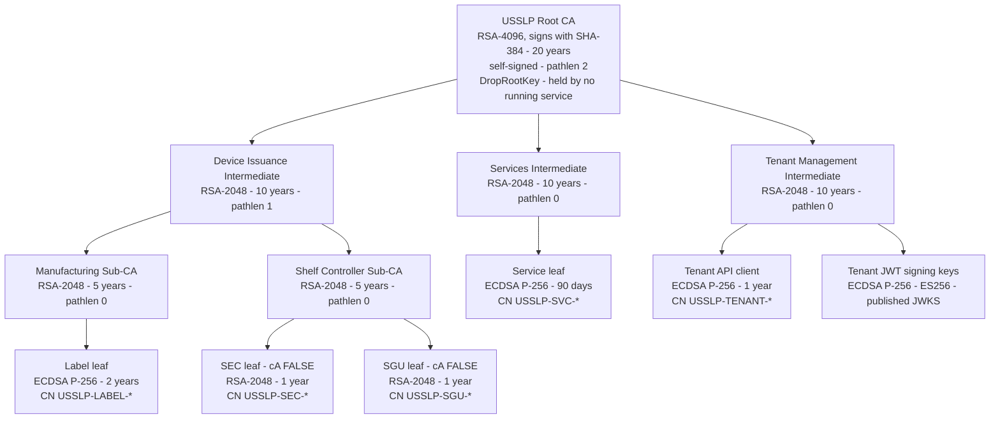
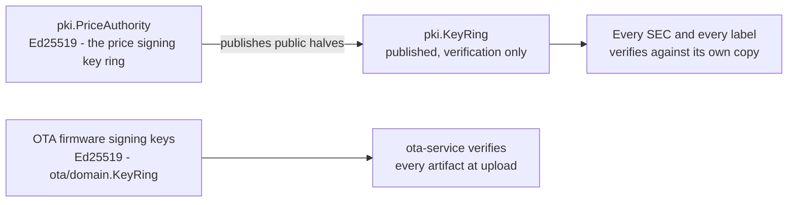
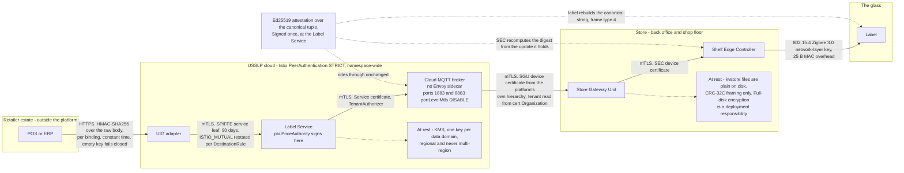
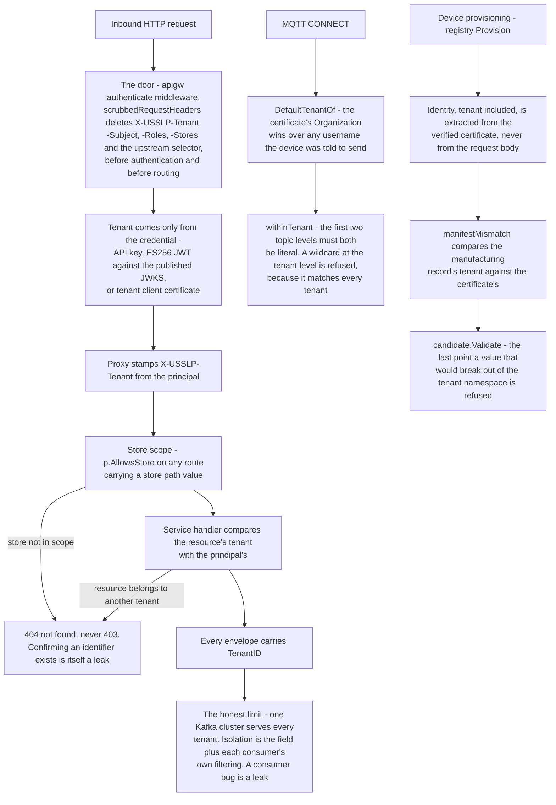
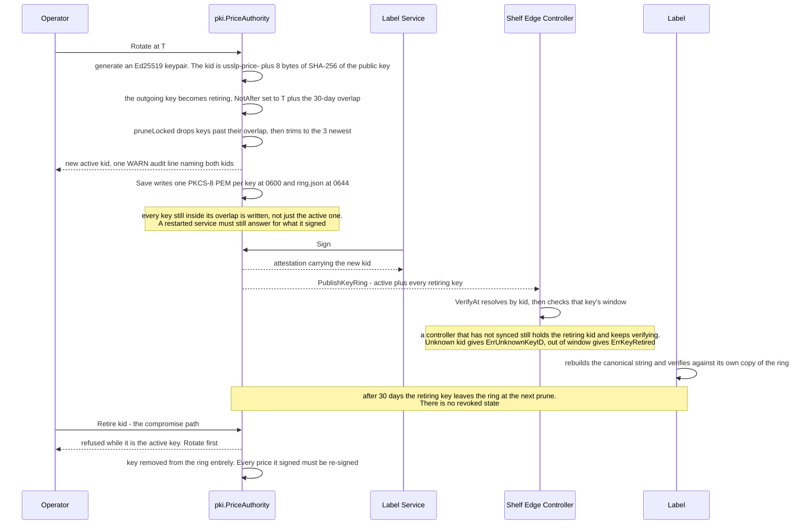

# USSLP security architecture

What is actually implemented, what it is worth, and what it does not cover.

Every claim here cites the code that makes it true. Where a control is
provisioned but not wired, or where a residual risk is real, this document says
so rather than describing an intended end state.

Related decision records: [ADR 0004](../adr/0004-end-to-end-price-attestation.md)
(end-to-end attestation), [0005](../adr/0005-ed25519-for-price-attestation.md)
(Ed25519), [0006](../adr/0006-crl-over-ocsp.md) (revocation),
[0012](../adr/0012-multi-tenancy-and-the-tenant-boundary.md) (tenancy),
[0016](../adr/0016-staged-ota-with-signed-manifest.md) (firmware signing).

---

## 1. The model

USSLP operates under NIST SP 800-207 zero trust: **no device, user or service is
trusted because of where it sits on the network.** `platform/pkg/pki/doc.go`
states the reasoning without hedging — a shelf label hanging on a rail in a back
aisle is physically reachable by anyone who walks past it, and a store's LAN is
one of the least defensible networks in commercial computing. The platform
assumes some devices are already compromised and is designed so that a
compromised device cannot change a displayed price anywhere.

Three properties deliver that, and all three are implemented:

1. **Every hop is mutually authenticated.** A label proves possession of a key
   issued by the Manufacturing Sub-CA before a controller will talk to it; the
   controller proves possession of a Shelf Controller Sub-CA key before the
   gateway will relay for it; every cloud service proves a SPIFFE identity before
   another service answers it.
2. **Identity is structured, not free text.** A certificate does not say "some
   device". It says which tenant, which store and which device, in a form the
   MQTT broker's authorizer extracts in constant time and turns into a topic ACL.
3. **Authority to change a price is separate from authority to speak on the
   network.** Holding a valid device certificate lets you join the mesh. It does
   not let you author a price.

Property 3 is the load-bearing one. Compromising every device in a store yields
no ability to display an unauthorised price — only the ability to display
nothing, which is detected within three missed heartbeats.

---

## 2. The PKI hierarchy

Implemented in `platform/pkg/pki` (`ca.go`, `profile.go`). Six authorities.

Separately, and deliberately **not** in this tree:

### Why the algorithms differ by level

`pki/profile.go` states it: the root and intermediates are RSA because their
certificates must remain verifiable by whatever validates them in 2045, including
firmware and HSMs that predate widespread ECDSA support, and RSA-4096 is the
conservative choice for a key that cannot be rotated cheaply. Label and service
leaves are ECDSA P-256 because a Cortex-M4F verifies a P-256 signature in a
fraction of the energy RSA-2048 costs, and a 90-day service leaf is rotated often
enough that long-horizon algorithm risk does not apply.

### The path-length constraints are structural, not decorative

A leaf carries `cA=FALSE` and the sub-CA above it carries `pathlen 0`, so **even
an attacker holding a sub-CA key cannot mint a further CA to hide behind.** A
stolen label key is worth exactly one label.

### The root key is modelled as offline

`Hierarchy.DropRootKey()` loads the root key, signs intermediates with it, then
drops it from memory. In production the root key never exists on a networked
machine at all; the type reflects that operational reality rather than papering
over it. Everything the platform does day to day is signed by an intermediate, so
a hierarchy without its root key is fully operational. Only creating a new
intermediate requires bringing the root back, and that is a planned ceremony with
witnesses.

### What the package deliberately does not do

`pki` makes **no authorisation decisions.** Deciding that a particular device is
entitled to a particular identity is the provisioning service's job. This is why
`CSRRequest` carries an `Identity` alongside the CSR and **the subject inside the
CSR is ignored entirely**: a certificate signing request is attacker-controlled
input.

### Key material on disk

`pki/store.go`: CA keys are `0600`, CA directories `0700` (so a process running
as another user cannot even enumerate which authorities exist), certificates and
the published key ring `0644` because they are public by design and are served to
devices.

---

## 3. Device identity and SPIFFE

`pki.Identity` has five kinds — `label`, `sec`, `sgu`, `service`, `tenant` — and
authorisation everywhere starts by branching on it. A label may publish
acknowledgements; a SEC may publish on behalf of the labels in its zone; a
service may do neither.

The SPIFFE ID is the canonical form, in trust domain `usslp.io` — a name the
platform controls but never resolves, since no USSLP certificate is validated by
a public CA:

| Kind | SPIFFE ID |
|---|---|
| label / sec / sgu | `spiffe://usslp.io/tenant/{tenant}/store/{store}/{kind}/{device}` |
| service | `spiffe://usslp.io/ns/{namespace}/sa/{service}` |
| tenant client | `spiffe://usslp.io/tenant/{tenant}/client/{name}` |

The common-name prefix is redundant with the SAN **by design**: an operator
reading `openssl x509 -text`, a log line or a broker's connection table sees the
kind immediately, and a certificate whose CN and SAN disagree is **rejected**
rather than silently resolved in favour of one.

`ErrNoIdentity` (a foreign certificate) and `ErrMalformedIdentity` are distinct
errors, and only the second is worth an alert: USSLP-shaped SANs whose contents
are inconsistent means either the issuance path is broken or somebody is probing
the parser.

### Zero-touch provisioning

`registry.Service.Provision` runs four checks and **the order is the security
design, not an implementation detail:**

1. The certificate chain is verified against the platform's own hierarchy,
   including revocation, **before a single field of the request body is read.**
2. The identity is extracted from the verified certificate, never from the
   request body — so a controller cannot enrol a label into a store it does not
   serve.
3. The **manufacturing record** is looked up and compared: public key,
   certificate serial, radio address, hardware tier. A certificate that verifies
   but was never issued for a device that was actually built is refused. The
   manifest is the anchor: a device certificate proves the Manufacturing Sub-CA
   signed *something*; the manifest says the platform expected that something to
   exist.
4. Only then is registry state consulted, for the anti-cloning check.

Anything failing at (3) or (4) **quarantines the identity**, deliberately: when
two things present the same identity the platform cannot tell which is the
genuine label, and continuing to trust either is worse than taking both out of
service until someone walks the aisle.

`cloneEvidence` recognises three signals, each of which can only be produced by
two physical things sharing one identity:

- the same identity announcing from a **different store** (store is bound into
  the certificate, so this requires the key to have been copied onto hardware
  shipped elsewhere);
- the same identity announcing from a **different radio** (the EUI-64 is burned
  into the transceiver and is not something firmware can choose);
- a **radio address already claimed** by a different identity — the same conflict
  seen from the other side.

Moving between controllers *within* a store is explicitly not evidence: that is a
shelf reset and it happens every week.

**Measured:** `TestZeroTouchProvisioning` — a label the platform had never seen
went from powered on to trading in 1.808 s with no human step, its first price
landing in 1.806 s, with a genuine certificate from the platform's own sub-CA.

---

## 4. mTLS everywhere, and the encryption matrix per hop

The table reads hop by hop; the boundaries it crosses do not. The same
information arranged by where the trust actually stops — and by the one thing
that crosses every boundary unchanged.

| Hop | Transport | Authentication | Confidentiality | Integrity of the price | Where |
|---|---|---|---|---|---|
| POS / ERP → UIG | HTTPS | HMAC-SHA256 over the raw body, per binding, constant-time compare | TLS | HMAC | `uig/adapter/verify.go` |
| Operator / integration → API Gateway | HTTPS | API key (PBKDF2-hashed at rest), ES256 JWT against published JWKS, or tenant client certificate | TLS | — | `apigw/auth.go`, `apigw/apikey.go` |
| Service ↔ service (cloud) | mTLS | SPIFFE identity, Services CA, 90-day leaf | Istio `PeerAuthentication` **STRICT**, namespace-wide, `ISTIO_MUTUAL` restated per DestinationRule | — | `deploy/istio/` |
| Cloud → cloud MQTT broker | mTLS | Service certificate; `TenantAuthorizer` with a cross-tenant wildcard | TLS | **Ed25519 attestation inside the payload** | `pkg/mqtt` |
| Cloud broker → SGU (the WAN) | mTLS | SGU device certificate; tenant derived from cert Organization | TLS | Attestation rides through unchanged | `edge/sgu/bridge.go` |
| SGU → SEC (store LAN) | mTLS | SEC device certificate | TLS | Attestation rides through unchanged | `edge/sgu`, `edge/sec` |
| SEC → label (802.15.4) | Zigbee 3.0 | Network-layer key; device certificate at commissioning | **Zigbee NWK security — in the airtime baseline, not a footnote** (`mesh.MACOverheadBytes` = 25 with security on) | **Ed25519 signature carried in frame type 4 and verified on the glass** | `edge/mesh`, `edge/labelsim/wire_attested.go` |
| Label → NFC reader | ISO 14443 | none (field-powered read) | none | n/a — read-only price display | `firmware/src/nfc` |
| At rest, cloud | — | IRSA | KMS, **one key per data domain, regional and never multi-region** | — | `deploy/terraform/modules/kms` |
| At rest, gateway | — | filesystem | Not encrypted by the platform | CRC-32C framing on WAL and log records | `pkg/kvstore`, `pkg/eventlog` |

Two entries deserve emphasis.

**The MQTT broker is exempt from mesh mTLS and that is deliberate.**
`deploy/istio/peerauthentication.yaml` is STRICT namespace-wide with one
port-level exemption: the broker terminates connections from Store Gateway Units
that are appliances in a back office and will never have an Envoy sidecar. Device
identity there is **device mTLS at the broker** with certificates from the
platform's own hierarchy, not mesh mTLS. PERMISSIVE mode was rejected outright —
left on, it is indistinguishable from having no mTLS at all, because nothing ever
tells you a caller chose plaintext.

**Gateway-at-rest encryption is not provided by the platform.** A Store Gateway
Unit's `kvstore` files are plain on disk. Full-disk encryption on the appliance is
a deployment responsibility, and this document does not claim otherwise.

---

## 5. The tenant boundary

Constructed rather than checked — see
[ADR 0012](../adr/0012-multi-tenancy-and-the-tenant-boundary.md) for the full
reasoning. The mechanism, in three sentences:

- A request's tenant comes **only** from the credential that authenticated it,
  and is stamped onto the proxied request.
- `scrubbedRequestHeaders` **deletes** `X-USSLP-Tenant`, `X-USSLP-Subject`,
  `X-USSLP-Roles`, `X-USSLP-Stores` and the upstream selector from every inbound
  request at the door, before authentication and before routing — so no code path
  can exist in which a client's assertion about its own tenancy reaches an
  upstream.
- The MQTT namespace puts the tenant immediately below the root so one ACL rule
  is complete isolation, and `mqtt.TenantAuthorizer` **refuses a subscribe filter
  that does not name its tenant literally** — `usslp/+/#` is rejected, because a
  `+` there matches every tenant on the broker.

Three sentences describe the mechanism; below is every place the tenant is
actually decided or enforced, on all four surfaces at once. Nothing in it reads
a tenant from a request body — every arrow into the boundary starts at a
credential.

Cross-tenant access returns **404, not 403**. Confirming that an identifier
exists somewhere in the platform is itself a leak.

**Measured:** `TestNoCrossTenantLeakage` runs two retailers in one process — the
hardest case, no network or namespace between them — and passes on all four
shared surfaces: HTTP API (including the fan-out directory), event stream, MQTT
namespace, credentials.

**The honest limit:** the event streams are *attributable*, not physically
separate. One Kafka cluster serves every tenant in a pooled deployment and the
isolation is the tenant field plus each consumer's own filtering. A consumer with
a bug that ignores the field is a leak, and nothing structural prevents it.

---

## 6. Key rotation and the price-authority key ring

`pki.PriceAuthority` holds the Ed25519 keys the Label Service signs with. It is
**the platform's most consequential secret**, and it is deliberately not the same
secret as any TLS key: a device certificate lets a device speak, the price
authority key lets the platform *authorise*.

| Property | Value | Reasoning |
|---|---|---|
| `DefaultRotationOverlap` | **30 days** | Sized from the worst realistic case, not from hygiene: a price signed today may still be on a shelf a month from now, and a controller re-verifies its cached state from scratch on every reboot — which for a store that lost power during a refit is weeks later. A shorter overlap turns a routine rotation into a store full of labels refusing to redisplay what they already show. |
| `DefaultRetainedKeys` | 3 | Covers two unscheduled rotations inside one overlap window without unbounded growth of the ring, which every device downloads. |
| Key states | `active`, `retiring` — **and no `revoked`** | A compromised signing key is removed from the ring *entirely* and every price it signed is re-signed. Leaving a compromised key listed in any state invites a verifier to accept it. |
| Key identifier | `usslp-price-` + first 8 bytes of SHA-256 of the public key | Self-authenticating: an attacker cannot publish a ring entry claiming an existing `kid` with a substituted key, because the identifier would not match the bytes. 64 bits is enough — forging one requires a preimage, not a birthday collision. |

What makes those constants safe is that a rotation requires no coordination with
any device. Nothing on a shelf is re-signed, and a controller that has not
synced yet is not wrong — it is still inside the overlap.

The delegated store-scoped authority
([ADR 0003](../adr/0003-edge-first-architecture.md)) is the one exception, and it
is narrow by construction: one store, a short validity, revocable from the cloud
without touching a single label. `LocalAuthority` is nil by default, and a
gateway without one records a locally originated price and **does not display
it**, telling the caller so.

Other rotations: service leaves every 90 days (short enough that revocation is
largely moot for that population); tenant JWT signing keys published as a JWKS so
verifiers resolve by `kid` from a key set they already hold, never from anything
the token carries.

`USSLPAttestationFailure` pages on any increase in
`usslp_attestation_failures_total` — there is no error budget, because the
acceptable number of unverifiable prices reaching a shelf is zero.

---

## 7. Revocation

Signed CRLs, not OCSP. The full argument is
[ADR 0006](../adr/0006-crl-over-ocsp.md); the operational summary:

- `pki.RevocationList` builds and signs a CRL with RFC 5280 §5.3.1 reason codes.
  `pki.Verify` consults it during chain verification and it is a hard failure
  (`ErrRevoked`), never a warning.
- Revocation takes effect when the next list is distributed — bounded by
  `NextUpdate` and by the edge's sync cadence. Hours, not days.
- **That latency is tolerable specifically because of the attestation
  separation.** Revoking a label does not need to be instant: a label cannot
  change a price whatever its certificate says. Revocation that must be instant —
  a compromised sub-CA, a compromised price-authority key — is handled by
  rotating the authority, not by waiting for a list.

**Residual:** a gateway that has not synced a list in three weeks enforces a
three-week-old view and looks entirely healthy doing it. `NextUpdate` is the
signal; checking it is the relying party's job, and distributing fresh lists to
100,000 gateways on a schedule is provisioned (the maintenance window, the config
directory) rather than automated.

---

## 8. The attestation chain of custody

The sequence is in [ADR 0004](../adr/0004-end-to-end-price-attestation.md). What
matters for a security review is the boundary each check defends.

| Check | Defends against | If it fails |
|---|---|---|
| POS HMAC at the UIG (`VerifyHMACSHA256`, constant time, empty key fails **closed**) | A forged price change from the internet | 401, nothing published, `usslp_uig_verify_failures_total` |
| Ed25519 signature by `pki.PriceAuthority` | Anything downstream authoring a price | `usslp_attestation_failures_total` — pages, no budget |
| SEC recomputes the digest **from the update it holds, never from the digest on the wire**, and verifies against its synced key ring | An attacker with write access to the store's broker; a corrupted MQTT payload | Update dropped, previous price stays on the glass, `sec_compliance_alerts_total` — pages |
| **Label rebuilds the canonical string and verifies against its own key ring** | A **rooted or physically replaced controller** | Refused at the glass, ack carries an attestation verdict |
| Per-label monotonic sequence, checked before the signature | Replay, reorder, rollback of a price | Frame discarded as `stale-sequence` |
| Sequence persisted **before** the panel is driven | A brownout mid-waveform leaving new pixels with an old sequence | One price change lost, retry accepted |
| `audit-log` retains the attestation for 365 days | The question a trading standards officer asks | — |

The canonical string is byte-identical between `canon.CanonicalString` (Go) and
`firmware/src/crypto/usslp_canon.c` (C), tested against **bytes** rather than
hashes over six vectors including pre-epoch timestamps, `INT64_MIN`, non-ASCII
SKUs, zero- and three-decimal currencies, and the separator-collision case where
store `"ab"`/label `"c"` must not hash the same as store `"a"`/label `"bc"`. If
the two disagreed by one character, every label in the fleet would refuse every
update and keep showing yesterday's price — correctly, quietly and forever, with
no telemetry signature distinguishing it from an attack.

---

## 9. Threat model

Attack paths, controls, and what is left over. **Residual risk is stated as it
is.**

| # | Threat | Attack path | Control | Residual risk |
|---|---|---|---|---|
| 1 | **Rooted or swapped Shelf Edge Controller** | Physical access to a ceiling void or service corridor; replace the box or obtain root on it; attempt to publish arbitrary prices onto the zone's radio | Frame type 4 carries the signed tuple end to end; the label rebuilds the canonical string and verifies against **its own** key ring before driving a pixel ([ADR 0004](../adr/0004-end-to-end-price-attestation.md)). `TestEveryLabelVerifiesForItself` audits the fleet and fails if any label would take a controller's word for a price. | **Denial of service is fully available.** A rooted controller can suppress every update in its zone, so prices go stale rather than wrong. Detected within three missed heartbeats and by `usslp_labels_pending_delivery`, but a stale price is still a live compliance exposure until someone acts. The controller also sees every price in its zone — a competitor-intelligence exposure the platform does not defend against. A deployment running `CONFIG_USSLP_REQUIRE_ATTESTATION=n` has none of the primary control at all; the fleet audit is the only thing that finds those labels. |
| 2 | **Cloned label** | Extract the key and certificate from a stolen label; flash them onto other hardware; present for provisioning | Manufacturing-manifest comparison (public key, cert serial, EUI-64, tier) and `cloneEvidence` on three independent signals; **both** identities quarantined on detection; `pathlen 0` means a stolen label key mints nothing further. | Detection is at **provisioning**, so a clone that never re-provisions and simply joins with a live certificate is caught only by the EUI-64/store mismatch if it announces. A clone in the *same* store on the *same* radio address is indistinguishable from the original, which is why the identity is quarantined rather than adjudicated. A cloned label still cannot display an unauthorised price. |
| 3 | **Compromised POS credential** | An HMAC binding key leaks from a retailer's CI, a Postman collection, a screenshot | Per-binding HMAC over the raw body with constant-time compare; empty key **fails closed**; 24-hour idempotency window; per-tenant, per-credential and per-cost-class token buckets; Tier-1 guard rails refuse below-cost, out-of-regulatory-bound and parity-breaking prices in the cloud **and** on the gateway; the Label Service refuses a change of more than five times the current price as a corrupt feed. | **An attacker with a valid binding key can set any price inside the guard rails.** That is a genuine authorised-channel compromise and the platform is designed to accept prices from that channel. The blast radius is one tenant and the prices are attested, logged in `audit-log` for 365 days, attributable to the binding, and rate-limited — but they will be displayed. Key rotation is a tenant action; the platform provides no automatic detection of a leaked binding key. |
| 4 | **Malicious tenant** | An authenticated tenant attempts to read, write or observe another tenant's data through the API, the event stream, the WebSocket feed or MQTT | Tenant derived from credential only; tenant-bearing headers scrubbed at the door; cross-tenant reads return 404; MQTT ACL refuses a filter that does not name its tenant literally; per-tenant rate limits; `TestNoCrossTenantLeakage` covers all four surfaces in one process. | **Stream isolation is logical, not physical.** A consumer bug that ignores the tenant field on an envelope is a leak with nothing structural to stop it. A tenant can also infer platform-wide load from its own latency. Model 3 (dedicated node pools) separates workloads but **not control planes**: a compromise of the shared Kubernetes API server crosses it. |
| 5 | **Stolen firmware signing key** | An Ed25519 OTA signing key is exfiltrated; the attacker signs a malicious image and attempts a rollout | The signature covers the **manifest** (version, hardware tier, digest), so an image cannot be re-declared for another tier; the key ring is a set so rotation does not need the whole fleet on one side; `KeyRing.Verify` tries every key rather than the one the upload names; rollout still requires an authenticated `ota:write` principal, staged cohorts and four health gates; MCUboot verifies the signature at boot on the device. | **This is the most severe unmitigated threat in the model.** A stolen key plus an OTA principal is arbitrary code on the fleet. The staged cohorts bound the blast radius to the first wave *only if the malicious image fails a health gate* — a competent attacker's image passes all four. There is no dual control on artifact upload, no threshold signing, no transparency log, and no revocation path for a signed artifact already in flight. The controls that exist are integrity controls, not compromise-recovery controls. |
| 6 | **Mesh traffic injection** | A software-defined radio in the aisle; inject, replay or corrupt 802.15.4 frames | Zigbee network-layer security on every frame (in the airtime baseline); Ed25519 verification at the label; monotonic sequence rejects replay and reorder; CRC-32C on the image payload; malformed frames refused at every length by the decoder (tested at every truncation point). | **Jamming is unmitigated and cheap.** 2.4 GHz is unlicensed; a jammer denies a zone. That degrades to stale prices, not wrong ones, and shows as delivery failures and missed heartbeats. Traffic analysis is also available: an observer learns a store's reprice cadence and volume from frame timing even without decrypting. |
| 7 | **Insider with database access** | An operator or an attacker with the platform's own storage reads or modifies `kvstore` files, the event store, or the analytics segments directly | API keys are stored only as PBKDF2 output, so a disclosure does not hand over working credentials; `audit-log` is append-only with 365-day retention; the event store is append-only with a global monotonic position, so a deletion is detectable as a gap; KMS is per data domain so one key grant is not all of them; CA keys are `0600` in `0700` directories and the root key is offline. | **Read access is essentially unmitigated.** Prices, planograms and the full shape of a retailer's estate are readable by anyone who can read the files. Nothing is encrypted at the application layer; at-rest protection is KMS in the cloud and *nothing at all* on a store gateway. **Write access cannot forge a displayed price** — that requires the Ed25519 authority — but it can delete history, and while the append-only structure makes a gap detectable, nothing in this tree actively detects one. There is no WORM storage, no external log shipping, and no tamper-evidence beyond the structure itself. |

### Threats explicitly out of scope

- **A malicious factory.** The manufacturing manifest is trusted. Somebody who
  controls the production line controls what the manifest says.
- **Supply-chain compromise of the Go toolchain or the base image.** Kyverno
  verifies image signatures at admission and Gatekeeper allow-lists registries,
  which covers substitution but not a compromised build.
- **A compromised root CA.** Recovery is a new hierarchy and a fleet reflash.
- **Physical destruction of labels.** A shelf with no label is visibly a shelf
  with no label.

---

## 10. Compliance mapping, and the evidence the platform actually produces

| Regime | How USSLP relates to it | Evidence the platform produces today | Gap |
|---|---|---|---|
| **PCI DSS SAQ-A** | **USSLP is not in the cardholder data environment.** No component handles, stores, processes or transmits payment data — there is no card field in `canon`, no payment code path, and the POS integration carries item prices and inventory, never transactions. The relevant obligation is to *stay* out of scope. | The UIG's adapter surface is a fixed set of price, catalogue and inventory fields (`uig/mapping`); every delivery is recorded in `uig/deliveries` with what was parsed. Network segmentation is enforced by `NetworkPolicy` and Istio `AuthorizationPolicy`. | Nothing produces an affirmative, auditable statement that no cardholder data crossed the boundary. A scanner on the ingest path would. |
| **GDPR / CCPA** | USSLP holds no shopper personal data. It holds retailer *staff* identifiers (`Principal.Subject`, `UploadedBy` on an artifact, JWT subjects) and store-level operational data. | Structured JSON logs carry tenant and subject on every request-scoped line, so a subject-access or erasure request is a bounded search rather than a full-text one. `audit-log` is keyed by tenant. Regional KMS keys and the Gatekeeper `USSLPDataResidency` constraint enforce residency in eu-west-1 and ap-south-1. | **No erasure mechanism exists.** The audit stream is append-only for 365 days by design, which is in direct tension with an erasure request naming a staff subject; nothing in the tree resolves that tension. The optional BLE shopper beacon advertises no identifiers beyond the store's own, which keeps it out of scope — but that is a firmware setting a deployment can change. |
| **NTEP (US) / OIML (international) — weights and measures** | The core obligation the platform is built around: the price on the shelf must be the price at the till. | The strongest evidence in the platform. Every displayed price carries an Ed25519 signature over `(tenant, store, label, SKU, price, effective time, sequence, promotion)`, verified at the controller **and** at the glass, retained in `audit-log` for 365 days. Refusals are counted (`usslp_attestation_failures_total`, `sec_compliance_alerts_total`) and page with no error budget. The ghosting policy exists because a ghosted previous price is a weights-and-measures defect, not a cosmetic one. | The attestation proves *authorisation*, not *what pixels were lit*. A rendering fault that draws the wrong number from a correctly signed tuple is outside the chain. `DisplayedSequence` is explicitly **not** a safe test for "the shelf is showing a price" when an ack has been lost. |
| **FCC Part 15 / CE RED / BIS (India) — radio** | A device-certification obligation, not a software one. | The airtime model (`edge/mesh`) is built from published 802.15.4 parameters and the duty-cycle arithmetic is asserted by `firmware/tests/test_power.c`. Regional deployments exist (us-east-1, eu-west-1, ap-south-1) with residency constraints. | **Nothing here is certification evidence.** No hardware has been built, no firmware has been compiled, and no radio has been tested. Every current and timing figure is a datasheet or blueprint number — `firmware/README.md` says so under *Not verified*. |
| **SOC 2 (Security, Availability, Confidentiality)** | The organisational control framework a platform operator would be audited against. | Change management: GitOps with auto-sync off in production, `release-*` tags, Argo Rollouts canaries gated on Prometheus analysis. Access control: RBAC with `keys` as its own resource, PBKDF2-hashed API keys with expiry, mTLS with 90-day service leaves. Monitoring: the metric and alert surface in `deploy/observability`, with `make verify-metrics` proving every alert names a metric that exists. Availability: documented SLOs with error budgets and multi-window burn-rate alerting. Incident response: nine runbooks, each linked from the alert that fires. | Everything a SOC 2 audit needs *about people* — access reviews, onboarding and offboarding, vendor management, a risk register, evidence retention — is organisational and outside this repository. The technical controls are strong; the evidence *collection* is not automated. |

---

## 11. Known security gaps

Collected in one place so they are not spread across sections.

1. **No at-rest encryption on a store gateway.** `kvstore` files are plain.
2. **No dual control or transparency log on firmware signing.** See threat 5.
3. **CRL distribution is manual.** No automated push to the edge fleet.
4. **`AllowAll` exists in `pkg/mqtt`.** It logs a warning at start-up, and a
   broker running it in front of real stores would put every tenant in one
   namespace. It is there for `make dev`.
5. **Two services start successfully while refusing to do their job.**
   `label-service` with no `USSLP_PRICE_AUTHORITY_DIR` generates an ephemeral
   signing key whose attestations verify against no key ring in the field;
   `ota-service` with no `USSLP_OTA_SIGNING_KEYS` refuses every artifact upload.
   Both log it once at boot and then look healthy. This is documented in
   `deploy/README.md` §6 and is a deployment trap rather than a code defect.
6. **Traces reach the backend over a log bridge, not over OTLP.**
   `obs.NewRuntime` exports spans to the structured log, where the collector's
   `filelog` receiver reconstructs them. It works — the span log has its own
   level and rate so the application log level cannot silence it, which it used
   to — but a log line per exported span is a stopgap. See `observability.md`.
